# FLUX 2

**Flow. Learn. Unleash. eXecute.**

FLUX 2 is an original 2.5D top-down elemental arena game built in Godot 4.7.1.
It combines crisp independent-aim combat, expressive chained movement, readable
bullet patterns, and a bounded world-chemistry sandbox. The player always
arrives in the Wellspring: a walkable shared academy where training, character
and spell configuration, hosting, joining, settings, testing, and safe exit are
physical places rather than a detached menu.

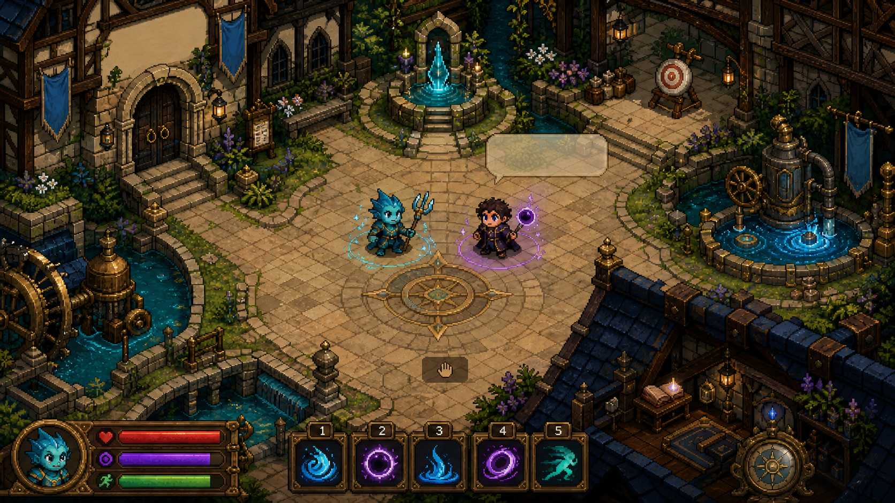

> **Current playable state:** Windows is the active release target. Two distinct champions,
> full universal movement foundation, seven playable foundation spells, the
> Wellspring campus, an authoritative 2–8 player direct-IP Farflow loop, and a
> packaged one-file Windows installer are working. Eight elemental bursts and
> the 36-reaction chemistry acceptance slice are the active implementation goal.

## Get, play, host, join

| Person | One safe path | Result |
|---|---|---|
| Windows player | Download and double-click `FLUX2-Windows-Setup.exe` | Hash-verified per-user install, Start Menu shortcut, safe version switch, then play |
| Windows developer | Run `scripts\run.cmd` | Pinned Godot source launch at 120 Hz |
| Host | Walk east to **Host Farflow**, press interact | Opens authoritative UDP session on port `24872` |
| Friend | Walk to **Join Farflow**, press interact, type/paste the host address, press Enter | Address is saved locally; join is compatibility-checked with clear refusal on mismatch/full session |
| Everyone | Use the **Session Hearth** | Ready, synchronized start, results, and rematch without reopening the company |

Build the one-file friend package on Windows:

```powershell
scripts\install-export-templates.cmd
scripts\package.cmd Windows
```

Send only `exports\release\FLUX2-Windows-Setup.exe`. Re-running a newer setup
stages and verifies the new version before atomically switching the launcher;
an interrupted install leaves the previous version selected. The development
build is unsigned, so Windows may show a publisher warning or an enterprise
Device Guard policy may block the installer until a release certificate and
signing pipeline exist. The portable `exports\release\FLUX2-Windows-x86_64.zip`
bundle is the fallback for managed test machines; its checksum is listed in
`exports\release\SHA256SUMS.txt`.

The current unified Windows package is built from `main`; verify the supplied
installer or portable ZIP against `exports\release\SHA256SUMS.txt` before
sharing it.

For internet play, the host currently forwards/allows **UDP 24872**. The friend
opens **Join Farflow**, types or pastes the host's public address, and presses
Enter. The last valid address is saved on that PC. Developers and diagnostics
may still override it from the command line:

```powershell
scripts\run.cmd --join-address=203.0.113.10 --player-name="River Guest"
```

LAN play uses the host's LAN address. Two local copies default to `127.0.0.1`.
Automatic discovery, relay, NAT traversal, encryption, and signed public update
channels are not claimed yet; test direct-IP builds only with trusted friends.

## Product state

| Area | Now | Next acceptance |
|---|---|---|
| Repository | One authoritative Godot runtime; browser runtime retired | Keep docs/content/runtime hashes in one lineage |
| Lifecycle | Source launch, portable archives, checksums, one-file Windows setup/update/launch | Signed releases, clean uninstall UI, public update channel |
| Wellspring | Nine districts, walk-up stations, practice actors, movement routes | Stronger authored landmarks and compact onboarding |
| Movement | Full universal foundation at deterministic 60/120 Hz | Pattern-pressure tuning and player playtest |
| Combat | Projectile, beam, spray, field, ricochet, launch, slow | Data-driven five-shot burst family for eight elements |
| Chemistry | Material grid and 36 design-locked recipes | All recipes form, act, decay, reset, and explain themselves in-game |
| Champions | Oh Tipi and S. Wayne playable | Do not expand until first-eight chemistry passes |
| Farflow | Host-authoritative 2/4/8-player direct-IP loop | Per-peer LOS filtering, then measured later 32-player gate |
| Visuals | Original compact pixel grammar plus validated nine-element v3 projectile sheets live on every projectile | Whole-scene character/environment/HUD cohesion acceptance |

## Design pillars

| Pillar | Observable rule |
|---|---|
| Movement is offense and defense | Routes, aim, spacing, timing, feints, and resource discipline decide exchanges |
| Bullet hell stays readable | Every lane exposes origin, owner, shape, element, speed class, impact, and expiry |
| Chemistry changes space | Reactions create routes, cover, hazards, visibility, friction, conduction, and counters—not automatic elemental bonus damage |
| Fast, not frictionless | Actions chain when physically legal; startup, cost, recovery, collision, and authored cooldowns preserve decisions |
| Minimal spectacle, maximal response | Strong silhouettes, restrained effects, exact hit confirmation, and no state hidden behind decoration |
| One simulation truth | Fixed-tick systems own outcomes; rendering, particles, sound, and camera never invent gameplay |
| Always playable | Every slice ends launchable, tested, documented, and recoverable before the next begins |

Broad inspiration comes from compact pixel adventures, room-scale action games,
bullet-hell shooters, arena combat, and expressive movement games. FLUX copies
no protected characters, maps, weapons, layouts, symbols, art, audio, or exact
mechanics.

## Controls

All gameplay bindings are remappable at the in-world Controls Lectern and saved
in a versioned local profile.

| Action | Keyboard/mouse default | Controller default |
|---|---|---|
| Move / aim | WASD / mouse | Left stick / right stick |
| Primary | Left mouse | Right trigger |
| Active | Right mouse or E | West face |
| Sprint | Shift | Left shoulder |
| Slide / fast-fall intent | C or wheel down | South face |
| Jump / movement chain | Space or wheel up | Right shoulder |
| Context technique | V | East face |
| Interact | F | North face |
| Speech wheel | Hold T, choose direction | D-pad up |
| Spells | 1–4 | Remappable |
| Spell layers | Ctrl+1–4 / Alt+1–4 | Remappable |
| Reset practice | R | Remappable |
| POV / zoom | F8 / F9 / F10 / F11 | Lectern/remappable |

The Spell Loom exposes twelve independently ordered positions: Plain 1–4,
Ctrl+1–4, and Alt+1–4. An empty position refuses without consuming Flux or
cooldown. Ctrl and Alt are spell-layer modifiers; slide remains on C.

## Movement grammar

| Technique | Purpose | Bound / counterplay | State |
|---|---|---|---|
| Strafe + independent aim | Crossfire, retreat, prediction | Acceleration, brake, counter-strafe timing | Playable |
| Sprint | Rotate, pursue, disengage | Continuous Stamina drain and delayed recovery | Playable |
| Hop / double jump | Vary height and timing | Costs, bounded air actions, vulnerable landing; 90 ms opening attack intangibility | Playable |
| Slide / slide jump | Low committed burst into long route | Entry-speed gate, weak steering, Stamina, hard-cover stop | Playable |
| Air redirect / air dodge | One committed correction or escape | Limited use, fixed duration, safe collision recovery | Playable |
| Ground roll | Evade a predicted lane while grounded | 24 Stamina; 130 ms opening attack intangibility inside 240 ms action | Playable |
| Wavedash | Convert angled air dodge into ground momentum | Exact landing geometry; no free stacking | Playable |
| Wall contact / wall kick | Rebound through authored wall routes | 220 ms same-wall lockout | Playable |
| Vault / superglide | Cross marked low cover and crest routes | Authored surfaces, clearance, narrow conversion window | Playable |
| Wall skim | Brief run along an authored wall | One Stamina purchase, 420 ms maximum, recovery and surface lockout | Playable |
| Variable hop / fast fall | Change aerial rhythm | Bounded height and committed descent | Playable |
| Landing cut | Trade timing for reduced landing recovery | Never cancels attack/status commitment | Playable |
| Impact influence / tech | Bend launch; regain control near impact | Gradual influence; V tech costs 18 Stamina | Playable |
| Edgeweave | Skim a hostile projectile to recover Stamina | No reward on hit/full Stamina/repeat contact | Playable |

Roll, jump, and air dodge intangibility applies only to attack contact during
the authored opening windows. Solid world geometry remains solid.

## Combat, resources, and spell geometry

| Resource/layer | Contract |
|---|---|
| Health | Defeat resource with authored recovery timing |
| Flux | Every attack costs Flux; casting delays recovery and insufficient Flux refuses before creating an outcome |
| Stamina | Movement resource for sprint, aerial actions, slides, wall routes, roll, and tech |
| Affinity | 3 innate points normally split 2+1; bounded build discount only, never automatic damage advantage |
| Primary | Reliable independent-aim pressure with positive Flux cost |
| Spell weave | Twelve configurable positions over four buttons and three modifier layers |
| Authority | Startup, collision, cost, cooldown, damage, reaction, score, and reset are simulation/host owned |

| Delivery family | Player decision | Required read |
|---|---|---|
| Bolt/projectile | Lead, weave, clash, ricochet, use cover | Origin, direction, radius, owner, element, impact |
| Burst/fan | Occupy several lanes or leave a deliberate gap | Ordered fan angles and common timing |
| Beam/ray | Hold or sweep a lane | Startup line, obstruction, active time, recovery |
| Spray/cone | Commit close or displace a flank | Facing, boundary, count, escape edge |
| Wave/arc | Shape a broad moving front | Curvature, travel direction, expiry |
| Orb/orbit | Delay, zone, intercept | Owner, orbit rule, release tell |
| Field/volume | Deny, reveal, slow, prime terrain | Exact boundary, delay, duration, counter |
| Construct/tether | Change cover or sustain a relation | Health/support, sever rule, cleanup |

The first bullet-pattern acceptance is five projectiles at
`-24°, -12°, 0°, +12°, +24°`, ordered negative-to-positive for deterministic
IDs and replay. Pattern geometry never changes because an element skin changes.

## Elements

Eight elements are active in the first chemistry phase. Four remain gated until
the eight-family matrix is playable, bounded, resettable, and readable.

| Active element | Physical/magical identity | Typical spatial verbs |
|---|---|---|
| Earth | Mass, metal, structure, growth, fracture | Raise, brace, block, crumble, conduct |
| Fire | Heat, ignition, smoke, pressure | Burn, spread, consume, soften, illuminate |
| Water | Flow, pressure, wetness, cleansing, displacement | Flood, carry, cool, connect, erode |
| Wind | Air, sound, pressure, lift, redirection | Push, pull, bend, disperse, orbit |
| Ice | Cold, friction, brittle structure, lanes | Freeze, slide, bridge, fracture, focus |
| Charge | Conduction, stored force, interruption | Arc, store, ground, overload, reveal |
| Light | Life, reveal, refraction, protection | Expose, reflect, split, ward, restore |
| Dark | Death, plague, blood, decay, concealment | Wither, pursue, obscure, sacrifice, drain |

| Deferred | Identity | Gate |
|---|---|---|
| Spirit | Psyche, dream, memory, resolve, aether | First-eight acceptance complete |
| Chaos | Void, entropy, instability, mutation | First-eight acceptance complete |
| Gravity | Weight, pull, orbit, anchoring | First-eight acceptance complete |
| Time | Delay, haste, echo, bounded rewind | First-eight acceptance complete |

### Complete first-eight interaction matrix

The matrix is symmetric: row+column and column+row resolve to one recipe.

| + | Earth | Fire | Water | Wind | Ice | Charge | Light | Dark |
|---|---|---|---|---|---|---|---|---|
| **Earth** | Fortify | Magma | Mud | Dustfront | Permafrost | Grounding Network | Crystal Prism | Blightsoil |
| **Fire** | Magma | Conflagration | Steam | Firestorm | Thermal Shock | Plasma Arc | Solar Flare | Cinderveil |
| **Water** | Mud | Steam | Flood | Mistcurrent | Freeze | Conductive Flood | Mirrorwater | Blackwater |
| **Wind** | Dustfront | Firestorm | Mistcurrent | Vortex | Hailstream | Ion Storm | Lightbend | Shadowdraft |
| **Ice** | Permafrost | Thermal Shock | Freeze | Hailstream | Glacier | Superconduct | Crystal Lens | Black Ice |
| **Charge** | Grounding Network | Plasma Arc | Conductive Flood | Ion Storm | Superconduct | Overload | Arcflash | Static Shroud |
| **Light** | Crystal Prism | Solar Flare | Mirrorwater | Lightbend | Crystal Lens | Arcflash | Radiance | Penumbra |
| **Dark** | Blightsoil | Cinderveil | Blackwater | Shadowdraft | Black Ice | Static Shroud | Penumbra | Umbral Field |

Every recipe has `formation → active → residue/decay`, public thresholds,
bounded area/propagation/lifetime/work/ownership, and at least one spatial
counter. Worldbone is immutable; authored structures can stage and break;
transient matter has hard capacities and deterministic cleanup. The machine
truth is [`content/reactions/first_eight_element_reactions_v1.json`](content/reactions/first_eight_element_reactions_v1.json).

## Champions

Only Oh Tipi and S. Wayne are currently selectable. Every other entry is a
design/migration target, not a claim of playable content. Ordinary champions
use a unique two-element 2+1 profile; Treevor is the sole 1+1+1 exception.

| Champion | Ancestry | Body type | Weighted affinities | Availability |
|---|---|---|---|---|
| Oh Tipi | Seakin | Middle | Water 2 · Charge 1 | **Playable** |
| S. Wayne | Hobbit | Small | Dark 2 · Light 1 | **Playable** |
| The Red Baron | Undead | Middle | Fire 2 · Ice 1 | Planned |
| Steezo | Goblin | Small | Charge 2 · Fire 1 | Planned |
| Treevor the Mason | Treefolk | Large | Earth 1 · Wind 1 · Fire 1 | Planned exception |
| Oll' I | Werewolf | Large | Earth 2 · Dark 1 | Planned |
| Fluup | Orc | Large | Wind 2 · Charge 1 | Planned |
| Wa Bidi | Goblin | Small | Wind 2 · Fire 1 | Planned |
| Grace Reava | Sylph | Small | Wind 2 · Water 1 | Planned |
| Waka Aren Si | Gnome | Small | Charge 2 · Light 1 | Planned; `nico_lai` compatibility ID |
| Spai Si | Demon | Middle | Wind 2 · Dark 1 | Planned |
| Leaf the Hidden | Treefolk | Middle | Earth 2 · Wind 1 | Planned |
| Ha Rekt | Wyrmborn | Large | Ice 2 · Wind 1 | Planned |
| Dr. Apex | Stoneborn | Large | Light 2 · Earth 1 | Planned |
| Haara | Nymph | Small | Light 2 · Water 1 | Planned |
| Hesus Christo | Elf | Middle | Earth 2 · Water 1 | Planned |
| Grimm Bow | Troll | Large | Dark 2 · Water 1 | Planned |
| Biggy Bob | Dwarf | Middle | Earth 2 · Fire 1 | Planned |
| Jan Wicked | Human | Middle | Ice 2 · Dark 1 | Planned |
| Ba Djoh | Minotaur | Large | Earth 2 · Ice 1 | Planned |
| Urzh | Stoneborn | Large | Charge 2 · Earth 1 | Planned |
| Donnok | Dwarf | Middle | Fire 2 · Water 1 | Planned |
| Djonah Thaan | Vampire | Middle | Dark 2 · Charge 1 | Planned |
| Unnamed Angel | Angel | Middle | Light 2 · Wind 1 | Non-selectable placeholder |

Only three body types exist: `small`, `middle`, and `large`. Tiny and huge are
retired vocabulary and migrate to small and large respectively; medium migrates
to middle. Body type bounds silhouette, footprint and tuning ranges but never
grants hidden reach, evasion, damage or elemental advantage.

Champion atlases contain body and clothing only. Front/south poses face the
camera with centered, balanced anatomy; north is a centered back view, east is
an authored profile, and west is its deterministic mirror. Shadows, auras,
spells, projectiles, environment, tools and equipment are separate reusable
layers. Magic originates from a visible empty-hand lane above the shared feet
pivot; staffs, wands, rods,
scepters, held foci and floating companion foci are excluded. Character bodies
and clothing avoid sexualized presentation.

## Ancestry body plans

| Ancestry | Boon/identity | Bound/trade-off |
|---|---|---|
| Human | Adaptable neutral baseline | No extreme body advantage |
| Dwarf | Grounded structure resistance | Slower route profile |
| Gnome | Compact device specialist | Low health and mass |
| Hobbit | Low profile and recovery | Increased launch vulnerability |
| Elf | Precision and air control | Fragile body budget |
| Orc | Heavy commitments and interruption resistance | Slower recovery |
| Troll | Large-body endurance | Delayed, highly readable actions |
| Minotaur | Forward momentum and structural impact | Weak turning and miss recovery |
| Seakin | Current/water-route steering | Depends on authored currents |
| Wyrmborn | Strong anthropomorphic aerial commitment | Reduced Stamina budget |
| Stoneborn | Braced mineral mass and structure synergy | Slow acceleration/movement |
| Treefolk | Rooted stability and growth hooks | Large, fire-readable body |
| Sylph | Fine air control | Very low health and mass |
| Undead | Remnant/rune restoration rules | Reduced ordinary healing |
| Goblin | Fast tool-led play | Fragile body |
| Nymph | Bloom/support reactions | Power requires readable setup |
| Vampire | Pursuit and interruptible sustain | Must establish Dark/blood setup |
| Werewolf | Forward breaker | Strong commitment, weak turning |
| Angel | Feather-wing body-plan foundation | Champion identity unapproved |
| Demon | Angular redirect silhouette | No hidden reach or free evasion |

Body type changes only bounded health, recovery, speed, acceleration, mass,
footprint, knockback, air control, camera/readability, and route clearance; the
presentation layer uses a restrained 0.90×/1.00×/1.10× body scale around the
shared feet pivot for small/middle/large. Hitboxes and simulation outcomes do
not inherit this art scale implicitly.
Wings, tails, horns, fins, roots, and extra limbs are not surprise hitboxes.

## Wellspring structure

| District | Play purpose | Landmark |
|---|---|---|
| Source Court | Arrival, introduction, attunement | Cosmic Wellspring |
| Farflow Concourse | Host, join, charter, teams, travel | Farflow Gates |
| Movement Gardens | Fundamentals, advanced routes, trials | Momentum Arbor |
| Elemental Proving Grounds | Aim, targets, destruction, chemistry | Eightfold Basins |
| Living Archive | Codex, rules, roster, replays, analytics | Oracular Dome |
| Restoration Grove | Recovery and low-pressure interaction | Heartroot Garden |
| Deep Foundry | Fabrication and transmutation | Flux Crucible |
| Starward Crown | Settings, accessibility, diagnostics | Twin Astrolabes |
| Seasonal Reaches | Private trials and later events | Fourfold Orrery |

The map must always offer an ordinary safe route, a faster committed route, and
a situational route using movement, material state, or team setup. Buildings
occlude cone-view sight; angles are clamped to 15–360°, and full view is the
default in gameplay while the Wellspring does not force limited information.

## Farflow network contract

| Rule | Current boundary |
|---|---|
| Capacity | Public cap 8; charters provide 2/4/8; later 32 only after measured architecture gate |
| Transport | Godot ENet over UDP 24872, direct IP |
| Authority | Host owns movement validation, resources, casts, hits, cooldowns, stations, roster, score, reset |
| Compatibility | Protocol 29, snapshot 11, tick/tuning/map/content hashes |
| Client feel | Local movement prediction and bounded reconciliation; combat stays authoritative |
| Join in progress | Observer until next gathering, then normal Hearth readiness |
| Disconnect | 15-second in-memory exact-actor reservation and capability rotation |
| Shutdown | Double-confirm host close, reason-bearing guest release, safe local return |
| Security honesty | Strict packet/type/size/rate bounds; no transport encryption/authentication claim yet |

Maintained local journey:

```powershell
scripts\smoke-farflow.cmd
scripts\smoke-farflow.cmd -Executable exports\windows\flux2.exe
```

## Visual system and embedded reference gallery

Runtime art uses an original compact handheld-era proportion language: large
readable heads, short bodies, stable feet, distinctive ancestry silhouettes,
restrained shading, clear bare-hand cast poses, clean shadow/elevation
separation, and symmetric front/back/mirrored-direction rules. The 640×360 virtual
pixel composition scales with nearest-neighbor filtering while gameplay camera
zoom remains configurable from 50–100%.

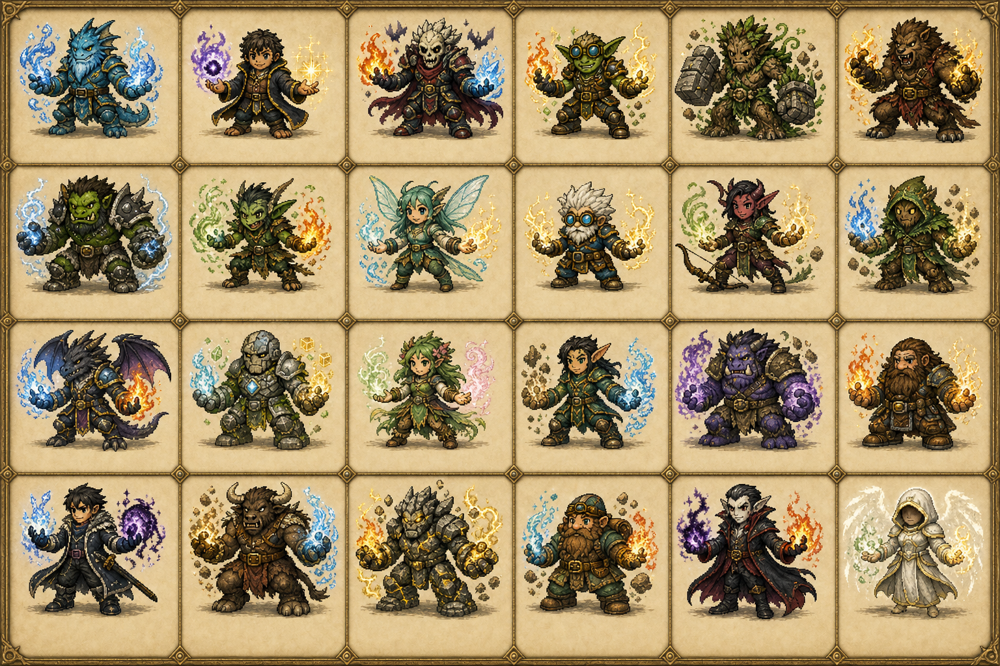

<details>
<summary><strong>Visual direction boards</strong></summary>

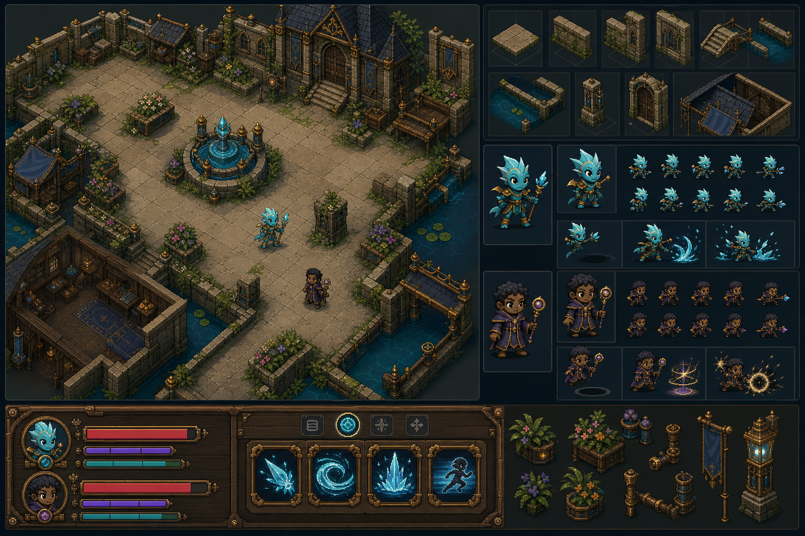

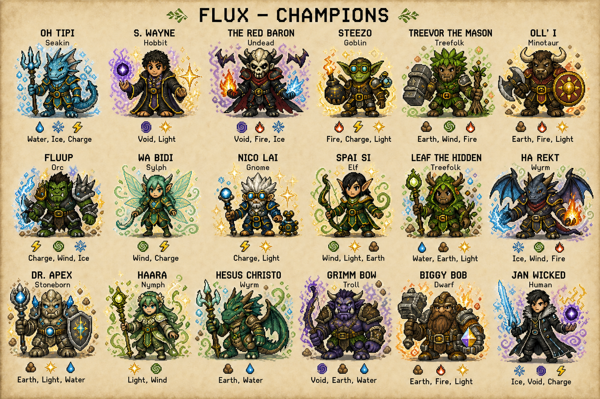


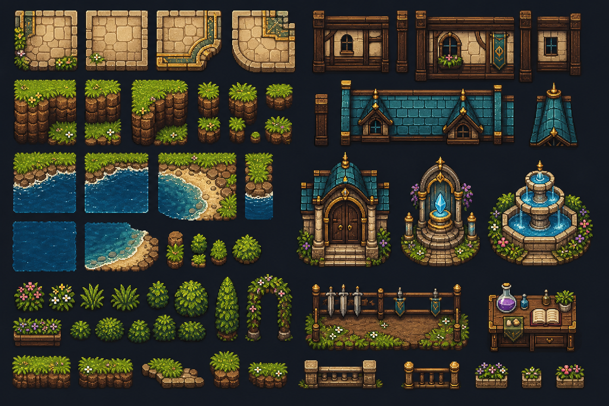

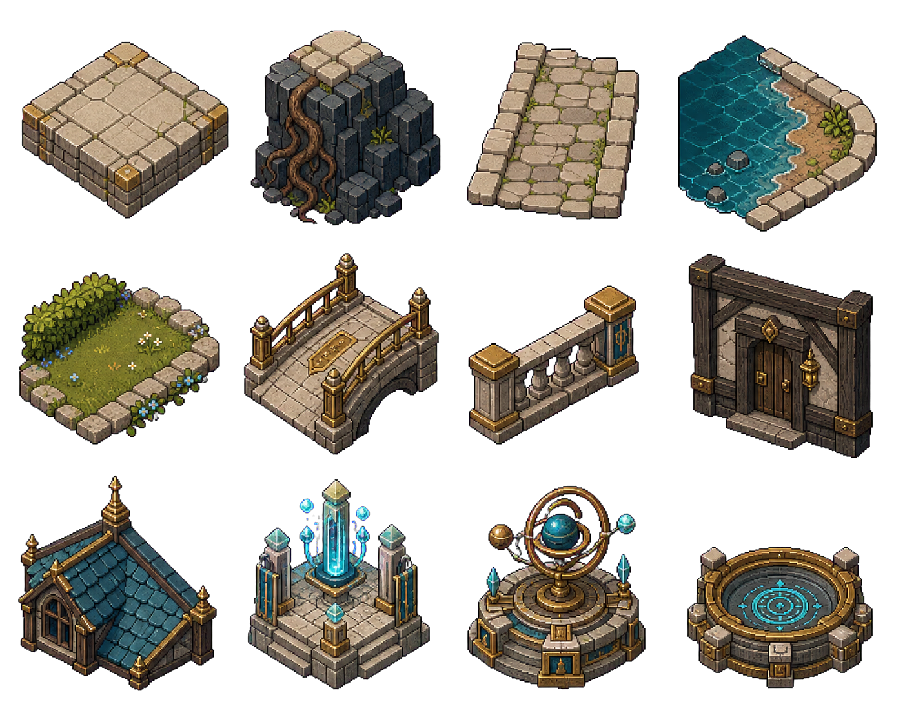

</details>

<details>
<summary><strong>Canonical three-body system</strong></summary>

| Small | Middle | Large |
|---|---|---|
| 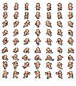 | 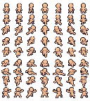 | 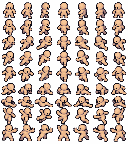 |

The retained `size_1_tiny`, `size_2_small`, `size_3_medium`, `size_4_large`,
and `size_5_huge` path fragments belong to the legacy visual archive; only
`small`, `middle`, and `large` are authored runtime body types.

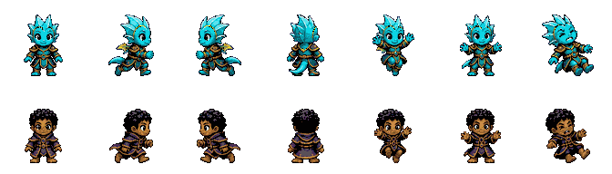

This atlas is a reusable body/clothing layer for the two foundation champions;
spells, auras, shadows, projectiles, environment and equipment are composed
independently. Each champion's `atlas_row` is authored in
`content/visual/foundation_champion_visuals_v1.json`, so adding a body-only
champion is a validated content edit rather than a renderer change.

</details>

<details>
<summary><strong>Burst projectile production system</strong></summary>

The reviewed v3 board supplies neutral plus Fire, Water, Wind, Earth, Charge,
Ice, Light, and Dark. Deterministic tooling derives separate 32 px runtime
sheets with 8 directions × 16 columns: formation, travel, impact, residue, and
one reserved migration cell. Every live projectile now uses the appropriate
element sheet while its exact aim, radius, collision, speed and outcome remain
simulation-owned.


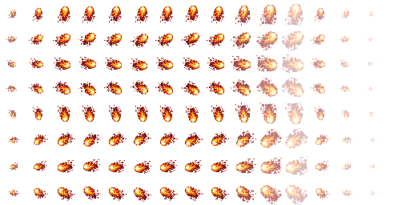

</details>

Spell delivery animation is also data-driven:
`content/visual/spell_animation_skeletons_v1.json` defines bounded startup →
release → travel → impact → residue phases for projectile, beam, spray and
field families. Foundation spell profiles reference one matching skeleton; the
loader fails closed on shape mismatches while all simulation timing and outcomes
remain authoritative. The manifest is centrally registered in
`content/visual/visual_asset_registry_v1.json` and its hash is printed in the
bootstrap diagnostic for reproducible Windows handoffs.

The Nexus source court also has a small authored decoration layer: six bounded
lantern, planter, and rune anchors live in the court profile, are validated
relative to the court footprint, and render after pavers at restrained opacity.
They improve approach readability and give the space a lived-in rhythm without
changing topology, collision, routes, station radii, or simulation state.

The current visual checkpoint has truthful 1280×720 captures at 50%, 75% and
100% zoom, a 1920×1080 capture at 75%, and a 20-frame startup/chain cast capture
under `.godot/visual-captures/post-unify-v9-*`; these are ignored review
artifacts and can be regenerated with `scripts/capture-visual.ps1`.

Concept images guide proportion, color roles, mood, and readability. They do not
define hitboxes, timing, abilities, map topology, or simulation rules. Promotion
requires deterministic slicing, manifests, native/4× review, accessibility,
gameplay-zoom evidence, and tests.

## Architecture

```text
content/       validated champions, abilities, maps, materials, reactions, visuals
src/sim/       fixed-tick deterministic movement/combat/state
src/net/       protocol, snapshots, validation, host/client session boundary
src/app/       boot, input, preferences, Wellspring orchestration
src/presentation/ renderer-owned visuals and feedback only
scenes/        Godot composition and authored runtime scenes
assets/        promoted runtime art plus quarantined concept/provenance
reference/     design/reference inputs that are never silently runtime authority
tests/         deterministic content, simulation, network, launch acceptance
packaging/     Windows bootstrap source and manifest
scripts/       one-command run, test, package, installer, and network smoke
docs/          focused contracts; README is the player/developer front door
.agent/        current implementation gates, backlog, worklog, handoff memory
```

Rules flow in one direction:

```text
validated content -> commands -> fixed-tick simulation -> authoritative state
                                              |
                                              +-> snapshots/replay
                                              +-> presentation events
```

No renderer, particle, animation, sound, client packet, or concept image owns an
outcome.

## Develop, test, package

Pinned engine: **Godot 4.7.1**.

```powershell
scripts\doctor.cmd
scripts\run.cmd
scripts\test.cmd
scripts\package.cmd Windows
```

`scripts/test.*` runs deterministic suites plus source and imported-resource
boots at both 60 and 120 Hz. A test is reported only when it actually ran.
Generated `.godot/`, exports, local dependencies, credentials, and personal
firewall rules are not source.

Existing Linux-compatible simulation and helper scripts are retained but frozen;
this implementation pass makes no new Linux release or acceptance claim.

## Continuous implementation order

| Gate | Small slices | Acceptance |
|---:|---|---|
| 0 | Retire duplicate runtime → record recovery → replace stale docs | One Godot authority; no useful design truth lost |
| 1 | Verify setup/update/launch → host card → join card → safe close | Fresh Windows user reaches Wellspring and a trusted friend joins with one shared file plus address |
| 2 | Lock camera/pixel tokens → three body types → body-only directional atlases → separate hand-cast effects → environment → HUD | Whole scene reads at gameplay zoom, in motion, high contrast, and reduced motion; no spell or world pixels are baked into champion sprites |
| 3 | Burst data contract → deterministic fan → projectile capacity → movement pressure room | Five-shot patterns stay readable and evadeable while every universal technique chains legally |
| 4 | Eight burst spells → reaction catalog → exposure/contact → 36 bounded states → crucible/reset/codex | Every element can fire; every unordered pair forms, acts, decays, explains itself, and resets at 60/120 Hz |
| 5 | **Playtest pause** | User receives a packaged current build and focused test route before roster expansion |

After the first-eight playtest, work resumes with reaction tuning, richer spell
geometries/chemistry, one complete champion at a time, per-peer visibility,
additional maps, bots, and only then broader modes/roster.

## Focused contracts

- [Repository consolidation](docs/BRANCH-CONSOLIDATION.md)
- [Player controls and POV](docs/PLAYER-CONTROLS-AND-POV.md)
- [Combat foundation](docs/COMBAT-FOUNDATION.md)
- [Ability configuration](docs/ABILITY-CONFIGURATION.md)
- [Core game design](docs/CORE-GAME-DESIGN.md)
- [Spell delivery foundations](docs/SPELLCASTING-DELIVERY-FOUNDATIONS.md)
- [First-eight affinities](docs/CHAMPION-AFFINITIES-FIRST-EIGHT.md)
- [First-eight reactions](docs/ELEMENT-REACTIONS-FIRST-EIGHT.md)
- [Selective environment responses](docs/ELEMENT-ENVIRONMENT-RESPONSES.md)
- [Reaction implementation plan](docs/ELEMENT-REACTIONS-IMPLEMENTATION-PLAN.md)
- [Material grid](docs/MATERIAL-GRID-FOUNDATION.md)
- [Projectile foundations](docs/PROJECTILE-DELIVERY-FOUNDATIONS.md)
- [Networking](docs/NETWORKING.md)
- [Wellspring](docs/WELLSPRING-HUB.md)
- [Sprite pipeline](docs/SPRITE-PIPELINE.md)
- [Visual system](docs/VISUAL-SYSTEM.md)
- [Development workflow](docs/DEVELOPMENT.md)

The source license and third-party notices govern redistribution. Reference
material is never permission to copy another game's protected expression.
