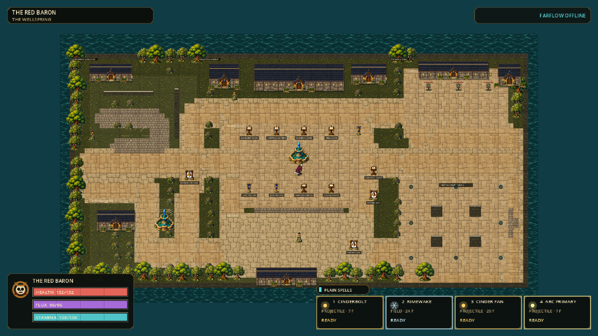
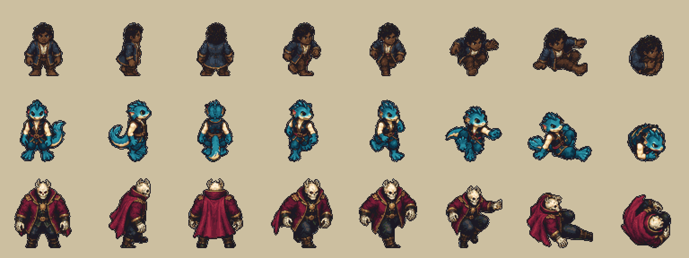
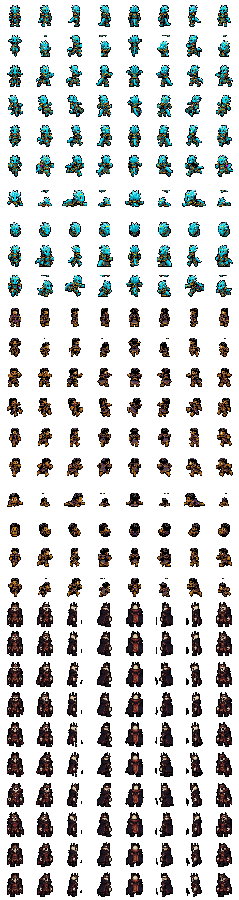

# FLUX 2

**Flow. Learn. Unleash. eXecute.**

FLUX 2 is an original 2.5D top-down elemental arena game built in Godot 4.7.1.
It combines crisp independent-aim combat, expressive chained movement, readable
bullet patterns, and a bounded world-chemistry sandbox. The player always
arrives in the Wellspring: a walkable shared academy where training, character
and spell configuration, hosting, joining, settings, testing, and safe exit are
physical places rather than a detached menu.


> **Current playable state:** Windows is the active release target. Three distinct champions,
> full universal movement foundation, sixteen playable foundation spells, the
> Wellspring campus, an authoritative 2–8 player direct-IP Farflow loop, and a
> packaged one-file Windows player app are working. Comparable bursts for all
> eight first-phase elements and the strict, symmetric 36-reaction definition
> compiler are working; bounded exposure/contact is the next chemistry goal,
> and world mutation remains deliberately gated until that slice passes.

**Latest clarity/control update:** shared Baron-led proportions with dark-skinned
S. Wayne, simple one-color projectiles, a full sixteen-spell drag/drop panel and
vertical-lift jumps with live air steering/braking. Each attack has one element;
chemistry and hybrids stay gated. See [controls and clarity](docs/CLARITY-AND-CONTROL-ITERATION.md).

**Illustrated source revision:** illustrated stone/grass/water terrain, slate-and-timber
buildings, reusable props and renewed small/middle/large eight-way body templates
are integrated into the 3072x1728 six-area campus. The art uses an elevated
approximately 55-degree view, while floors, movement, aiming and collisions
remain screen-aligned. Roof/canopy fading preserves nearby character visibility;
50/75/100% zoom remains available. Visual acceptance is reopened, not inherited
from the earlier artwork. See the [visual acceptance ledger](docs/VISUAL-REFINEMENT-ACCEPTANCE.md).



Run `.\flux.cmd play` for this source revision. Existing Windows exports predate
these changes and must be rebuilt before sharing; do not mix old packages and
new-source hosts. The [map/movement ledger](docs/WELLSPRING-MOVEMENT-ACCEPTANCE.md)
records the unchanged no-vault controls and prior protocol-33 movement checkpoint. Current air control uses protocol 34.



Rows: small S. Wayne, middle Oh Tipi, large Red Baron. Columns: front, side,
back, walk A/B, jump, slide, roll. All ten runtime pose rows cover eight directions;
hit/recovery derives from grounded recoil and sprint B reuses walk B. The 29
semantic actions use explicit aliases, not 29 independently drawn animations.
Spells, auras and ground shadows remain separate from body/clothing artwork.
See [editable sources and prompt specifications](reference/art/wellspring_v3/README.md).

Current counts deliberately distinguish authored inventory from promoted play:

| Dimension | Authoritative current meaning |
|---|---|
| Abilities | 21 validated authored records; 16 have runtime wire IDs and are globally weaveable, while five passive/gated kit records are not selectable spells |
| Chemistry | 36 symmetric definitions compile and hash; `runtime_enabled` remains false until bounded exposure/contact, execution and reset pass |
| Champions | 3 playable entries; 24 identities in the non-selectable roster/affinity plan |
| Bodies | 3 authored gameplay roles: small, middle and large; five-size paths are legacy source/archive adapters only |
| Cadence | 120 Hz authoritative simulation; 60 Hz transport snapshots and a 60-sample presentation clock are distinct non-gameplay cadences |

## Get, play, host, join

| Person | One safe path | Result |
|---|---|---|
| Windows player | Download and double-click `FLUX.exe` | One hash-verified file installs or updates per-user, repairs if needed, then starts the game |
| Windows developer | Run `.\flux.cmd play` | One thin task front door dispatches to the pinned Godot source launch at 120 Hz |
| Host | Use **Host Farflow** on the southern edge of Source Court | Opens authoritative UDP session on port `24872` |
| Friend on the same LAN | Walk to the Farflow stations and choose **Join** | Compatible hosts appear automatically through bounded UDP discovery; different builds remain visible but cannot be joined |
| Internet friend | Walk to **Join Farflow**, press interact, type/paste the host address, press Enter | Address is saved locally; join is compatibility-checked with clear refusal on mismatch/full session |
| Everyone | Use the **Session Hearth** | Ready, synchronized start, results, and rematch without reopening the company |

Build the one-file friend package on Windows:

```powershell
scripts\install-export-templates.cmd
scripts\package.cmd Windows
```

Developer verification is explicit and warning-clean:

```powershell
scripts\test.cmd -Tier Fast     # import + 120 Hz boot
scripts\test.cmd -Tier Focused -Suite reaction-catalog
scripts\test.cmd -Tier Full     # Fast + all deterministic suites
scripts\test.cmd -Tier Release  # Full + Windows package/install/repair/boot
```

Every tier reports elapsed time and stderr bytes. Unexpected Godot warnings are
failures. On 2026-09-04 the actual Windows game export booted successfully,
but Application Control still blocked the rebuilt unsigned `FLUX.exe`
installer before installation; Release acceptance needs trusted signing or
administrator-approved publisher trust. No security settings were changed.

Send only `exports\release\FLUX.exe`. Double-clicking a newer copy stages and
verifies the new version before atomically switching the installed `FLUX.exe`;
an interrupted install leaves the previous version selected. The development
build is unsigned, so Windows may show a publisher warning or an enterprise
Device Guard policy may block the unsigned app until a release certificate and
signing pipeline exist. The portable `exports\release\FLUX2-Windows-x86_64.zip`
bundle is the fallback for managed test machines; its checksum is listed in
`exports\release\SHA256SUMS.txt`.

Build the Windows package from the intended unified `main` checkpoint; verify the supplied
`FLUX.exe` or the portable ZIP against `exports\release\SHA256SUMS.txt` before
sharing it.

For internet play, the host currently forwards/allows **UDP 24872**. The friend
opens **Join Farflow**, types or pastes the host's public address, and presses
Enter. The last valid address is saved on that PC. Developers and diagnostics
may still override it from the command line:

```powershell
scripts\run.cmd --join-address=203.0.113.10 --player-name="River Guest"
```

LAN play uses the host's LAN address. Two local copies default to `127.0.0.1`.
LAN discovery is automatic while the contextual Farflow station panel is open;
its controls never become a detached main menu. Relay, NAT traversal,
encryption, and signed public update channels are not claimed yet; test
direct-IP internet builds only with trusted friends.

## Product state

| Area | Now | Next acceptance |
|---|---|---|
| Repository | One authoritative Godot runtime; generated state/drift checks, selectable suites, receipts, developer front door, asset inventory, canonical roster adapters and exact-package content evidence are verified | Current visual/camera replacement before C6 exposure/contact; unsigned installer trust remains independently blocked |
| Lifecycle | Source launch, portable archives, checksums, one-file Windows install/update/run | Signed releases, clean uninstall UI, public update channel |
| Wellspring | Nine districts, walk-up stations, practice actors, movement routes | Stronger authored landmarks and compact onboarding |
| Movement | Full universal foundation at deterministic 120 Hz; normalized eight-way commands, active directional air control/facing, alternating gait contacts, native eight-way jump/slide/roll art, relative gait, and directional evasion cues | Measure response/braking/reversal/chains during chemistry, then tune the existing grammar from the packaged playtest before adding techniques |
| Combat | Sixteen runtime spells cover projectile, five-shot burst, beam, spray, field, ricochet, launch and slow; one validated catalog exclusively owns their economy, timing, geometry, damage, control and Loom order; all eight elemental Bursts share exact geometry/economy while retaining distinct art and chemistry payloads | Keep the Burst baseline fixed while chemistry supplies the first systemic differences |
| Chemistry | Material grid, eight element-bearing Bursts, and 36 compiled symmetric recipes mapped to nine bounded spatial primitives and seven integer channels; mutation is off | Bounded exposure/contact, shared effect execution, lifecycle/presentation, reset, replay and Farflow proof |
| Champions | Oh Tipi (middle), S. Wayne (small), and The Red Baron (large) playable | Validate the three roles under bullet-pattern pressure before another champion |
| Farflow | Host-authoritative 2/4/8-player loop with contextual zero-config LAN discovery and direct-IP internet joining | Physical two-PC LAN/internet proof, then per-peer LOS filtering; measured 32-player work remains deferred |
| Visuals | Integrated Wellspring gate accepted at 4.64/5; the foundation champions share The Red Baron's cell-bounded dark-ink language, and the Proving Court uses quiet room lanes, response pockets and bounded markers | Maintain one world/body/shadow/spell/projectile/interface hierarchy and improve weak live areas from gameplay captures, not isolated concept art |

## Design pillars

| Pillar | Observable rule |
|---|---|
| Movement is offense and defense | Routes, aim, spacing, timing, feints, and resource discipline decide exchanges |
| Bullet hell stays readable | Every lane exposes origin, owner, shape, element, speed class, impact, and expiry |
| Chemistry changes space | Reactions create routes, cover, hazards, visibility, friction, conduction, and counters—not automatic elemental bonus damage |
| Fast, not frictionless | Actions chain when physically legal; startup, cost, recovery, collision, and authored cooldowns preserve decisions |
| Minimal spectacle, maximal response | Strong silhouettes, restrained effects, exact hit confirmation, and no state hidden behind decoration |
| One visual grammar | Champions read first, threats second, interactions third, architecture fourth, and ambient detail last at every zoom |
| One simulation truth | Fixed-tick systems own outcomes; rendering, particles, sound, and camera never invent gameplay |
| One production sandbox | Players, developers, tests and captures exercise the same validated commands, systems, reset rules and packaged runtime |
| Composition before duplication | New champions, spells, elements, ancestries and materials combine reusable kernels and fail closed when incomplete |
| Simple verbs, deep combinations | Depth comes from movement, geometry, elements, world state and timing composing—not hidden exceptions or option count |
| Learn by doing | Strong defaults, nearby affordances and one contextual prompt teach before the Living Archive explains |
| Failure is actionable | Every blocked action or failed journey names one cause, one safe next action and preserves a quick retry |
| Plug-and-play is gameplay | Obtain, install/update, start, host/join, leave and recover are short, honest and safe player journeys |
| Always playable | Every slice ends launchable, tested, documented, and recoverable before the next begins |

Broad inspiration comes from compact pixel adventures, room-scale action games,
bullet-hell shooters, arena combat, and expressive movement games. FLUX copies
no protected characters, maps, weapons, layouts, symbols, art, audio, or exact
mechanics.

## Controls

All gameplay bindings are remappable at the in-world Controls Lectern and saved
in a versioned local profile.

| Action | Keyboard/mouse default | Controller default |
|---|---|---|
| Move / aim | WASD / mouse | Left stick / right stick |
| Primary | Left mouse | Right trigger |
| Active | Right mouse or E | West face |
| Sprint | Shift | Left shoulder |
| Slide / fast-fall intent | C or wheel down | South face |
| Jump / movement chain | Space or wheel up | Right shoulder |
| Context technique | V | East face |
| Interact | F | North face |
| Speech wheel | Hold T, choose direction | D-pad up |
| Spells | 1–4 | Remappable |
| Spell layers | Ctrl+1–4 / Alt+1–4 | Remappable |
| Reset practice | R | Remappable |
| POV / zoom | F8 / F9 / F10 / F11 | Lectern/remappable |

The Spell Loom exposes twelve independently ordered positions: Plain 1–4,
Ctrl+1–4, and Alt+1–4. An empty position refuses without consuming Flux or
cooldown. Ctrl and Alt are spell-layer modifiers; slide remains on C.

Press edges are retained across the render-to-simulation boundary and then use
the same 180 ms deterministic action buffer, so quick keyboard, mouse-wheel and
controller chords are not lost between frames. All eight movement-plus-slide
combinations are exercised end to end at 120 Hz and the resulting slide lanes
are verified at the authoritative 120 Hz tick. If a physical keyboard cannot
report a three-key chord because of hardware rollover, wheel-down or a Controls
Lectern remap is the equivalent slide input.

## Movement grammar

**2026-09-04 playable revision:** the larger Wellspring loop and no-vault
movement update are implemented in source. Sprint+Jump stays Jump; Q / left
trigger is Evade, V / B is Wall/Air Turn/Tech. Slide has a brief 50 ms opening
protection window and second-press brake. [Current map, controls and acceptance
ledger](docs/WELLSPRING-MOVEMENT-ACCEPTANCE.md) separates tested behavior from
pending human balance/visual acceptance and independent activity isolation.

| Technique | Purpose | Bound / counterplay | State |
|---|---|---|---|
| Strafe + independent aim | Crossfire, retreat, prediction | Acceleration, brake, counter-strafe timing | Playable |
| Sprint | Rotate, pursue, disengage | Continuous Stamina drain and delayed recovery | Playable |
| Hop / double jump | Take off along held movement, steer and face through all eight directions in air | Steering trades momentum during a hard reversal; paid redirect remains stronger; vulnerable landing; 90 ms opening attack intangibility | Playable |
| Slide / slide jump | Low committed burst into long route | Entry-speed gate; 50 ms opening protection; vulnerable tail; second C brakes; world stays solid | Playable |
| Air redirect / air dodge | Strong snap correction or committed escape beyond ordinary air steering | Limited use, cost, fixed duration, safe collision recovery | Playable |
| Ground roll | Evade a predicted lane while grounded | 24 Stamina; 130 ms opening attack intangibility inside 240 ms action | Playable |
| Wavedash | Convert angled air dodge into ground momentum | Exact landing geometry; no free stacking | Playable |
| Wall contact / wall kick | Rebound through authored wall routes | 220 ms same-wall lockout | Playable |
| Vault / crest superglide | Retired | Serialized IDs remain reserved, no action activates either | Removed |
| Wallrun | Contact-following run along authored practice walls | 18 Stamina; 420 ms maximum; detach at wall end, away input or second V; no i-frames | Playable |
| Variable hop / fast fall | Change aerial rhythm | Bounded height and committed descent | Playable |
| Landing cut | Trade timing for reduced landing recovery | Never cancels attack/status commitment | Playable |
| Impact influence / tech | Bend launch; regain control near impact | Gradual influence; V tech costs 18 Stamina | Playable |
| Edgeweave | Skim a hostile projectile to recover Stamina | No reward on hit/full Stamina/repeat contact | Playable |

Slide, roll, jump, and air dodge intangibility applies only to attack contact during
the authored opening windows. Solid world geometry remains solid.

Movement polish is measured rather than guessed: legal input should affect
authoritative state within one 120 Hz tick unless a visible commitment blocks
it; one transition contract owns buffers/cancels/costs/cooldowns/refusals; and
repeatable journeys record stopping distance, reversal, landing recovery and
chain success. Small favors acceleration/recovery, middle flexibility and
large stability/momentum without changing universal access or creating hidden
collision advantage. No new technique is added until every existing one has a
distinct use, readable transition, deterministic test and counterplay.

## Combat, resources, and spell geometry

| Resource/layer | Contract |
|---|---|
| Health | Defeat resource with authored recovery timing |
| Flux | Every attack costs Flux; casting delays recovery and insufficient Flux refuses before creating an outcome |
| Stamina | Movement resource for sprint, aerial actions, slides, wall routes, roll, and tech |
| Affinity | 3 innate points normally split 2+1; bounded build discount only, never automatic damage advantage |
| Primary | Reliable independent-aim pressure with positive Flux cost |
| Spell weave | Twelve configurable positions over four buttons and three modifier layers |
| Authority | Startup, collision, cost, cooldown, damage, reaction, score, and reset are simulation/host owned |

| Delivery family | Player decision | Required read |
|---|---|---|
| Bolt/projectile | Lead, weave, clash, ricochet, use cover | Origin, direction, radius, owner, element, impact |
| Burst/fan | Occupy several lanes or leave a deliberate gap | Ordered fan angles and common timing |
| Beam/ray | Hold or sweep a lane | Startup line, obstruction, active time, recovery |
| Spray/cone | Commit close or displace a flank | Facing, boundary, count, escape edge |
| Wave/arc | Shape a broad moving front | Curvature, travel direction, expiry |
| Orb/orbit | Delay, zone, intercept | Owner, orbit rule, release tell |
| Field/volume | Deny, reveal, slow, prime terrain | Exact boundary, delay, duration, counter |
| Construct/tether | Change cover or sustain a relation | Health/support, sever rule, cleanup |

| Playable spell | Element · shape | Foundation owner / decision |
|---|---|---|
| Rillshot | Water · projectile | Oh Tipi; quick flowing pressure |
| Tideline | Water · spray | Oh Tipi; close fan displacement |
| Rimewake | Ice · field | Oh Tipi / Red Baron; visible pursuit break |
| Eclipse Disc | Dark · ricochet projectile | S. Wayne; one readable rebound |
| Pocket Eclipse | Light · beam | S. Wayne; committed line control |
| Cinderbolt | Fire · projectile | Red Baron; measured lane pressure |
| Cinder Fan | Fire · five-shot fan | Red Baron; ordered lane pressure with deliberate gaps |
| Stone Burst | Earth · five-shot burst | Global comparison spell; structure/fracture payload |
| Rill Burst | Water · five-shot burst | Global comparison spell; flow/wetness payload |
| Gale Burst | Wind · five-shot burst | Global comparison spell; pressure/redirection payload |
| Rime Burst | Ice · five-shot burst | Global comparison spell; cold/friction payload |
| Arc Burst | Charge · five-shot burst | Global comparison spell; conduction payload |
| Prism Burst | Light · five-shot burst | Global comparison spell; reveal/refraction payload |
| Eclipse Burst | Dark · five-shot burst | Global comparison spell; decay/concealment payload |
| Arc Primary | Charge · projectile | Global proven spell |
| Vector Lance | Charge · projectile | Global proven active |

The first-eight bullet-pattern baseline is playable: each element emits five projectiles at
`-24°, -12°, 0°, +12°, +24°`, ordered negative-to-positive for deterministic
IDs and replay. It spends one positive Flux cost, cannot multiply damage on one
target, stays inside bounded work/snapshot capacity, and leaves authored dodge
lanes. Element changes presentation and the future chemistry payload; it never
changes this comparison geometry, economy, or damage budget.

## Elements

Eight elements are active in the first chemistry phase. Four remain gated until
the eight-family matrix is playable, bounded, resettable, and readable.

| Active element | Physical/magical identity | Typical spatial verbs |
|---|---|---|
| Earth | Mass, metal, structure, growth, fracture | Raise, brace, block, crumble, conduct |
| Fire | Heat, ignition, smoke, pressure | Burn, spread, consume, soften, illuminate |
| Water | Flow, pressure, wetness, cleansing, displacement | Flood, carry, cool, connect, erode |
| Wind | Air, sound, pressure, lift, redirection | Push, pull, bend, disperse, orbit |
| Ice | Cold, friction, brittle structure, lanes | Freeze, slide, bridge, fracture, focus |
| Charge | Conduction, stored force, interruption | Arc, store, ground, overload, reveal |
| Light | Life, reveal, refraction, protection | Expose, reflect, split, ward, restore |
| Dark | Death, plague, blood, decay, concealment | Wither, pursue, obscure, sacrifice, drain |

| Deferred | Identity | Gate |
|---|---|---|
| Spirit | Psyche, dream, memory, resolve, aether | First-eight acceptance complete |
| Chaos | Void, entropy, instability, mutation | First-eight acceptance complete |
| Gravity | Weight, pull, orbit, anchoring | First-eight acceptance complete |
| Time | Delay, haste, echo, bounded rewind | First-eight acceptance complete |

### Complete first-eight interaction matrix

The matrix is symmetric: row+column and column+row resolve to one recipe.

| + | Earth | Fire | Water | Wind | Ice | Charge | Light | Dark |
|---|---|---|---|---|---|---|---|---|
| **Earth** | Fortify | Magma | Mud | Dustfront | Permafrost | Grounding Network | Crystal Prism | Blightsoil |
| **Fire** | Magma | Conflagration | Steam | Firestorm | Thermal Shock | Plasma Arc | Solar Flare | Cinderveil |
| **Water** | Mud | Steam | Flood | Mistcurrent | Freeze | Conductive Flood | Mirrorwater | Blackwater |
| **Wind** | Dustfront | Firestorm | Mistcurrent | Vortex | Hailstream | Ion Storm | Lightbend | Shadowdraft |
| **Ice** | Permafrost | Thermal Shock | Freeze | Hailstream | Glacier | Superconduct | Crystal Lens | Black Ice |
| **Charge** | Grounding Network | Plasma Arc | Conductive Flood | Ion Storm | Superconduct | Overload | Arcflash | Static Shroud |
| **Light** | Crystal Prism | Solar Flare | Mirrorwater | Lightbend | Crystal Lens | Arcflash | Radiance | Penumbra |
| **Dark** | Blightsoil | Cinderveil | Blackwater | Shadowdraft | Black Ice | Static Shroud | Penumbra | Umbral Field |

Every recipe now compiles through stable wire IDs into one of nine shared
primitives (`surface`, `flow`, `cover`, `field`, `conduction`, `visibility`,
`hazard`, `refraction`, `fracture`) and seven clamped integer channels. Each has
`formation → active → residue/decay`, public thresholds,
bounded area/propagation/lifetime/work/ownership, and at least one spatial
counter. Worldbone is immutable; authored structures can stage and break;
transient matter has hard capacities and deterministic cleanup. C5 validates
and compatibility-hashes this truth but cannot mutate the world; C6 promotes
bounded exposure/contact. The machine truth is
[`content/reactions/first_eight_element_reactions_v1.json`](content/reactions/first_eight_element_reactions_v1.json).

## Champions

Oh Tipi, S. Wayne, and The Red Baron are currently selectable. Every other entry is a
design/migration target, not a claim of playable content. Every champion spends
the same three affinity points: two-element specialists use `2+1`, while
three-element generalists use `1+1+1` and gain breadth without a strength-2
discount. Duplicate combinations are legal when their full play patterns differ.

| Champion | Ancestry | Body type | Weighted affinities | Availability |
|---|---|---|---|---|
| Oh Tipi | Seakin | Middle | Water 2 · Charge 1 | **Playable** |
| S. Wayne | Hobbit | Small | Dark 2 · Light 1 | **Playable** |
| The Red Baron | Undead | Large | Fire 2 · Ice 1 | **Playable** |
| Steezo | Goblin | Small | Charge 1 · Fire 1 · Light 1 | Planned |
| Treevor the Mason | Treefolk | Large | Earth 1 · Wind 1 · Fire 1 | Planned |
| Oll' I | Werewolf | Large | Earth 1 · Fire 1 · Light 1 | Planned |
| Fluup | Orc | Large | Wind 1 · Charge 1 · Ice 1 | Planned |
| Wa Bidi | Goblin | Small | Charge 1 · Wind 1 · Fire 1 | Planned |
| Grace Reava | Sylph | Small | Wind 1 · Water 1 · Light 1 | Planned |
| Waka Aren Si | Gnome | Small | Charge 2 · Light 1 | Planned; `nico_lai` compatibility ID |
| Spai Si | Demon | Middle | Wind 1 · Earth 1 · Light 1 | Planned |
| Leaf the Hidden | Treefolk | Middle | Water 1 · Earth 1 · Light 1 | Planned |
| Ha Rekt | Wyrmborn | Large | Ice 1 · Wind 1 · Fire 1 | Planned |
| Dr. Apex | Stoneborn | Large | Earth 1 · Light 1 · Water 1 | Planned |
| Haara | Nymph | Small | Light 2 · Wind 1 | Planned |
| Hesus Christo | Elf | Middle | Earth 2 · Water 1 | Planned |
| Grimm Bow | Troll | Large | Earth 2 · Water 1; Chaos reserved | Planned |
| Biggy Bob | Dwarf | Middle | Earth 1 · Fire 1 · Light 1 | Planned |
| Jan Wicked | Human | Middle | Ice 1 · Dark 1 · Charge 1 | Planned |
| Ba Djoh | Minotaur | Large | Earth 1 · Fire 1 · Water 1 | Planned |
| Urzh | Stoneborn | Large | Earth 1 · Fire 1 · Charge 1 | Planned |
| Don Doko Don | Dwarf | Middle | Earth 1 · Fire 1 · Water 1 | Planned; `donnok` compatibility ID |
| Djonah Thaan | Vampire | Middle | Dark 1 · Charge 1 · Fire 1 | Planned |
| Unnamed Angel | Angel | Middle | Light 2 · Wind 1 | Non-selectable placeholder |

Only three body types exist: `small`, `middle`, and `large`. Tiny and huge are
retired vocabulary and migrate to small and large respectively; medium migrates
to middle. Body type bounds silhouette, footprint and tuning ranges but never
grants hidden reach, evasion, damage or elemental advantage.

| Body type | Equal-budget role | Strengths | Honest trade-offs |
|---|---|---|---|
| Small | Skirmisher | Ground speed, Flux recovery, compact visual read | Health and Stamina reserves |
| Middle | Adapter | Balanced resources, route flexibility, stable recovery | No extreme stat; moderate commitments |
| Large | Anchor | Health, Stamina, lane presence | Ground speed and Flux recovery |

All three retain the same foundation collision radius and the complete universal
movement grammar. The validated body-profile catalog rejects champion stats
outside the selected role envelope, so size is asymmetric but never a strict
upgrade. Their authored upright silhouettes progress `58 → 68 → 76 px`; this is
large enough to identify skirmisher, adapter, and anchor at a glance while the
shared hit radius prevents smaller art from gaining hidden evasion or larger art
from gaining reach.

Champion atlases contain body and clothing only. The current green runtime has
authored frames in `S/SE/E/NE/N/NW/W/SW`: front/south faces the camera with
centered, balanced anatomy; north is a centered back view; east/west are
profiles; diagonals are distinct three-quarter silhouettes. Jump, slide, and
roll now use native art in every direction. Walk and sprint alternate two
opposite planted-leg contacts on each champion's editable cadence. Simulation movement and aim stay continuous, keyboard
diagonals stay normalized, and presentation resolves travel separately from
facing so aim-facing forward/back/strafe movement remains readable. Shadows, auras, spells,
projectiles, environment, tools and equipment are separate reusable layers.
Magic originates from a visible empty-hand lane above the shared feet pivot;
staffs, wands, rods,
scepters, held foci and floating companion foci are excluded. Character bodies
and clothing avoid sexualized presentation.

## Ancestry body plans

| Ancestry | Boon/identity | Bound/trade-off |
|---|---|---|
| Human | Adaptable neutral baseline | No extreme body advantage |
| Dwarf | Grounded structure resistance | Slower route profile |
| Gnome | Compact device specialist | Low health and mass |
| Hobbit | Low profile and recovery | Increased launch vulnerability |
| Elf | Precision and air control | Fragile body budget |
| Orc | Heavy commitments and interruption resistance | Slower recovery |
| Troll | Large-body endurance | Delayed, highly readable actions |
| Minotaur | Forward momentum and structural impact | Weak turning and miss recovery |
| Seakin | Current/water-route steering | Depends on authored currents |
| Wyrmborn | Strong anthropomorphic aerial commitment | Reduced Stamina budget |
| Stoneborn | Braced mineral mass and structure synergy | Slow acceleration/movement |
| Treefolk | Rooted stability and growth hooks | Large, fire-readable body |
| Sylph | Fine air control | Very low health and mass |
| Undead | Remnant/rune restoration rules | Reduced ordinary healing |
| Goblin | Fast tool-led play | Fragile body |
| Nymph | Bloom/support reactions | Power requires readable setup |
| Vampire | Pursuit and interruptible sustain | Must establish Dark/blood setup |
| Werewolf | Forward breaker | Strong commitment, weak turning |
| Angel | Feather-wing body-plan foundation | Champion identity unapproved |
| Demon | Angular redirect silhouette | No hidden reach or free evasion |

Body type changes only bounded health, recovery, speed, acceleration, mass,
footprint, knockback, air control, camera/readability, and route clearance.
Small, middle and large bodies all render at `1.00×` around the shared feet
pivot; their authored atlas silhouettes, not per-action scaling, carry the size
difference. Hitboxes and simulation outcomes never inherit art size implicitly.
Wings, tails, horns, fins, roots, and extra limbs are not surprise hitboxes.

## Wellspring structure

| District | Play purpose | Landmark |
|---|---|---|
| Source Court | Arrival, introduction, attunement | Cosmic Wellspring |
| Farflow Concourse | Host, join, charter, teams, travel | Farflow Gates |
| Movement Gardens | Fundamentals, advanced routes, trials | Momentum Arbor |
| Elemental Proving Grounds | Aim, targets, destruction, chemistry | Eightfold Basins |
| Living Archive | Codex, rules, roster, replays, analytics | Oracular Dome |
| Restoration Grove | Recovery and low-pressure interaction | Heartroot Garden |
| Deep Foundry | Fabrication and transmutation | Flux Crucible |
| Starward Crown | Settings, accessibility, diagnostics | Twin Astrolabes |
| Seasonal Reaches | Private trials and later events | Fourfold Orrery |

The map must always offer an ordinary safe route, a faster committed route, and
a situational route using movement, material state, or team setup. Buildings
occlude cone-view sight; angles are clamped to 15–360°, and full view is the
default in gameplay while the Wellspring does not force limited information.

## Farflow network contract

| Rule | Current boundary |
|---|---|
| Capacity | Public cap 8; charters provide 2/4/8; later 32 only after measured architecture gate |
| Transport | Godot ENet over UDP 24872, direct IP |
| Authority | Host owns movement validation, resources, casts, hits, cooldowns, stations, roster, score, reset |
| Compatibility | Protocol 34, snapshot 12, tick/tuning/map/content hashes |
| Client feel | Local movement prediction and bounded reconciliation; combat stays authoritative |
| Join in progress | Observer until next gathering, then normal Hearth readiness |
| Disconnect | 15-second in-memory exact-actor reservation and capability rotation |
| Shutdown | Double-confirm host close, reason-bearing guest release, safe local return |
| Security honesty | Strict packet/type/size/rate bounds; no transport encryption/authentication claim yet |

Maintained local journey:

```powershell
scripts\smoke-farflow.cmd
scripts\smoke-farflow.cmd -Executable exports\windows\flux2.exe
```

## Visual system and embedded reference gallery

Runtime art uses an original mature compact pixel proportion language: smaller
ordinary heads, clear torsos and limbs, stable feet, distinctive ancestry silhouettes,
restrained shading, clear bare-hand cast poses, clean shadow/elevation
separation, and symmetric front/back/mirrored-direction rules. The 640×360 virtual
pixel composition scales with nearest-neighbor filtering while gameplay camera
zoom remains configurable from 50–100%.


<details>
<summary><strong>Visual direction boards</strong></summary>


</details>

<details>
<summary><strong>Canonical three-body system</strong></summary>

The production/redesign order is fixed from smallest to largest: S. Wayne
(`small`) → Oh Tipi (`middle`) → The Red Baron (`large`).


The retained `size_1_tiny`, `size_2_small`, `size_3_medium`, `size_4_large`,
and `size_5_huge` path fragments belong to the legacy visual archive; only
`small`, `middle`, and `large` are authored runtime body types.



This atlas is a reusable body/clothing layer for all three foundation champions;
spells, auras, shadows, projectiles, environment and equipment are composed
independently. Each champion's `atlas_row` is authored in
`content/visual/foundation_champion_visuals_v1.json`. The versioned 768×2880
atlas packs eight direction columns under each champion. Every grounded,
empty-hand cast, hit/recovery, jump, slide, and roll state has native eight-way
art; walk and sprint add a second opposite contact row for true leg alternation.
The Red Baron is the shared anatomy, material, and ink reference: a deterministic builder
derives a restrained one-pixel exterior ink from his darkest visible material
clusters and applies it cell-by-cell without recoloring or bleeding between
champions. A bounded source-time pass first removes direction-dependent scale
drift, then processes `small`, `middle`, and `large`, keeping the 58/68/76 px
upright heights, runtime scale `1.0`, and shared feet pivot while reducing
oversized heads on the first two templates. Hair,
fins, horns, identity palettes, ancestry features and the three authored body
silhouettes remain distinct.
An independent two-stroke directional evasion cue still reinforces actual
travel/facing during invulnerability frames.
During free locomotion the body faces travel; while combat intent is active it
faces aim and exposes forward, backward, and strafe gait cues. Neither profile
is synthesized at runtime. The
validator rejects missing states, directions, hashes, pivots or
layout drift before the scene can boot, and the deterministic builder plus exact
generation prompts live beside the source sheets.

</details>

<details>
<summary><strong>Burst projectile production system</strong></summary>

The reviewed v3 board supplies neutral plus Fire, Water, Wind, Earth, Charge,
Ice, Light, and Dark. Deterministic tooling derives separate 32 px runtime
sheets with 8 directions × 16 columns: formation, travel, impact, residue, and
one reserved migration cell. Every live projectile now uses the appropriate
element sheet while its exact aim, radius, collision, speed and outcome remain
simulation-owned. Live projectile presentation clamps the readable diameter to
28–46 px, adds a dark under-silhouette, exact collision rim and forward travel
cue, and interpolates from authoritative fixed-tick positions; current projectile
speeds are intentionally about 13–15% slower than the preceding checkpoint.


</details>

Spell delivery animation is also data-driven:
`content/visual/spell_animation_skeletons_v1.json` defines bounded startup →
release → travel → impact → residue phases for projectile, beam, spray and
field families. Foundation spell profiles reference one matching skeleton; the
loader fails closed on shape mismatches while all simulation timing and outcomes
remain authoritative. The manifest is centrally registered in
`content/visual/visual_asset_registry_v1.json` and its hash is printed in the
bootstrap diagnostic for reproducible Windows handoffs. The first two phases
also drive a shared, restrained hand-gather and release cue at the champion's
empty hand. A separate fail-closed direction contract keeps body cast/recovery,
gather/release, projectile orientation and trail art on the same nearest-eight
sector while simulation aim, continuous hand offset and beam/spray geometry
remain exact. Spell-specific silhouettes stay layered on top, never baked into
champion sprites.

The Nexus source court also has a small authored decoration layer: six bounded
lantern, planter, and rune anchors live in the court profile, are validated
relative to the court footprint, and render after pavers at restrained opacity.
They improve approach readability and give the space a lived-in rhythm without
changing topology, collision, routes, station radii, or simulation state.

The current visual checkpoint has truthful 1280×720 captures at 50%, 75% and
100% zoom, a 1920×1080 capture at 75%, an 8-frame startup/chain cast capture,
and high-contrast/reduced-effects captures under
`.godot/visual-captures/post-unify-v9-*`; these are ignored review artifacts
and can be regenerated with `scripts/capture-visual.ps1`.

Run `scripts\capture-visual-matrix.cmd -Name review-name` for the bounded
integrated review: it distributes idle, walk, sprint, reverse, jump, cast, hit
and evade across all eight directions for Oh Tipi and S. Wayne, covers
50/75/100% zoom plus every visual profile, captures 720p/1080p overviews, and
proves a real mixed-champion Farflow pair. It writes ignored truthful frames, a
machine-readable manifest and one contact sheet below
`.godot/visual-captures/`; a prefix is never overwritten or resumed silently.

The complete eight-way movement checkpoint adds alternating walk/sprint contacts
plus native jump/slide/roll art for both champions. Truthful live gait evidence
is under `.godot/visual-captures/animation-v8-*`; older cardinal evidence remains
under `.godot/visual-captures/movement-v5-*`. Capture-only
`--capture-direction=south|south_east|east|north_east|north|north_west|west|south_west`
makes the full direction matrix reproducible and does not affect ordinary
controls or simulation. A shared fixed-point presentation resolver now owns
this exact order, sector boundaries, zero-vector fallback and review
hysteresis; continuous simulation movement and aim remain unchanged.

The body manifest now exposes exact semantic aliases for all live movement,
control, cast/recovery and defeat states, plus reserved attack, defense,
interaction and taunt presentation cues. Advanced actions intentionally reuse a
promoted direction-complete row through data rather than hidden renderer branches;
unknown, missing, extra, or nonexistent-row aliases fail closed. Truthful
impact/cast-recovery evidence lives under ignored
`.godot/visual-captures/semantic-v5-*`.

Concept images guide proportion, color roles, mood, and readability. They do not
define hitboxes, timing, abilities, map topology, or simulation rules. Promotion
requires deterministic slicing, manifests, native/4× review, accessibility,
gameplay-zoom evidence, and tests.

## Architecture

### Authority order

When two sources disagree, use this order and repair the lower source in the
same slice:

| Rank | Authority |
| ---: | --- |
| 1 | Executed runtime, validated content and passing tests; no prose may overrule observed behavior |
| 2 | `README.md`, `.agent/BACKLOG.md`, `.agent/OVERHAUL-IMPLEMENTATION.md` and `.agent/memory.md` for current state/order |
| 3 | Focused documents explicitly labelled `canonical` for product/system contracts |
| 4 | Files labelled `planned` for gated future behavior; never claim them as live |
| 5 | Files labelled `migration`, `historical`, `baseline` or `superseded`; consult only for lineage and recovery |

`SPECIFICATION.md`, `docs/OVERHAUL-PLAN.md` and `docs/DEVELOPMENT.md` are not
current entry points. C5.5 now generates protocol/schema/hash/count/platform/
package reports and verifies current-facing counts against source; the Loom and
exported payload also expose the same validated runtime-content summary.

```text
content/       validated champions, abilities, maps, materials, reactions, visuals
src/sim/       fixed-tick deterministic movement/combat/state
src/net/       protocol, snapshots, validation, host/client session boundary
src/app/       boot, input, preferences, Wellspring orchestration
src/presentation/ renderer-owned visuals and feedback only
scenes/        Godot composition and authored runtime scenes
assets/        promoted runtime art plus quarantined concept/provenance
reference/     design/reference inputs that are never silently runtime authority
tests/         deterministic content, simulation, network, launch acceptance
packaging/     Windows bootstrap source and manifest
scripts/       one-command run, test, package, installer, and network smoke
docs/          focused contracts; README is the player/developer front door
.agent/        current implementation gates, backlog, worklog, handoff memory
```

Rules flow in one direction:

```text
validated content -> commands -> fixed-tick simulation -> authoritative state
                                              |
                                              +-> snapshots/replay
                                              +-> presentation events
```

No renderer, particle, animation, sound, client packet, or concept image owns an
outcome.

The incremental architecture target keeps `bootstrap.gd` as the composition
root only. Runtime-content validation, Wellspring interactions, Farflow
orchestration, combat presentation, capture diagnostics and safe quit move into
focused collaborators only when their seam is touched; movement, combat,
networking and rendering are never rewritten together. Packet validation/codec
logic separates from ENet lifecycle without moving authority to clients.

Expansion follows the canonical
[foundation systems contract](docs/FOUNDATION-SYSTEMS.md): champions compose
ancestry/body/stats/affinities/kit/presentation; spells compose delivery,
elemental payload, modifiers, economy, outcomes and presentation; reactions
compile unordered element pairs onto bounded shared primitives. Versioned
developer scenarios submit ordinary semantic commands, so focused tests,
replays, Farflow and packaged builds prove one production rule path.
Enemies use bounded command policies rather than private physics; objectives and
modes compose session/lifecycle policies rather than fork combat. After F7,
every content unit moves through intent → definition → isolated proof →
production integration → communication → stress/package → promotion. Stable
IDs, explicit dependencies, capacity budgets, compatibility classes, generated
acceptance rows and migrations make expansion repeatable without executable
mods or champion/element-specific controller branches.
The developer loop follows the
[delivery-efficiency plan](.agent/DELIVERY-EFFICIENCY.md): selected suites and
small scenarios provide fast inner feedback, while every published checkpoint
still runs the complete deterministic gate and records an honest receipt.

## Develop, test, package

Pinned engine: **Godot 4.7.1**. `.\flux.cmd` is the single Windows developer task
front door; it delegates rather than duplicating the underlying scripts.

```powershell
.\flux.cmd doctor
.\flux.cmd check
.\flux.cmd assets
.\flux.cmd play
.\flux.cmd play -SmokeTest
.\flux.cmd test -Tier Full
.\flux.cmd package
```

`scripts/current-state.cmd -Check` writes the ignored
`.godot/reports/current-state.json` report from executed settings, source and
catalogs, then fails on current contract drift. `scripts/test.*` runs that audit,
deterministic suites, and source/imported-resource boots at the authoritative
120 Hz tick. `-Tier Focused -Suite <stable-id>` runs only named suites; Full
cannot accept a filter and therefore cannot silently become partial. Use
`scripts\test.cmd -ListSuites` to discover IDs. Every completed gate writes an
ignored, hash-bearing JSON receipt under `.godot/receipts/` containing only the
steps and suites that actually ran.

The Spell Loom displays the full sixteen-spell catalog next to twelve slots.
Drag from the catalog or another slot; click both selections then Assign, or use
the keyboard/controller. Equipped spells swap without resetting cooldowns.
The diagnostics (not the player-facing setup panel) retain the loaded counts:
16 selectable spells, 12 positions, 3 playable champions and 36 sealed recipes.
`scripts/runtime-state.ps1` emits the same validated runtime content summary;
with `-PackPath <file.pck>` it executes the exported payload from its own
directory, without checkout fallback. Windows packaging includes that result
as `BUILD-STATE.json`, bound to the PCK's SHA-256. This proves content identity,
not installer execution, remote connectivity or human playtest acceptance.

`.\flux.cmd assets` writes a conservative tracked-asset inventory under
`.godot/reports/`. It separates direct runtime-code references, catalog
declarations, tooling inputs, documentation-only references and unreferenced
candidates. A candidate is never safe to delete until catalog, export and
history reachability are also proven.

`play -SmokeTest` tests the real source launcher with a bounded headless
120 Hz run and no LAN discovery socket, so it can run while another game is
open. Normal play keeps discovery enabled. The launcher waits for the actual
game process; it no longer mistakes an old PowerShell exit code for a failure.

Generated `.godot/`, exports, local dependencies, credentials, and personal
firewall rules are not source.

Linux-oriented source and helper scripts are retained as frozen compatibility
and migration evidence; some still expose the retired 60 Hz option and are not
current validation entry points. The supported Windows paths above enforce the
single 120 Hz gameplay cadence. This pass makes no Linux release or acceptance
claim.

## Continuous implementation order

| Gate | Small slices | Acceptance |
|---:|---|---|
| 0 | Retire duplicate runtime → record recovery → replace stale docs | One Godot authority; no useful design truth lost |
| 1 | Verify setup/update/launch → host card → join card → safe close | Fresh Windows user reaches Wellspring and a trusted friend joins with one shared file plus address |
| 2 | Lock camera/pixel tokens → three body types → body-only directional atlases → separate hand-cast effects → environment → HUD | Whole scene reads at gameplay zoom, in motion, high contrast, and reduced motion; no spell or world pixels are baked into champion sprites |
| 3 | **Complete:** burst data contract → deterministic fan → projectile capacity → movement pressure room | Five-shot patterns stay readable and evadeable while every universal technique chains legally at 120 Hz |
| 4 | **Complete:** eight bursts → bounded reaction catalog | Every unordered pair has one symmetric, fail-closed, compatibility-hashed recipe while live mutation remains off |
| 4.5 | **Complete in this checkpoint:** generated truth/tooling → canonical roster adapters → in-game/package state | Protocol/platform/tick/roster/body/content truth agrees before persistent reaction state is added; archival pixels remain separate and compatibility is preserved |
| 4.6 | **Implemented: campus + M0-M2 movement** — wide loop, solid practice walls, dedicated Evade, slide protection/brake, air-wall kicks and local practice echo | Human movement/visual playtest and concurrent activity isolation remain pending |
| 5 | Exposure/contact → shared primitives → lifecycle/readability → Crucible/reset/codex | Every pair forms, acts, decays, explains itself, replicates and resets at 120 Hz |
| 6 | **Playtest pause** | The exact packaged green build passes named solo, movement, pressure, chemistry, friend, accessibility and recovery journeys before broad retuning or scope expansion |
| 7 | Measured movement feel → action clarity → projectile/map hierarchy → visual cohesion | Existing techniques become crisp and distinct, failures teach one correction and the Wellspring reads as one inhabited world before growth |
| 8 | F0–F7: scenarios → movement → combat → chemistry → champion composition → player sandbox → developer sandbox → stress acceptance | The reusable base is fun, understandable, expressive, maintainable, performant and proven before routine content expansion |

After the first-eight playtest, work first resolves recorded movement-feel and
visual-cohesion findings. It then resumes with reaction tuning, richer spell
geometries/chemistry, one complete champion at a time, per-peer visibility,
additional maps, bots, and only then broader modes/roster.

## Focused contracts

- [Repository consolidation](docs/BRANCH-CONSOLIDATION.md)
- [Player controls and POV](docs/PLAYER-CONTROLS-AND-POV.md)
- [Player experience and usability](docs/PLAYER-EXPERIENCE-OVERHAUL.md)
- [Combat foundation](docs/COMBAT-FOUNDATION.md)
- [Ability configuration](docs/ABILITY-CONFIGURATION.md)
- [Core game design](docs/CORE-GAME-DESIGN.md)
- [Foundation systems and expansion](docs/FOUNDATION-SYSTEMS.md)
- [Delivery efficiency](.agent/DELIVERY-EFFICIENCY.md)
- [Spell delivery foundations](docs/SPELLCASTING-DELIVERY-FOUNDATIONS.md)
- [First-eight affinities](docs/CHAMPION-AFFINITIES-FIRST-EIGHT.md)
- [First-eight reactions](docs/ELEMENT-REACTIONS-FIRST-EIGHT.md)
- [Selective environment responses](docs/ELEMENT-ENVIRONMENT-RESPONSES.md)
- [Reaction implementation plan](docs/ELEMENT-REACTIONS-IMPLEMENTATION-PLAN.md)
- [Material grid](docs/MATERIAL-GRID-FOUNDATION.md)
- [Projectile foundations](docs/PROJECTILE-DELIVERY-FOUNDATIONS.md)
- [Networking](docs/NETWORKING.md)
- [Wellspring](docs/WELLSPRING-HUB.md)
- [Sprite pipeline](docs/SPRITE-PIPELINE.md)
- [Visual system](docs/VISUAL-SYSTEM.md)

Historical and migration references remain linkable for evidence but do not
define current work: [root specification](SPECIFICATION.md),
[long-form overhaul record](docs/OVERHAUL-PLAN.md),
[legacy development notes](docs/DEVELOPMENT.md),
[Sanctum naming adapter](docs/SANCTUM-HUB.md), and completed implementation or
visual-baseline records explicitly labelled as such.

The source license and third-party notices govern redistribution. Reference
material is never permission to copy another game's protected expression.
