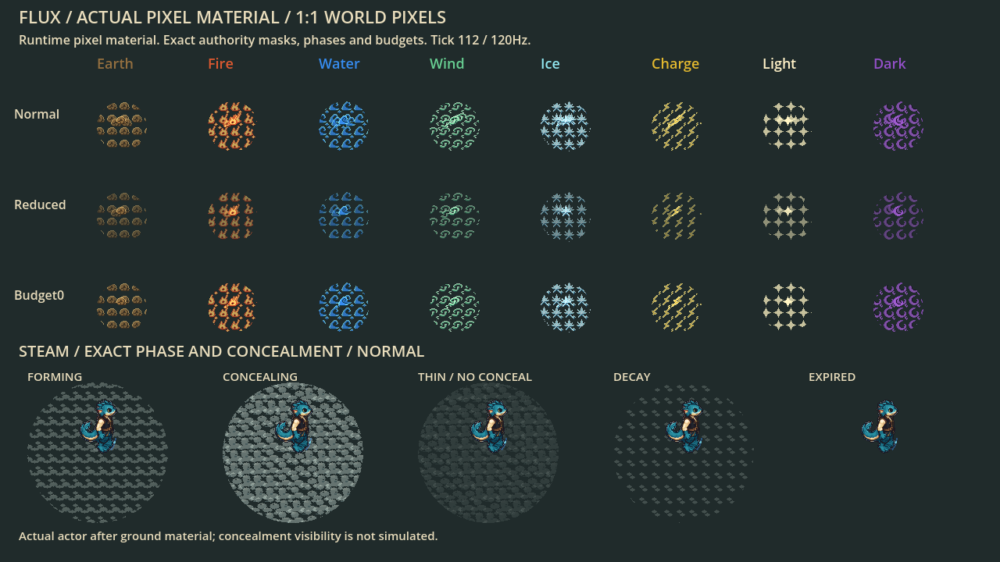
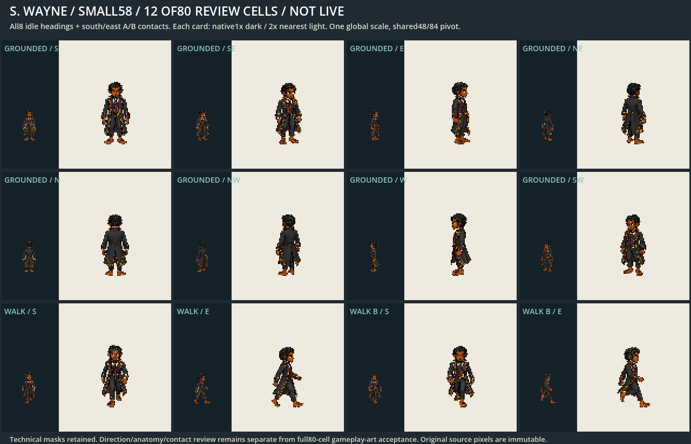
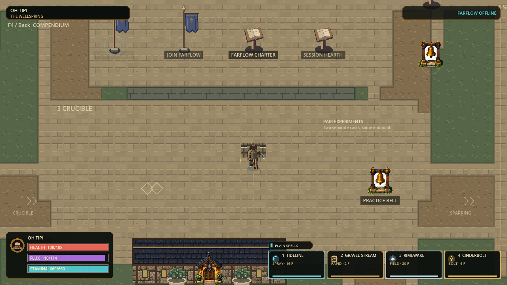
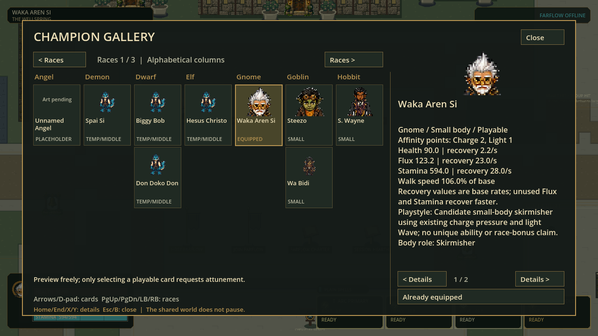

# FLUX

A movement-led, shared elemental magic sandbox for Windows: learn expressive
movement, configure hand-cast spells, combine temporary elements and play with
friends in the Wellspring.

**Current source: 29 playable profiles, 57 spells, active first-grade chemistry.**
All 29 profiles now use their matching Small / Middle / Large shared adventurer body
in gameplay and character selection. Names, races, stats and affinities remain
distinct; race-specific skins are retained as historical assets, not shown live.
Human movement/animation acceptance and later character skins remain in progress.
The shared bodies now wear warm charcoal/leather/gold clothing at 92% visual scale;
the source rig, hurtboxes and wall clearance are unchanged. Wellspring paving and
all eight basic magic animations use the same clearer pixel language. New finite
trail chemistry is an explicit gameplay change. Both players need this build.

**Current priority: distinct mirror reactions, starting with Earth cover/movement.**
The [next-slice plan](docs/MIRROR-AND-WORKSHOP-PLAN.md) then rolls out basic race
visuals and a larger interactive Wellspring. Planned mechanics are not already
in the verified portable; the measured runtime budget miss remains an open gate.
The Earth Rampart playtest is packaged; human movement/readability acceptance
remains open. Basic race silhouettes are queued after the mirror pilot series;
detailed named skins still need satisfactory shared-template/direction review.
Current body facing follows the cursor/controller aim independently of travel;
casting remains possible throughout voluntary movement, subject to spell startup,
cooldown, Flux and forced-control safeguards. The new
[three-size skeleton system](art_batches/character_style_v1/wireframe_motion_v2/README.md)
is the live shared foundation: 240 key-pose cells, 1,536 walking cells and 1,536 distinct
sprinting cells cover eight travel directions by eight aim directions by eight
stride phases per size. Nine textures are shared across the whole cast.
Opposed aim/travel uses backpedalling or strafing, not a twisted spine.
Hurtboxes depend only on size (15 / 18 / 21px); wall clearance is 18px for all.
The [playtest clarity checkpoint](docs/PLAYTEST-CLARITY-CHECKPOINT.md) separates
current verification from the retained [warm-style/trail checkpoint](docs/WARM-STYLE-TRAILS-CHECKPOINT.md),
[awareness checkpoint](docs/MOTION-AWARENESS-CHECKPOINT.md)
and [earlier template evidence](docs/CHARACTER-TEMPLATE-V2-CHECKPOINT.md).

The [new cast-look reference](reference/art/cast_style_post_templates_v1/README.md)
now informs live basic clothing, terrain and magic. Unique race/character skins
and final illustrative fidelity remain pending; a shared body is not a finished cast.
[Current race/facing rollout and readability checkpoint](docs/RACE-VISUAL-ROLLOUT.md).

## Game at a glance

| Aspect | Current game |
| --- | --- |
| World | Wellspring 3072x2304 campus; 9 districts, 12 stations; southern movement loop, wallrun line and wide return routes |
| Movement | Eight-way keyboard/continuous analog; sprint, jump, Float, slide, roll, air dodge, wavedash, wallrun/kick, redirect, fast fall, tech |
| Resources | Health, attack Flux, movement Stamina; independent quiet-time recovery |
| Spells | Seven families; 4 buttons across Plain/Ctrl/Alt = 12 individually configurable positions |
| Elements | Fire, Water, Earth, Wind, Charge, Ice, Light, Dark |
| Chemistry | 36 symmetric first-grade reactions; finite deposits, explicit extent/phase/counter |
| Characters | 29 playable entries; 30 identities including one reserved Angel; 3 body roles |
| Networking | Host-authoritative Farflow, offline or up to 8 same-build players |
| Engine | 120 Hz authoritative simulation; 60 Hz transport snapshots; Godot 4.7.1 |
| Performance | Known budget miss: eight-player empty-obstacle simulation p95 9.868-10.606 ms exceeds 8.333 ms, plus separate snapshot work; this is not rendered FPS or sustained 120 FPS certification |
| Feedback | Element-specific impact imprints; local cast/contact sound with volume/mute at Controls Lectern |
| Sight option | 55-degree ground-projected cone; 72px nearby awareness respects opaque cover; your own body is never masked |

The [current design contract](SPECIFICATION.md) owns scope. The
[single implementation queue](.agent/OVERHAUL-IMPLEMENTATION.md) owns next work.
Old checkpoint numbers and concept sheets are evidence/reference, not competing plans.

## Learn by doing

Start with one readable action, then combine it with another; the Wellspring is
a practice space, not a requirement to memorize the whole catalog.

| Try | What to notice |
|---|---|
| Walk, stop, jump, steer in air | Travel and aim are independent; jump gives height, not an automatic forward launch |
| Walk, hold Shift, release Shift | Sprint is now 60% faster than walking, with a longer stride and distinct lean; size modifiers still apply |
| Open F4 Movement; select Jump or Float | The opening protection window is not the same as total airtime; hold costs are additional |
| At the Spell Loom, equip Fire Bolt and Water Bolt in two slots | All characters can use both; twelve configurable positions do not require twelve different spells |
| Cast both at one nearby endpoint before the first matter expires | Two separate deposits combine into Steam; its active mist conceals distant actors, not projectiles, and deals no damage |
| Land a new shot on an older flight trail | Spend both casts' chemistry payloads for one reaction; sustained effects are shorter than terminal + terminal |
| Compare Bolt with Rapid | Bolt may leave narrow trail ingredients; Rapid never leaves flight trails, but still deposits terminal matter |
| Experiment inside the Crucible | A compact card explains live matter/reaction phase, remaining time, effect and counter; hidden during menus and rounds |
| Make Light + Light, then Fire + Water nearby | Radiance can reveal actors inside Steam; keep the two reaction origins in separate nearby cells so their active areas overlap |
| Compare Earth + Earth, then Fire + Earth | Rampart is active breakable movement/shot/ray cover and a wallrun/kick surface; Magma damages grounded enemies, so jumping is a relevant counter |
| Use the Practice Bell and change one choice | Refill resources/clear temporary effects; repeat before adding more spells or movement to the chain |
| Follow Canopy south into SOUTH MOVEMENT LOOP | Two-line hints follow your current bindings, grounded/wallrun/air/Float state and remaining Stamina; try the paid wallrun/kick line or simply walk around |
| Open Controls Lectern and compare elemental sounds | Default 30%; use header -/+ or brackets/LB/RB; 0/Start mutes; unmute restores 30% |

In **F4 Chemistry**, select the pair you want, then **Details**: the title,
effect/counter and warning/active/harmless-decay timeline all follow that pair.
Left/right or D-pad changes its second element without leaving Details.

Radiance and Steam stay **two independent reactions**, not a new chained recipe.
Use two Light Bolts at one nearby point, then Fire and Water Bolts about three
floor tiles to the side before Radiance ends. The Crucible card recognizes their
active overlap. Radiance must reach an actor: worldbone can block the reveal,
and leaving Radiance lets its short refreshed reveal expire. Steam still hides
only actors that satisfy its own concealment rules, never projectiles.
The southern movement card is also personal: it disappears in menus, on focus
loss, while spectating or during rounds. F4 retains the complete movement rules.

Sound is intentionally local and non-positional. Only your accepted casts and
on-screen, chemistry-visible contacts produce cues. Sight-cone mode suppresses
contact cues; casts remain audible. Menus, focus loss and spectating silence it.
The editable eight-element sound sketches need human listening acceptance.
The [current eight-player paid-load diagnostic](docs/evidence/playtest-clarity-runtime-v1/README.md)
preserves deterministic state but misses the CPU budget; it is not rendered FPS
or remote-play proof. The [earlier runtime comparison](docs/evidence/template-delivery-v1/runtime/BATCH-CANDIDATE.md)
remains historical evidence, not a timing result for this checkpoint.

## Install, play, update

**Latest local developer playtest:**
[Earth Rampart checkpoint](docs/RAMPART-M1-CHECKPOINT.md),
verified Full **95 suites / 537,802 assertions**, zero failures/stderr,
38 actual production-game captures, strict export/PCK identity verification
and isolated Windows release boot. Open
[flux2.exe](exports/windows-rampart-m1-p47-20260909/windows/flux2.exe)
with its adjacent `flux2.pck`. No editor or installation is needed for this raw
exported game. The previous refreshed installer was blocked by this PC's Windows
Application Control; this checkpoint is portable-only, with no installer retry
or policy bypass.
For the same current build in one archive, use the
[current portable ZIP](exports/windows-rampart-m1-p47-20260909/release/FLUX2-Windows-x86_64.zip), 97.7 MB;
extract it completely and keep its files together.

Quick comparison: walk with WASD, hold Shift to sprint and aim independently.
At the Spell Loom compare Fire Bolt with Fire Rapid: Rapid must leave no flight
trail; a new Water impact on older Fire matter makes Steam. Try the smaller
clothed bodies against the warm floor at different zoom levels. Follow the quiet
Commons -> Movement -> Crucible -> Sparring floor guides; hover resource/practice
cards for details and compare protection during Float, casting and expiry.
F8 still tests the optional cone. Both friends must use this same new ZIP;
matching protocol numbers alone do not establish matching content. Older builds
are retained. Human style/feel, physical two-PC play and sustained rendered
120 FPS remain unaccepted; the measured CPU budget miss is an active follow-up.

The latest installer with a passed isolated setup/update/repair journey is the
older [QV FLUX.exe](exports/windows-followup-p47-20260909/release/FLUX.exe), 96.8 MB.
It includes V Technique / Q Evade, protocol47,27 profiles and57 spells, but not
the newer shared-body, warm-style, finite-trail or reaction-batch changes.
It is a historical fallback, **not an installer for the current portable**.
[Exact fallback evidence](docs/evidence/template-delivery-v1/delivery/README.md).

| Action | One path |
| --- | --- |
| Play current build | Extract the current portable ZIP completely; open PLAY-FLUX.cmd, or flux2.exe with its adjacent flux2.pck |
| Play current build again | Open the same extracted current-build folder; an older installed shortcut does not select it |
| Update current portable | Close the game; extract a newer verified portable into a new folder and keep the prior folder; no automatic online update |
| Verify current local files | In PowerShell 7, run `pwsh -NoProfile -File scripts/current-checkpoint.ps1` from the checkout; exact payload and evidence hashes, no launch or download |
| Historical installer only | QV FLUX.exe installs/updates/repairs its older QV payload; its installed shortcut still opens that older build |
| Source play | Run `flux.cmd play` from this checkout |
| Host | Host Farflow station; UDP24872 |
| Join | Join Farflow; LAN discovery or host address; both players need the same build |
| Exit | Close normally; game saves local settings and closes its peer |

Unsigned development build: Windows may warn/block it; never disable security.
This is an **offline updater**, not automatic internet updating or a published
GitHub release. Internet hosting needs the host's UDP24872 router/firewall
arrangement or a private overlay. Physical two-PC acceptance remains open.
The new export passed a headless local Farflow lifecycle smoke through joining,
late spectator handoff, rounds, reconnect and rematch; its
[same-machine logs](docs/evidence/playtest-clarity-runtime-v1/farflow/host.log)
do not establish physical two-PC or Internet play acceptance.

[Current delivery pointer and exact hashes](docs/current-checkpoint.json) ·
[Current checkpoint and acceptance limits](docs/PLAYTEST-CLARITY-CHECKPOINT.md) ·
[Historical installer-policy boundary](docs/evidence/template-delivery-v1/final-delivery/README.md) ·
[Older verified QV portable ZIP](exports/windows-followup-p47-20260909/release/FLUX2-Windows-x86_64.zip)

The pointer selects one immutable verified checkpoint, not every unexported edit
in this checkout. `scripts/current-state.ps1 -Check` validates current source
facts and reports pinned delivery separately. Missing local exports are marked
unavailable; `scripts/current-checkpoint.ps1` succeeds only when all pinned
payloads and evidence are present and match. File verification is not a new
installer, engine, human or two-PC acceptance run.

## Controls and movement

Bindings are configurable at the Controls Lectern; the F4 compendium is a fixed
interface shortcut. Detailed costs/timings and effects are taught from runtime
data in-game. Modal panels block local gameplay input, not the shared world.
The current defaults are **V Technique / Q Roll-Air Dodge**. Only a complete,
untouched old default keyboard profile migrates automatically; custom keys,
partial profiles and explicit unbinds remain yours. Mouse/controller layouts do
not change. [Migration and older-build boundary](docs/QV-RUNTIME-CHECKPOINT.md).
Movement now opens as one 16-technique table; Chemistry as a complete 8x8 reaction
matrix. Select a row/cell for a short explanation, then Enter/controller A/Details
for complete rules. Values and rebound controls come from the current game data.
After a menu or Alt-Tab interruption, release and freshly press held paid
actions before using them again; directional movement may resume normally.

| Action | Keyboard/mouse default |
| --- | --- |
| Move / aim | WASD / mouse |
| Primary / active | Left / right mouse |
| Sprint | Shift |
| Jump / hold / airborne Float | Space or wheel up |
| Slide / hold / fast fall | C or wheel down |
| Roll / air dodge | Q |
| Wall/air technique / tech | V |
| Interact | F; contextual action may also use E |
| Spell positions | 1–4, Ctrl+1–4, Alt+1–4 |
| Speech / reset | Hold T / R |
| Guide / view options | F4 / F8–F11 |

Controller movement/aim use left/right stick; actions are remappable.
Current low jump clears low ground projectiles above 18 px, not beams/areas/blasts.
Float holds height while paid, with 1.8/1.5/1.2 s Small/Middle/Large limits.
Protection is finite and explicitly displayed; solid world stays solid.
Movement chain premiums reset after 333 ms and do not grant free speed/protection.
No vaulting or crest-superglide action is available.

## Spell Loom

62 validated effective records; 57 have runtime wire IDs. Five passive/gated
kit records are not selectable spells. Every character can configure every
shared spell; affinities are not a class lock.

| Element | Bolt | Heavy | Rapid | Wave | Spray | Beam | Field |
| --- | --- | --- | --- | --- | --- | --- | --- |
| Fire | Cinderbolt | Cinder Shell | Ember Stream | Cinder Fan | Ember Sweep | Cinderline | Hearthring |
| Water | Rillshot | Tide Shell | Rill Stream | Rill Burst | Tideline | Undertow Line | Springwell |
| Earth | Flintshot | Boulder Shell | Gravel Stream | Stone Burst | Shard Gale | Faultline | Stonehold |
| Wind | Gale Needle | Pressure Shell | Gale Stream | Gale Burst | Squall | Pressure Line | Updraft |
| Charge | Arc Primary | Thunder Shell | Spark Stream | Arc Burst | Spark Shower | Voltline | Static Snare |
| Ice | Rimeshard | Frost Shell | Sleet Stream | Rime Burst | Sleet | Frostline | Rimewake |
| Light | Dawn Needle | Dawn Shell | Glint Stream | Prism Burst | Radiant Veil | Pocket Eclipse | Halo Ground |
| Dark | Eclipse Disc | Night Shell | Gloam Stream | Eclipse Burst | Gloam Breath | Nightline | Umbral Pool |

Vector Lance is the additional Charge Bolt variant. Wave is the simultaneous
five-lane Burst, not a delayed volley. Every attack spends positive Flux.

## Elements and chemistry

| Element | Terminal / trail lifetime | Material read |
| --- | ---: | --- |
| Fire | 4 / 1.1 s | Orange pointed tongues/sparks |
| Water | 5 / 1.4 s | Blue rounded ripples |
| Earth | 5 / 1.5 s | Ochre angular stones |
| Wind | 3 / 0.8 s | Pale mint directional ribbons |
| Charge | 3 / 0.8 s | Yellow branching sparks |
| Ice | 5 / 1.4 s | Cold faceted crystals |
| Light | 4 / 1.2 s | Ivory/gold stars and rays |
| Dark | 4 / 1.3 s | Violet/ink inward wisps |

Bolt/Heavy/Rapid/Wave leave deposits at their actual terminal position while their
chemistry payload remains unspent. Bolt/Heavy/Wave can also leave optional 16px
trail ingredients; **Rapid never leaves flight trails**. Terminal radius is 24-32px.
Plain matter is not damage or a status. Different casts can combine; siblings
from one Wave cannot. Beam/Spray/Field currently do not deposit.
Trail + trail never reacts. A new terminal can combine with an older trail for
60% sustained active time (instant windows unchanged). Each contributing cast
spends its whole chemistry payload once: leftover fragments disappear and a
still-flying projectile cannot refill them, but retains its direct attack damage.
Four trails per owner / 32 globally share the existing 16/128 material caps;
reserved paid terminal slots take priority over optional trails.
Existing trails still occupy material capacity until spent/expired, so they can
temporarily reduce room for another five-projectile Wave; Rapid avoids that
flight-trail overhead.
Only active reaction phases apply effects; reduced visuals never change rules.
Sustained active windows are about 25% longer, allowing more pulses if you remain
inside a damaging hazard. The five instant reactions retain their short windows;
all reactions still expire within five seconds including formation and decay.
Impacts have 1.5x finite playback and a stronger element imprint, without growing
their hit radius. The [live basic-element refinement](art_batches/magic_style_v3/README.md)
updates 112 normal/reduced sequences with editable pixel sources; reaction art
remains a separate next acceptance slice.

| + | Earth | Fire | Water | Wind | Ice | Charge | Light | Dark |
| --- | --- | --- | --- | --- | --- | --- | --- | --- |
| **Earth** | Rampart | Magma | Mud | Dustfront | Permafrost | Grounding Network | Crystal Prism | Blightsoil |
| **Fire** | Magma | Conflagration | Steam | Firestorm | Thermal Shock | Plasma Arc | Solar Flare | Cinderveil |
| **Water** | Mud | Steam | Flood | Mistcurrent | Freeze | Conductive Flood | Mirrorwater | Blackwater |
| **Wind** | Dustfront | Firestorm | Mistcurrent | Vortex | Hailstream | Ion Storm | Lightbend | Shadowdraft |
| **Ice** | Permafrost | Thermal Shock | Freeze | Hailstream | Glacier | Superconduct | Crystal Lens | Black Ice |
| **Charge** | Grounding Network | Plasma Arc | Conductive Flood | Ion Storm | Superconduct | Overload | Arcflash | Static Shroud |
| **Light** | Crystal Prism | Solar Flare | Mirrorwater | Lightbend | Crystal Lens | Arcflash | Radiance | Penumbra |
| **Dark** | Blightsoil | Cinderveil | Blackwater | Shadowdraft | Black Ice | Static Shroud | Penumbra | Umbral Field |

The 36 pairs are symmetric. Steam conceals without damage; Black Ice slows without
friction changes; Mirrorwater observes rather than reflects; Solar Flare/Radiance
reveal without healing. Worldbone stays immutable. Earth + Earth Rampart alone
adds temporary movement collision and wallrun/kick faces; its warning/decay are
permeable, and an overlapping actor can escape. Other temporary cover still
blocks shots/rays, not walking. Use **F4 -> Chemistry** for precise outcomes/counters, not name-based
assumptions. Recursive chemistry and additional elements are outside current scope.

Color identifies the element, not an automatic status: distinguish the spell's
impact, harmless leftover matter and an active reaction. The four additional
palette families retained in tooling are reserved styles, not selectable elements.

## Cast, three sizes, one motion system

[Complete race/character/affinity/stat table](docs/CURRENT-CAST.md).
Alphabetically ordered race columns, hover details and host-confirmed selection
are available in the Gallery. Switching character restores that character's
starter kit while preserving resource percentages; selecting the same character
is a no-op. No unique racial passives are implemented.

| Body | Playable count | Pixel envelope | Hurt radius | Baseline |
| --- | ---: | ---: | ---: | --- |
| Small | 8 | 53 (58 source) | 15 px | S. Wayne; faster tempo, less Health/Stamina |
| Middle | 9 | 63 (68 source) | 18 px | Oh Tipi; balanced reserves |
| Large | 10 | 70 (76 source) | 21 px | The Red Baron; deeper reserves, slower tempo |

Shared 96 px cells/pivot (48, 84), eight directions, stable scale, independent
shadows/effects and universal movement access. All sizes keep 18 px wall clearance;
hurt radii are fixed per size and never resize with animation. Original Oh Tipi supplies the
style; all casting is empty-handed. Unique sprites require genuine anatomical
contacts and complete reviewed pages, not palette swaps or portraits.


[Current sprite production contract](docs/SPRITE-PIPELINE.md) ·
[Visual direction](docs/VISUAL-DIRECTION.md)

<details>
<summary>Historical material-rendering and character review evidence</summary>

The material sheet uses the live renderer at native world-pixel scale; Steam
phases are explicit diagnostic fixtures, not a simulated multiplayer session.



Separate range outlines are removed from deposits/reactions, Field and Spray.
Material itself is tiled inside the actual area. Reduced Field contrast and
visible tile repetition still need visual acceptance; [current checkpoint](docs/MATERIAL-HURTBOX-CHECKPOINT.md).

The earlier S. Wayne **12/80-cell pilot below is historical**, superseded by his
complete80-cell historical source page, itself now replaced live by the shared
adventurer body. Original sources and exact reviewed background-removal
masks remain preserved; this old image is not evidence for the newly promoted sheet.



[Cleanup, evidence and remaining work](docs/CLEANUP-ART-CHECKPOINT.md).

</details>

## Actual game and validation

Latest source playtest: [Earth Rampart checkpoint](docs/RAMPART-M1-CHECKPOINT.md).
Full **95 suites / 537,802 assertions** passed with zero failures/stderr,
38 actual gameplay captures, strict export/PCK identity, same-export localhost
Farflow lifecycle and isolated Windows EXE/PCK boot. The builder verified 3,083 frozen source/package files remained
unchanged. All 29 profiles use three shared clothed bodies; individual skins await
human template/movement acceptance. The eight-player simulation CPU budget miss
and actual-map rendered performance remain open. A new installer has
not been attempted; the older QV installer is the last one with completed
isolated setup/update/repair checks.



<details>
<summary>Earlier named-skin and delivery checkpoints (not the current live body)</summary>




| Checkpoint | Evidence |
| --- | --- |
| Prior cast source | 90 suites /398,091 assertions; local Farflow and actual Gallery captures |
| Prior Windows delivery | 16 installer stages /20 native argv assertions; isolated install/update/repair/boot |
| Prior cleanup/art source | 87 suites / 398,314 assertions, clean import/120 Hz boot; actual Windows PCK checked; [checkpoint](docs/CLEANUP-ART-CHECKPOINT.md) |
| Prior input/Gallery refinement | 87 suites / 398,436 assertions, clean import/120 Hz boot; [checkpoint](docs/INPUT-LIFECYCLE-CHECKPOINT.md) |
| Prior material/hurtbox refinement | 87 suites / 419,354 assertions, clean import/120 Hz boot; [exact changes and playtest](docs/MATERIAL-HURTBOX-CHECKPOINT.md) |
| Verified four-page character checkpoint | Full87/419,622 passed with strict import/120Hz boot; actual local pair and Windows payload verified; [exact coverage and evidence](docs/CHARACTER-PAGES-CHECKPOINT.md) |
| Historical five-page character source | Final Full: 87 suites / 419,651 assertions, zero failures/stderr; strict import/120 Hz boot, 84.856s. Isolated Windows release EXE/PCK also booted as Jan Wicked. Not a new installer. [Evidence](docs/CHARACTER-PAGES-CHECKPOINT.md) |
| Open | Unique full-cast art, human feel/charm, mixed 8-player timing, physical remote play, signing/online updates |

</details>

## Develop and extend

[AI delegation research and current preparation wave](docs/AI-DELEGATION-RESEARCH.md)
documents five reusable specialist roles, the verified optional local coding
model, and the active 33%-remaining weekly work limit. Developer AI tools are
not required to install or play FLUX.

```powershell
.\flux.cmd play
.\scripts\current-state.ps1 -Check
.\scripts\test.cmd -Tier Focused -Suite cartoon-champion-presenter
.\scripts\test.cmd -Tier Full
.\scripts\package.ps1 -Target Windows -ExportRoot C:\path\to\new-build
```

Use the suite IDs printed by `scripts/test.ps1 -ListSuites`; no implicit partial
Full pass. Source/content/presentation stay separate. Reuse validated data and
fixed registration; add no identity-specific simulation or second animation
stack. Test exact touched paths, inspect actual visuals and retain a working
checkpoint. No automatic push or publication.

Archived obsolete producers cannot return: `scripts/check-current-scope.ps1`
guards their absence/dependencies. The cleanup's recovery copies are outside
the repo; current source, tests, usable assets and necessary migrations remain.
