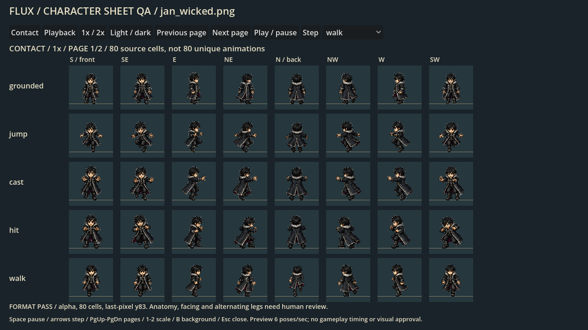
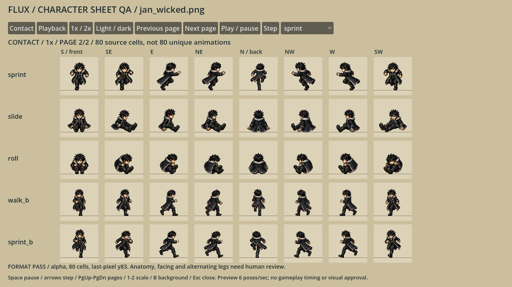

# Jan Wicked — unique Middle Human source candidate

Status: **complete 80-cell page, now active in the live source override registry after parent import/review; not final human visual/animation acceptance.** The unchanged candidate PNG is copied to `assets/sprites/champions_v3/style_v1/jan-wicked-v1.png`; `content/visual/champion_page_overrides_v1.json` pins the exact PNG/decoded-RGBA hashes below. Source promotion is not an installer update or five-page exported-build proof; the final cross-baseline clone-guard/Full checkpoint remains pending.

Current identity was verified in `foundation_champions_v1.json`, `CURRENT-CAST.md`, `front_cast_v2/PROMPTS.md` and the official `cast_sheet_v4` image/data: Jan Wicked, Middle Human, Ice 1 / Dark 1 / Charge 1. Pale skin, tousled black hair, clean-shaven face, charcoal/midnight-blue practical coat, silver clasps/collar, subtle plum lining, dark trousers/boots and empty bare hands. No weapons, staff, elemental objects, spell effects or environment are baked into the body.

## Candidate and evidence

| Property | Value |
|---|---|
| Complete sheet | `candidate-v2/jan_wicked.png` |
| PNG SHA256 | `a5847208c1cbf9ab2183006b0b918470efba0389207e436c0d2a4c4df3e119b2` |
| Decoded RGBA SHA256 | `d977c61a68d19cb5ac1426077fd64789ed940e3bd9166ed8e0168bf419379e0e` |
| Dimensions / cells | 768×960 RGBA8; 80 cells, each 96×96 |
| Middle reference / pivot | 68 px neutral standing; (48,84) |
| Actual decoded feet | Last opaque pixel **y83 in all 80 cells** |
| Alpha / clipping | Binary alpha; no empty or edge-clipped cells |
| Directions per row | S, SE, E, NE, N, NW, W, SW |
| Rows | grounded, jump, cast, hit, walk A, sprint A, slide, roll, walk B, sprint B |





### Important remaining acceptance limits

**Several northeast/northwest action poses remain too profile-like rather than clearly rear-diagonal; these headings still need refinement.** They are not silently marked finished because the eight direction slots exist. Walk has brisk/high-knee contacts, the coat shading and stride amplitude differ slightly between boards, and roll is only one compact tucked/seated pose per direction, not a full rotation. Walk/sprint are two-contact cycles rather than fully authored multi-frame animation clips. The parent approved an initial source playtest while preserving these limits, not final feel or human visual acceptance.

The useful improvement over candidate-v1 is genuine opposed north foot plants, distinct front A/B contacts, and clearer profile trailing-versus-planted leg silhouettes. Front cast/hit/slide remain square to the camera, the costume/black-haired identity is readable at native size, and empty hands are retained.

## Sources and technical assembly

Exactly **four built-in image-generation calls** were used. All original PNGs and complete prompts are retained; no API/CLI fallback and no additional generation in this attempt. Identity image: `reference/art/cast_sheet_v4/flux-cast-28-three-sizes.png`, Jan at row 3 / column 5; Jan-specific source prose is in `reference/art/front_cast_v2/PROMPTS.md`. Original Oh Tipi is a pixel-rendering style reference only, not a source for Human anatomy or held equipment.

| Immutable source | SHA256 | Candidate-v2 usage |
|---|---|---|
| `actions-v1.png` | `26014d91478976b7468aa2ac8ea67aca5f08d408bd5d59ce2246078753f1464a` | All 40 neutral/action poses |
| `gaits-roll-v1.png` | `6ad079258b4b31805aa2a6972413a69215cfba307117477bfa2218cb79b0fcca` | 22 gait-A/roll poses; weak B/north contacts rejected |
| `gait-b-contact-v2.png` | `c25cf7b187754681b3d664014a4084d403aebd68bb986ebec96ea41c05def14f` | 14 reverse contacts, excluding north |
| `north-contacts-v2.png` | `a095e723b54d326fee2118c166518d0a16589634106a221cb2ccd6c07279dafc` | Four explicitly opposed north contacts |

`source-layout-v2.json` records all 80 semantic cells using per-row measured whitespace crops and one-pixel margins, not an assumed equal grid. The original action neutral is 178 px high. Both main boards share the same source scale; reverse contacts use one uniform 306/178 calibration and the north board one uniform 494/178 calibration. The shared final Middle scale is 68/178. All poses on each source board share their factor: no per-pose fitting, anatomical warping or motion synthesis. `reference_cell_width` expresses this page-wide normalization, not literal correction-board spacing.

The generated pages had an opaque neutral checker despite the alpha request. The existing assembler performs explicitly user-authorized, source-SHA-locked **edge-connected matte extraction** and nearest sampling. Exact per-page removal masks and their hashes remain in candidate-v2. Originals are never overwritten; no global white removal is used. The final interior-neutral audit found one 38-pixel component at source `(437,542)` in sprint/east. Its enlarged source crop proves it is silver coat-hem trim, so **all of it was preserved**; no enclosed pixels were erased. `inspect_matte_crop.gd` only creates read-only inspection evidence, never production pixels.

Candidate-v1 remains a comparison/recovery artifact with uncorrected contacts; it is not the selected sheet.

## Executed checks and review commands

| Check | Result / evidence |
|---|---|
| Strict generic assembly | `candidate-v2/pack-check.log`: 80/80 poses, fixed Middle scale, source hashes verified |
| Standalone QA contract | `candidate-v2/qa-contract.log`: **353 assertions, 0 failures**, stderr empty |
| Actual Godot rendering | `.godot/character-qa/6d84fba91ea04e008d50beb0b53eda6d/`: 32 native/2× light/dark PNGs; source unchanged |
| Candidate admission | `candidate-v2/review-report.json`: binary alpha; baseline83 across80; no blank/clipped cells |
| Interior-neutral audit | `.godot/jan-matte-filtered-0.log` through `-3.log`; read-only; no accidental silver-trim erase |
| Source crop | `sprint-east-source-review.png`; nearest 4× inspection, not runtime artwork |

No full suite, live character swap, installer build or gameplay-mechanics change is claimed by this source-only lane.

From the repository root:

```powershell
.\scripts\review-character-sheet.ps1 -Sheet '.\art_batches\character_style_v1\jan_wicked\candidate-v2\jan_wicked.png' -Mode Check
.\scripts\review-character-sheet.ps1 -Sheet '.\art_batches\character_style_v1\jan_wicked\candidate-v2\jan_wicked.png' -Mode Export
```

Rebuild with `scripts/build_character_style_pack.gd`, `--spec=res://art_batches/character_style_v1/jan_wicked/source-layout-v2.json`, and a new, non-existing output folder under this directory. Do not overwrite prior evidence.
