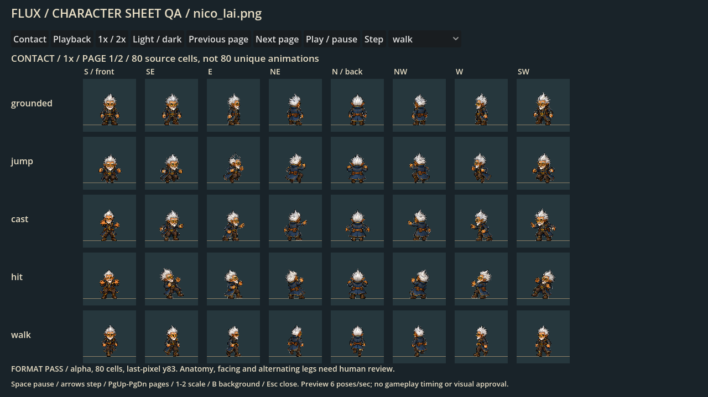
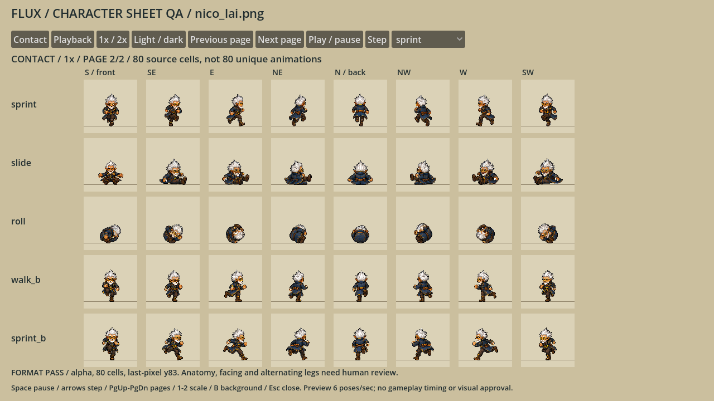

# Waka Aren Si — unique Small Gnome candidate

Status: **complete80-cell page promoted by the parent for source playtest** after native review and exact-alpha import. The live copy is `assets/sprites/champions_v3/style_v1/waka-aren-si-v1.png`, registered under stable ID `nico_lai`. This art lane itself did not change runtime files; human visual/feel acceptance remains open, and the old installer is unchanged.

The current display name is Waka Aren Si; `nico_lai` is the stable technical ID. Charge 2 / Light 1 does not appear as magic baked into these body sprites. Identity: swept white hair, short white beard, tan skin, pointed ears, round brass spectacles, navy/brass coat, dark trousers/boots, empty hands.

## Review and reuse

| Item | Current candidate |
|---|---|
| Sheet | `candidate-v2/nico_lai.png` |
| PNG SHA256 | `696ecc86eb1469463c8b7e235cf36c576853c57686c23ff2ac0cbd39fc2da96b` |
| Decoded RGBA SHA256 | `a981ec157cacfd6c72904fa21e6c986a0c6a175309ed69861069d2124321ee10` |
| Dimensions / cells | 768×960 RGBA8 / 80 cells of 96×96 |
| Small-body reference / pivot | 58 px neutral standing / (48,84) |
| Actual decoded baseline | Last opaque pixel y83 in all 80 cells |
| Alpha / clipping | Binary alpha; no empty or edge-clipped cells |
| Directions, every row | S, SE, E, NE, N, NW, W, SW |
| Rows | grounded, jump, cast, hit, walk A, sprint A, slide, roll, walk B, sprint B |
| Runtime impact | None: no catalog, presenter, gameplay or network file changed |





These are **80 source poses, not 80 complete independent animation clips**. Walk and sprint each have two supplied contacts per direction; other rows contain one pose per direction. Existing runtime motion would remain a separate integration concern.

### Visual findings

The corrected south cast, hit and slide now face directly toward the camera instead of drifting diagonally. South/north walk and sprint contacts visibly swap the planted and lifted boot. The profile and diagonal reverse poses have clearer bent trailing knees and separation than candidate-v1. Hands remain empty, and the white hair/brass spectacles/navy coat identity is visible at native size.

Remaining polish concerns: walk B has a brisk high-knee contact; correction pages have slightly thinner gait silhouettes and brighter face/beard shading than the original page; small yaw/microdetail variation remains, and profile contact separation is more obvious in sprint than walk. The roll row is one compact tucked pose per direction, not a complete rotation. These limitations are not cleared by alpha/baseline tests or this contact sheet. Parent independently reviewed all 80 cells plus native walk/sprint A/B and approved source-playtest promotion with these limits retained; two-contact cycles are not final human animation acceptance.

## Immutable sources and bounded generation

Four built-in image-generation calls were used; no API/CLI fallback and no more generation in this attempt. Original generated files remain both in the generation output directory and here. Full prompts are in `PROMPTS.md`.

| Source | SHA256 | Final usage |
|---|---|---|
| `full-page-v1.png` | `302ad2fa11fc5717c69cf52b8ccd4de437a0b68c04418c6f5a8a42dd5c47e067` | 45 original poses |
| `gait-rejected-repeated-contacts-v1.png` | `428dcaee69b67072bbbaa3e2fbfc60ad632077e6306cd51403eccc56b4f53a91` | 16 A poses; repeated B rows rejected |
| `gait-b-contact-v2.png` | `1ab327d1f96f9958e0363a0e2fbd55e37e8a25f75fe405c4d6d796495689b39b` | 16 reverse-contact poses |
| `south-actions-v2.png` | `ea3fd4c0a231b76994642df7fb5ff26c2e729a6fb1e043471c96dbdd7ca20e03` | 3 front-axis action corrections; neutral calibration pose unused |

Identity reference: `reference/art/front_cast_v2/10-waka-aren-si.png`, SHA256 `fc19f0e55d56b4daca9b65d414921fda0e92a91b82df246364b21c38cc4630f6`.
Style reference: `reference/art/oh_tipi_authority_v1/oh-tipi-authoritative-reference.png`, SHA256 `d50ed37439cc788dd36d1a8216d3621c034d1d7cc68d91200fdd4bafd25ee106`. Oh Tipi supplies pixel style only, not anatomy, weapons or effects.

### Technical cleanup and registration

All rectangles in `source-layout-v2.json` are measured from source whitespace **per row**, with a one-pixel matte border; no assumed equal source grid. A first two-pixel-border attempt overlapped adjacent row margins and was rejected before writing an atlas. The corrected layout is nonoverlapping.

The generated sources contained an opaque checker despite the alpha request. User-authorized, source-hash-locked **edge-connected neutral matte extraction** is performed by the existing generic assembler; the four exact pixel-removal masks and hashes are retained in candidate-v2. No global white removal, enclosed-component erasure, anatomy synthesis, painted pixels or per-pose scaling is used. A read-only interior-neutral audit preserved white hair, beard and cuffs; neutral components are not automatically background.

The original neutral source is 128 px tall. Source-wide calibration factors are 236/128 for the A page, 296/128 for the B page, and 621/128 from the unused neutral south-action reference. All poses on each page use one uniform factor, followed by the same 58/128 Small-body scale; `reference_cell_width` expresses this normalization, not literal correction-page grid pitch. The assembler registers actual surviving nearest-sampled pixels to y83. Original anatomy/shading differences are not compensated per pose.

## Executed checks

| Check | Evidence |
|---|---|
| Generic source/pack build | `.godot/nico-pack-v2.log`: 80/80, one Small-body scale, source hashes verified |
| Standalone strict QA model | `.godot/nico-qa-contract-20260908.log`: **353 assertions, 0 failures**, no warnings |
| Real Godot visual export | `.godot/character-qa/f8eaa856276749fdaa82d0f607eb3aa4/`: 32 PNGs, source unchanged, native/2× light/dark |
| Candidate report | `candidate-v2/review-report.json`: valid, zero baseline mismatches, zero partial-alpha pixels |
| Interior matte audit | `.godot/nico-matte-filtered-0.log` through `-3.log`; no pixel edits |

Candidate-v1 and its mask remain as original comparison/recovery material. The earlier inherited inspector emitted an expected export-incompatible `Image.load_from_file(res://...)` warning; the local read-only inspector decodes PNG bytes and the four final inspection runs were warning-free. No full suite, installer rebuild, live character swap or play-feel acceptance is claimed here.

From the repository root:

```powershell
.\scripts\review-character-sheet.ps1 -Sheet '.\art_batches\character_style_v1\nico_lai\candidate-v2\nico_lai.png' -Mode Check
.\scripts\review-character-sheet.ps1 -Sheet '.\art_batches\character_style_v1\nico_lai\candidate-v2\nico_lai.png' -Mode Export
```

For a fresh non-overwriting rebuild, run `scripts/build_character_style_pack.gd` with `--spec=res://art_batches/character_style_v1/nico_lai/source-layout-v2.json` and a **new** output directory under this folder.
