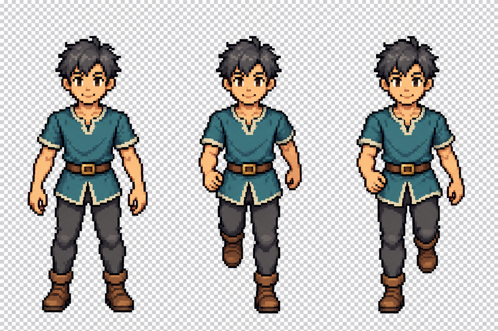

# Small South pilot v2 — held source candidate

Date: 2026-09-09. Status: **HELD**, agent review only. One built-in image-generation attempt; no retry, raster cleanup, assembly, runtime import or promotion.

The bounded request was one common-scale South board with grounded calibration, walk A (anatomical left support) and walk B (anatomical right support). This is not a complete template, an approved contact pair or a live game sprite.

## Evidence

- `source-original.png` is the immutable, byte-identical copy of the generated result, 1536 x 1024, SHA256 `85089fa23a7b1ecd31e48e11afba4107c40935321a0cd1eaf1ea67e54c3c7d90`.
- `prompt.txt` preserves the complete generation prompt and labeled reference roles. SHA256 `d12014a8770bc009e8d86b177c8b3d4825e3a2c932ea4003521626067e98a959`.
- `candidate-review.json` records the held decisions and exact reference hashes. It is a source-review record, **not** the production 80-cell admission receipt.
- Generation used the built-in tool, not API/CLI fallback. Default original remains at `C:/Users/sende/.codex/generated_images/01a0836d-f64f-7f61-84a8-d1ec30b09d04/exec-8d1fac9e-a593-41bd-9e70-22b089d2c03d.png`.

## What the source actually shows

The three figures preserve broadly similar frontal head/torso silhouettes and the neutral teal-tunic, charcoal-trouser, brown-boot wardrobe. Hands are empty; no race-specific traits, weapons, magic, floor shadows or new identity are present.

The legs visibly exchange extended/lifted roles. In the middle pose, the viewer-right leg extends to the lower baseline and the viewer-left boot lifts. In the right pose, those visible leg roles exchange. That is useful source evidence, but it is not sufficient to accept the whole gait.

**The arms do not form a defensible opposite pair.** Both walk poses retain a bent viewer-left arm/hand near the waist. Walk B does not clearly exchange the anatomical arm counter-swing from A; its viewer-right arm hangs further down instead of becoming the required forward counterpart. Different leg pixels alone do not pass the shared contact policy.

**Transparency failed.** A read-only System.Drawing inspection reports `Format24bppRgb`, not an alpha-bearing pixel format. The entire source is consequently opaque; the checkerboard is painted into the image, not a transparency viewer background. Pixel `(0,0)` is `[253,253,254,255]`. No global white removal, matte extraction or alpha fabrication was attempted.

The camera reads frontally, but this source has not established calibrated 55-degree elevation. Head/torso dimensions look broadly consistent at full source scale; exact bone length, ordinary-cranium ratio and 58px readability have not been certified. No per-pose fit or independent pose scale was assigned. There is no native 96px-cell registration proof, last-opaque-row83 proof or fixed48/84 pivot proof because the original fails source admission first.

## Gate decisions

| Gate | Result |
|---|---|
| Generic neutral identity and empty hands | Observed in this source; not a new roster identity |
| Frontal South cues | Frontal at source scale; exact camera calibration still pending |
| Same-board standing scale reference | Present, but no approved scale/crops assigned |
| Alternating leg silhouettes | Observed; does not certify complete anatomical contact quality |
| Opposite arm counter-swing | **Held**: same viewer-left arm bias in both contacts |
| Real transparent alpha | **Failed**: opaque RGB with painted checkerboard |
| Native58px anatomy and96px-cell registration | Not run; no accepted atlas generated |
| Full8-heading/10-row coverage, gait playback and human acceptance | Not attempted; remain open |
| Runtime/source assets, installer, commit and push | Unchanged by this art attempt |

## Deliberate stop

This lane stops at the one authorized generation attempt and review. A later independently authorized attempt would need to exchange the arm counter-swing explicitly and return real alpha, while preserving the same common-scale standing reference. Existing production art remains untouched. Do not promote this board, mark any of its three cells approved or count it toward completed template coverage.
