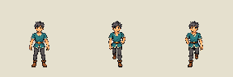

# Small South contact pilot v3 - held partial candidate

2026-09-09. Three poses only: South stand, Walk A and Walk B. **Not live,
not an80-cell template, and not user animation acceptance.**

| Review | Result |
|---|---|
| First generated board | Rejected: both walking poses repeated the same leg/arm contact |
| One targeted correction | Root and independent reviewer agree that both leg support and arm swing now exchange sides; head/torso still read South |
| Technical assembly | Shared production assembler, three96px cells, one real standing-derived scale; all occupied heights58px and feet end at84 |
| Matte | Opaque painted checker, not genuine alpha; reviewed edge-connected cleanup retains the immutable original and exact removal mask |
| Blocking visual defect | Enclosed checker islands remain in the bent-arm/body gaps; exterior transparency alone is insufficient |
| Additional cautions | Face/hand detail is busy at native size; high-stepping contacts need actual distance-driven playback review |
| Promotion | HELD; no runtime registry, character catalog, installer artwork or gameplay changes |

## Native and enlarged inspection

Stand / Walk A / Walk B, at actual58px body height:

Dark background reveals the enclosed matte defect; enlargement is nearest-neighbor:

The pose heights and fixed pivot pass [technical review](review-v1/technical-review.json).
Different frame hashes do not prove natural walking. A partial288x96 strip must
never be presented to an80-cell runtime atlas as though missing poses existed.

## Reproducible source and generation

Mode: built-in image generation followed by one targeted built-in edit. The
image-generation skill kept both outputs immutable and required inspecting the
result before any promotion. The user's specific background-removal/assembly
authorization permits the existing deterministic assembly, not fabricated poses.

- [Initial prompt](prompt.txt) → `source-original.png` (rejected repeated contacts).
- [Final correction prompt](correction-prompt.txt) → `source-corrected-v1.png`.
- Corrected source SHA256: `97f1cf793f43f8a1c7126f08972e9cacbdfa070c2501db1f8af1a1baaf4ee5ac`.
- [Source layout](source-layout.json) locks source hash, explicit512x1024 crops and reviewed matte rule.
- [Assembly manifest and exact removal-mask hash](review-v1/manifest.json).
- [Proof runner](review-proof.gd), adapted from the existing South v1 proof.

The first proof-helper attempt used an unavailable static hashing call and failed
to parse. It is not acceptance; the corrected helper reuses the existing importer
hash function and passed with empty stderr. Logs are retained with this pilot.

Next: source-hash-locked repair of only the identified enclosed background or a
genuine-alpha source correction; recheck skin/trim/negative spaces against both
tones, then distance-driven A/B playback and the Small rear-quarter pilot. Do
not mass-generate directions or start Middle/named-character pages from this hold.
