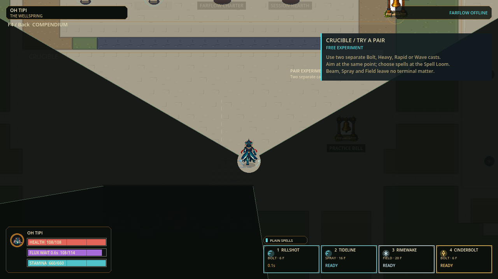
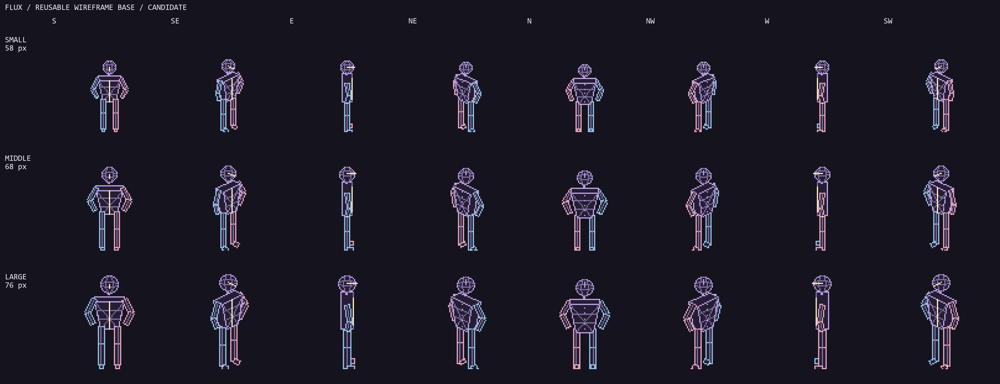

# Cursor facing, cone and three-size wireframe basis

Status: local verified source/playtest; candidate wireframe art; 2026-09-09.
Uncommitted and unpublished. Existing live characters and older builds retained.

Historical checkpoint: the later explicit live skeleton request supersedes this
page's candidate-only restriction. See the [shared skeleton checkpoint](SKELETON-MOTION-CHECKPOINT.md)
for the new body mapping and latest playtest; the evidence below remains unchanged.

## Play

Open [current flux2.exe](../exports/windows-aim-cone-p47-20260909/windows/flux2.exe)
with its adjacent PCK, or extract the entire [portable ZIP](../exports/windows-aim-cone-p47-20260909/release/FLUX2-Windows-x86_64.zip).
Both contain the new facing and cone behavior. No new installer was attempted;
the prior custom-installer Application Control block is not bypassed by this task.
The ordinary exported Godot executable boots without the unsupported `--path`
option; that rejected first invocation remains recorded, followed by the clean
normal boot. [Payload hashes and result](evidence/aim-cone-v1/checkpoint.json).

## Behavior

| Area | Current implementation | Preserved boundary |
|---|---|---|
| Facing | All live poses use cursor/controller aim at the8 authored headings, immediately, without turn easing or a pending-cast visual latch | Does not alter movement-facing, neutral evasions or locked shot endpoint/aim |
| Moving casts | Walk, sprint, jump, Float, slide, roll, air dodge and wall movement permit casting; movement silhouette stays visible | Flux/capacity/own cooldown, one occupied startup, forced control, UI/death/spectator safeguards remain |
| Gait | Forward/backward/left-strafe/right-strafe cadence derives from aim versus travel | Distance cadence, body scale, interpolation history and protection clocks unchanged |
| Cone | Uses same immediate aim; viewport-covering radii include polygon chord margin; screen-covering range skips96 outer annulus quads |15-360degree settings, range, full-view default, toggles and building shadows unchanged; no new information leak |
| Body basis | Three transparent geometric wireframe atlases, sharing existing fixed-bone source and editable landmarks | Candidate-only, no live race/character replacement or new simulation body |

Casting was already permitted during voluntary movement. The new combat matrix
protects that seam rather than changing balance:66 body/raw-mode combinations
exercise real cast starts, exact Flux payment, retained Stamina and movement
commitment. Compatibility-only mode values in the test do not enable retired
moves; independent ControlState gates still govern forced control.

## Verification

| Gate | Evidence |
|---|---|
| Full |91 suites /464,036 assertions /0 failures /0 stderr,81.275s; [receipt](evidence/aim-cone-v1/full-receipt.json) |
| Presenter |42,670 assertions, all live profiles/8 headings/actions; opposed aim/travel, locked-cast separation and no authority mutation |
| Combat |25,288 assertions including the expanded paid-cast matrix and existing refusals |
| Cone |76 assertions covering wide/tall/4K, translated viewport/offscreen origin,50/75/100%zoom and polygon-corner coverage |
| Render |6 actual game frames, three bodies moving east while aiming north/south; full/cone views; render sampling preserves canonical state |
| Settings |Transient capture harness; actual saved preferences SHA remained9205fa0f59683dc2ec17c33d01e458f3af9cb6d1854f16a9ce4e9e8a6e538cb0 |
| Delivery |Strict export with empty stderr;184 authored source records unchanged; isolated exported game boot at120Hz/protocol47 |

Initial tests exposed historical movement-facing fixture expectations. Those
fixtures now explicitly supply aim; the separate opposed-facing matrix remains
opposed. No failing tests were deleted or production authority changed to force
old expectations. Automated/render checks do not certify human smoothness,
physical networking or sustained120FPS. Cone draw-call reduction is structural,
not a new frame-time benchmark.

## Reusable body prototype

[Editable source, atlases and evidence](../art_batches/character_style_v1/wireframe_base_v1/README.md):
240 cells;96x96/pivot48,84; south heights58/68/76; binary alpha;2,400 fixed-bone
and384 opposite-contact checks. Ten key/contact poses are **not** complete smooth
animation clips. Profile torsos are intentionally spare; volume, foot contacts
and native-scale playback require refinement before runtime adoption. Existing
character art remains playable while this shared basis is developed.

Next smallest slice: wireframe distance-driven walk/strafe/backpedal playback
with full torso depth at profile/rear-quarter headings; then jump/Float/slide/
roll transitions and optional explicit in-game prototype preview. Only after
the neutral skeleton reads correctly should character identities inherit it.
