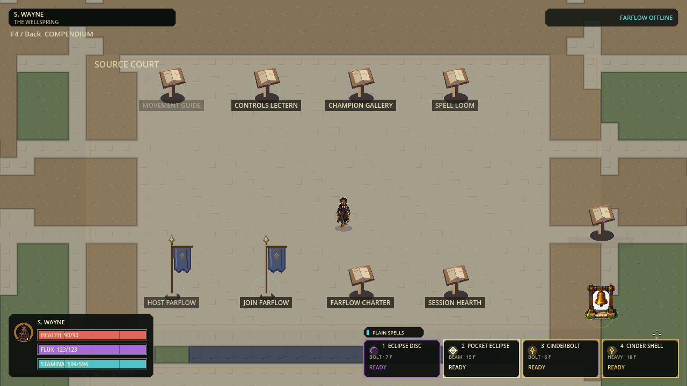
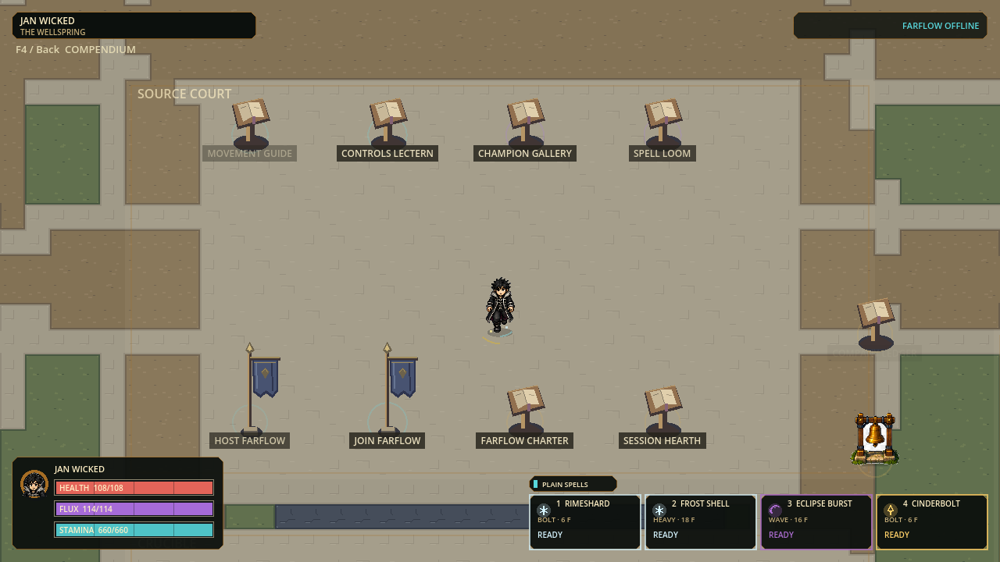
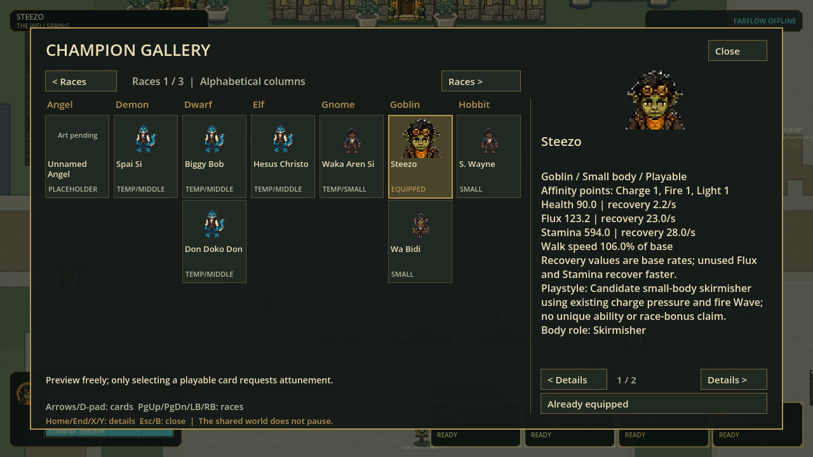
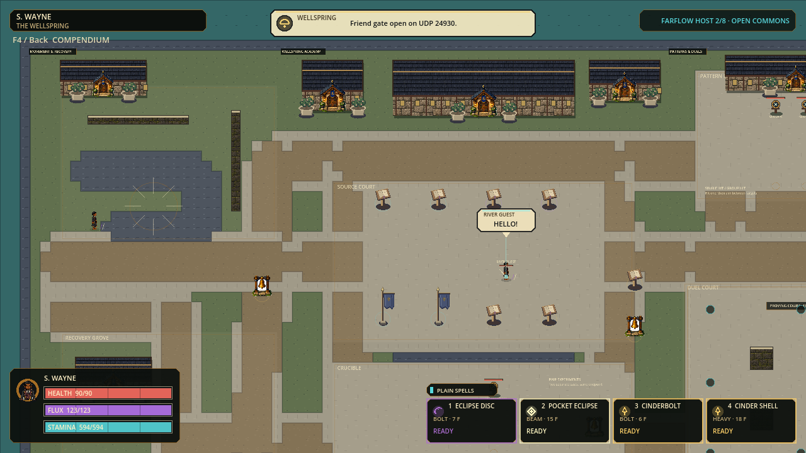

# Complete character pages checkpoint

Status: five live source-playtest pages, 2026-09-08; final Full and isolated Windows release-payload boot passed. Not a refreshed installer or full-cast art acceptance.

## Current outcome

All27 named profiles remain playable. Eight have individual sprite sets and19
still use explicitly labeled same-size templates. Five complete new-style pages
are active: Steezo, Oh Tipi, S. Wayne, Waka Aren Si and Jan Wicked. The reserved Angel is not
silently added. Catalog22 fallback declarations remain intact for safe rollback;
overrides and baseline assets together determine effective art coverage.

| Character | Body | Active source page | Review limits |
|---|---|---|---|
| Steezo | Small58px | `style_v1/steezo-v1.png` | Subtle profile sprint contacts and small correction shading variation |
| Oh Tipi | Middle68px | `style_v1/oh-tipi-v1.png` | Diagonal acting/contact clarity; south sprint B derives from walk B |
| S. Wayne | Small58px | `style_v1/s-wayne-v1.png` | Restrained diagonal arm motion and small yaw/costume variation |
| Waka Aren Si | Small58px | `style_v1/waka-aren-si-v1.png` | Brisk walk B, slightly narrower/brighter correction poses |
| Jan Wicked | Middle68px | `style_v1/jan-wicked-v1.png` | Several NE/NW actions too profile-like; brisk gait, coat/stride variation, single tucked roll pose |

Paths are under `assets/sprites/champions_v3/`. Every page has80 registered cells:
eight directions by grounded, jump, cast, hit, walk A, sprint A, slide, roll,
walk B and sprint B. These are two-contact gait cycles and single-pose action
sources, not80 independent animated clips. Human charm and feel remain open.

Biggy Bob, Red Baron and Fluup candidates remain isolated: successful alpha/geometry
checks did not establish correct remaining opposite-foot contacts. Fluup additionally
has enclosed pale matte islands and yaw inconsistencies. Treevor production is
isolated, with his existing live template retained. His80-cell candidate passed
technical checks and corrected three front/back contacts, but NE/NW walk-B swap
headings, west walk-B faces right and NE walk-A is too front-like. It is held.

## Reusable integration

The optional complete-page registry pins source PNG and imported RGBA hashes,
body registration and all80 cells. Invalid present registries fail closed rather
than partially replacing characters. Full textures are prepared atomically for
at most eight active identities; unchanged sets reuse textures. Gallery portraits
are32px derived caches and do not retain all27 full pages. Portrait generation
changes invalidate both portrait and details caches before early returns.

The shared assembler now measures actual occupied pixels after nearest sampling
before applying the48/84 foot pivot. It cannot hide a one-pixel dropped-toe shift
behind transparent resampling padding. All current override cells end at actual
last occupied y83; imported alpha is binary, no mipmaps or alpha-border rewriting.

Original sources, prompts, crop calibrations and exact cleanup masks remain in
`art_batches/character_style_v1/`; rejected proposals are not runtime assets.
Their folder is excluded from Windows exports. No anatomy is generated by the
technical assembler and no per-pose size fitting is allowed.

Movement, combat, resources, chemistry, protocol47 and120Hz authority are
unchanged. Hurt radii stay15/18/21px, while wall clearance stays18px for everyone.

## Evidence boundaries

| Gate | Actual result |
|---|---|
| Framework + first two live pages Full | 87 suites,419,622 assertions,0 failures; strict import/120Hz boot;81.605s, stderr0; [receipt](evidence/character-pages-v1/full-two-pages-receipt.json) |
| Four live pages Full | 87 suites,419,622 assertions,0 failures; strict import/120Hz boot;92.003s, stderr0; [receipt](evidence/character-pages-v1/full-four-pages-receipt.json) |
| Four-page focused regression | Three suites,33,059 assertions,0 failures;16.007s, stderr0; [receipt](evidence/character-pages-v1/four-pages-focused-receipt.json) |
| Five-page final Full | 87 suites, 419,651 assertions, 0 failures; strict import/120 Hz boot; 84.856s, stderr 0; [receipt](evidence/character-pages-v1/full-five-pages-receipt.json) |
| Five-page focused regression | Three suites, 33,059 assertions, 0 failures before the expanded clone guard; final expanded focused gate: 33,088 assertions, 0 failures |
| Shared assembly regressions | 1,022 assertions,0 failures, including sparse post-resample registration |
| Independent QA viewer | 353 assertions,0 failures, including mixed/misaligned decoded feet |
| Source coverage audit | Final 109 assertions/34 cases; counts baseline/override union and keeps declared 22 fallbacks separate; withholds effective totals on source errors |
| Actual world/UI | Hidden isolated Godot captures, not generated mockups; S. Wayne shown below |
| Four-page local network check | Actual two-process Farflow host/join with S. Wayne and Steezo, shared greeting;120 captured frames. Not a physical internet/friend test or120FPS certification |
| Two-page Windows release payload | Actual adjacent EXE/PCK release boot passed without source fallback; [log](evidence/character-pages-v1/pack-two-pages-boot.log); does not prove later pages' packaged state |
| Four-page Windows release payload | Actual release EXE with adjacent PCK, no source fallback, strict120Hz boot as Waka Aren Si; [log](evidence/character-pages-v1/pack-four-pages-boot.log) |
| Five-page final Windows release payload | Actual release EXE with adjacent PCK, no source fallback, strict 120 Hz boot as Jan Wicked; [log](evidence/character-pages-v1/pack-five-pages-boot.log) |
| Open acceptance | Rerun gates after later promotions. Physical remote and human animation acceptance remain open |
| Independent review finding fixed | Eight regression failures reproduced baseline clone admission; final focused33,088/0 and source audit109/34 pass. Runtime checks extension path/raw/RGBA plus the three foundation-page RGBA hashes once at configuration; same-identity replacement remains valid |

The first-two-page isolated release payload was65,452,760bytes, SHA256
`7c32ccee4035b7582f2cfb5eea523e7206c0039c951afc06f5bcd76eb4d37705`.
This is export evidence, not a new installer. The previously supplied installer
remains unchanged and does not include these source edits.

The subsequent four-page payload is65,866,932bytes, SHA256
`52d2214fcf5bb3e2c88053e8c5ec81f6198e9a5b006536da5a31e23b5871905d`.
Its official Windows release executable successfully booted the adjacent PCK as
Waka Aren Si with all four override declarations validated. Draft character-art
folders are excluded; this still is not the install/update/repair acceptance tier.

The final five-page payload is 66,159,932 bytes, SHA256
`aa71264bce48d97c47806c16ef002859e62e0beb9552d6b36750e5a68ba4c82d`.
Its official Windows release executable booted the adjacent PCK as Jan Wicked
after the baseline-identity clone guard was included. The local test pair is
`.godot/character-pages-five-export/flux2.exe` and `flux2.pck`; keep them together.
This is a portable local test payload, not an installer/updater release.

### Source-launch follow-up

An isolated Godot probe confirmed that `scripts/run.ps1`'s nonempty-cache check
does not prepare newly introduced character imports and can load stale pixels
after a source update. [Probe receipt](evidence/character-pages-v1/source-launch-cache-probe.json).
The verified adjacent EXE/PCK above is unaffected. The current checkout was
fully imported by the passing Full gate. Next launcher slice: a conditional
readiness fingerprint for declared character sources, import sidecars and engine,
plus imported-destination checks; repair changed inputs once, skip healthy launches.
This finding is not a claim that the launcher fix has been implemented.

## Continue or play

For this exact verified payload, open `.godot/character-pages-five-export/flux2.exe`.
For current source, run `flux.cmd play` from this checkout. Use the Champion Gallery in Wellspring.
Review each size/action/direction, volume stability, foot alternation, face direction,
empty hands and alpha on contrasting floors; technical tests do not replace this.
Continue from the single `.agent/OVERHAUL-IMPLEMENTATION.md` queue. Current user
cutoff is at least50% weekly allowance remaining, replacing the old75% cutoff.
No commit, push, branch deletion, installer replacement or publication was done.
The three other local branch tips are already ancestors of `main`; no merge was
necessary. Main is five commits ahead of the cached `origin/main` tracking ref.
No fetch was performed, so this is not a claim about current remote freshness.
