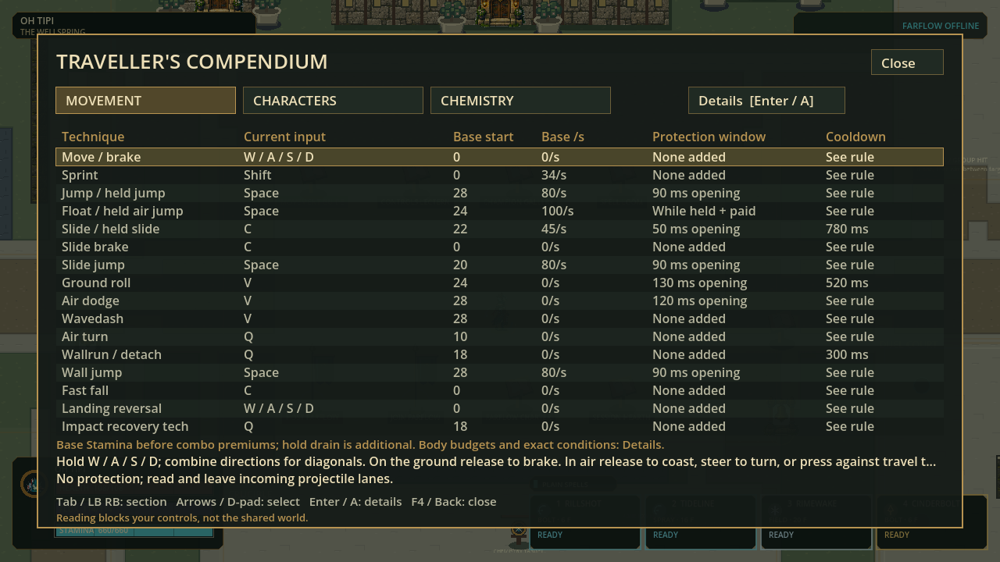
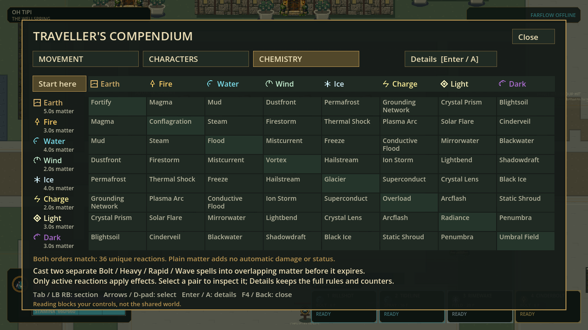
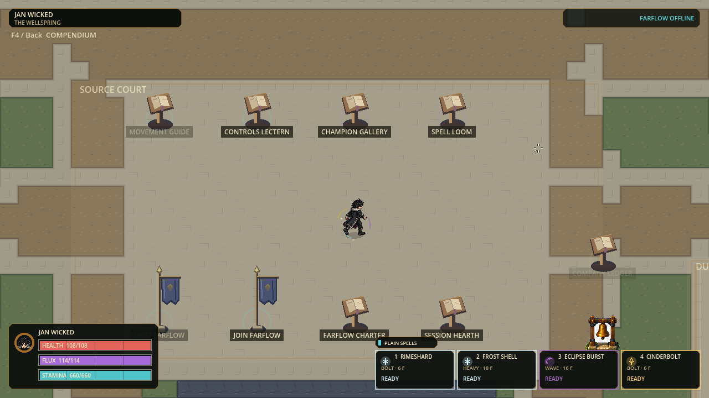
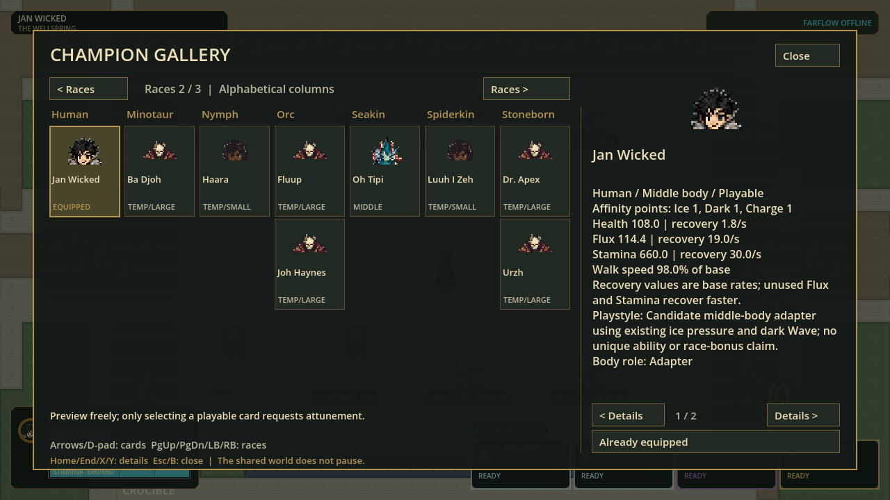

# Basic templates, gait, portraits and compact guides

Status: verified source framework/UI, 2026-09-08; complete basic raster templates still pending.

## Current result

The three-body character production front door is now explicit and reusable.
Small / Middle / Large remain 58 / 68 / 76 px, in the same 96 px cells with a
48/84 foot pivot. No movement, health, costs, hurtbox, clearance or protocol
rules changed in this slice. All 27 existing profiles remain playable; the art
coverage is still eight individual sets and 19 labeled templates. New artwork
must not be counted merely because a generation or template file exists.

The latest user gate is explicit: **complete and visually accept the three basic
size templates before any character-specific repair or addition resumes.** The
Small front-facing technical proof is 1/80 cells; it is not a completed Small
template. Middle and Large currently have construction references, not approved
neutral raster atlases. Named-character generation is paused.

| Work | Implemented | Acceptance boundary |
|---|---|---|
| Production setup | One canonical ID creates eight heading prompts, size/identity snapshot, source-layout scaffold and all 80 pending review entries | Scaffolding does not generate or approve artwork |
| Construction guides | Fixed-length analytic two-bone arms/legs, rigid torso/head and depth-sorted limb overlap; one South calibration; 24 ten-pose boards and 24 contact boards | Reference guides, not finished neutral atlases or a second live renderer |
| Direction grammar | Exact front, front-quarter, side, back-quarter and back cues; paired review against neighboring headings | Jan's existing diagonals are still too profile/front-like; raster correction remains open |
| Foot contacts | Explicit anatomical left A / right B support and opposing arms, with SHA-bound per-cell review | Different pixel hashes or swapped trouser colors do not prove a real step |
| Runtime gait | Real locomotion distance drives a shared normalized contact/pivot phase; stops when blocked, persists through ordinary turns and walk/sprint changes | Two authored contact frames remain; this is not a full multi-frame walk cycle |
| Cadence | One full cycle per 1.30 body heights; maximum five visual cycles/s | Initial readable calibration, not final human feel acceptance |
| Prediction | Actual actor supplies identity/body/lifecycle; predicted motion supplies movement; local correction offsets cannot become footsteps | Broader pre-existing non-movement prediction presentation cues remain a separate audit |
| Portraits | Exact top third of occupied front-facing grounded bounds, full width, proportional nearest fit into transparent 32 px cache | HUD and Gallery share the same sprite-derived portrait |
| Shared assembler | Explicit neutral asset kind accepts only three exact template IDs with matching body/height; all existing hash, matte, global-scale and actual-foot checks reused | One Small South technical cell; no automatic registry write or promotion |
| Movement menu | One table of all16 techniques, current bindings, base cost/drain, protection windows and cooldown | Combo premiums and hold costs labeled; complete conditions retained in Details |
| Chemistry menu | Full8x8 matrix, element glyph/color/name/lifetime, selected reaction summary | Existing36 symmetric reactions; presentation adds no new gameplay effects |

The generator setup no longer sends new characters through five-size or weapon
worksheets. Costume/race anatomy is authored over the current construction
rules; no palette-only clone is counted as a unique character.

## Deferred character production command

```powershell
.\scripts\new-character-art-batch.ps1 -ChampionId jan_wicked -BatchName directional-repair-NEW
```

Use a new safe batch name or omit it for a unique name. Existing directories,
unknown identities, traversal and reparse-point paths are rejected. The retained
technical ID `nico_lai` resolves to Waka Aren Si and `donnok` to Don Doko Don.
Appearance fields and source crops/hashes begin pending rather than fabricated.

Follow [the production guide](../art_batches/character_style_v1/template_v2/README.md)
and [current authoring instructions](ADDING-VISUAL-ASSETS.md). Accept the
Small neutral/contact pilot before broad expansion, complete all Small headings,
then Middle and Large. Obtain user acceptance of these basic templates together.
Only after that gate should existing character repairs and remaining cast pages
resume one by one. The command above is future tooling, not the active next task.

## Evidence

| Gate | Result |
|---|---|
| Integrated Full including compact guides | 87 suites / 431,965 assertions; zero failures/stderr; strict import and120 Hz boot;79.362s; [receipt](evidence/character-template-v2/basic-ui-full-receipt.json) |
| Client metadata and correction-tail regression | 72,315 assertions across five focused suites; zero failures; actual Small/Large prediction packet and signed soft-correction tests |
| Portrait focused regression | 43,707 assertions across presenter/HUD/Gallery; zero failures |
| Review validator | 138 assertions / 42 cases on PowerShell 7 and Windows PowerShell 5 |
| Batch scaffolder | 2,812 assertions / 58 cases on both PowerShell versions; all 27 IDs and isolated path-safety cases |
| Fixed-volume construction tests | 10,830 assertions, zero failures; fixed segment lengths, reachable geometry, handedness, eight headings and all three sizes |
| Neutral-aware shared assembler | 1,119 assertions, zero failures; malformed kinds/IDs/body/heights fail closed |
| Compact guide focused tests | 3,548 assertions, zero failures; row/cell fit, source-value parity, bindings, input and Details access |
| Actual render | Jan NE 120 frames, Gallery 4, S. Wayne 8; hidden isolated Godot runs, no warnings/stderr |
| Portrait stability | Zero changed opaque portrait pixels across all Jan and S. Wayne captured frames; [receipt](evidence/character-template-v2/portrait-stability.json) |
| Windows checkpoint pack | Strict export and actual adjacent release EXE/PCK boot from an isolated folder passed; no source-path fallback arguments, no stderr/warnings |

The initial Full attempt stopped at the documentation gate because the new
authoring guide lacked an explicit Status line; that line was restored and the
full suite was rerun. This did not require weakening a validation gate.
Captures establish actual rendered behavior, not sustained 120 FPS, internet
multiplayer acceptance or final human animation approval.

## Actual compact guide renders

At1280x720 all16 movement rows and all64 chemistry cells are visible. Select
using mouse, arrows/D-pad or wheel; Tab/shoulders changes section. Enter/A/Details
opens the full reader. F4/back closes the panel; reading blocks local controls,
not the shared world. Reaction color is reinforced by names and element glyphs.









## Artwork status and continuation

The built-in image-generation workflow produced three held rear-diagonal attempts
(repeated gait silhouettes/anatomical color swaps), one guide-first pair with
better articulation but unresolved cross-source scale, and a South-only source.
Reviewed deterministic removal/assembly preserved originals and exact masks.
The native Small front proof has clean registration/alpha but needs simpler,
stronger face/clothing pixel clusters before style acceptance. No unapproved
artwork enters live pages. All sources and exact prompts remain in the batch.

`guides-v1` has reversed front anatomical handedness; `guides-v2` and
`contact-guides-v1` still varied bone lengths/overlap. They are superseded evidence,
not current anatomical references. Use fixed-volume `guides-v3` and
`contact-guides-v2`; these are still construction diagrams, not sprite art.

No new neutral 80-cell atlas, repaired Jan page, remaining-cast completion,
installer refresh, push or publication is claimed here. The user's current
cutoff is at least 50% weekly allowance remaining.

## Test this source checkpoint

Open `.godot/basic-template-ui-export/flux2.exe` in this checkout. Keep its adjacent
`flux2.pck` with it. This is a local two-file developer playtest payload, not the
installer; the existing installer and earlier test payloads were left unchanged.
It contains the current compact menus, gait and portraits, with existing live
character sprites. Press F4 for the Compendium; try Movement, Chemistry, selection
and Details, then walk/sprint/turn/stop and compare HUD/Gallery portraits.

| Pack fact | Value |
|---|---|
| `flux2.exe` | 109,212,160 bytes; official Windows release template |
| `flux2.pck` | 66,172,412 bytes |
| PCK SHA-256 | `40d33dd8b1054b18c0d3deb1868ba92404a24955c31df3d6b19869204df37824` |
| Scope | Local dirty-main checkpoint; no commit, push, release or installer refresh |

Offline guide scripts and review images are excluded from shipped packs; no
neutral pilot is silently bundled as a playable character. The source-launch
cache-readiness issue remains a separate deferred delivery task.
