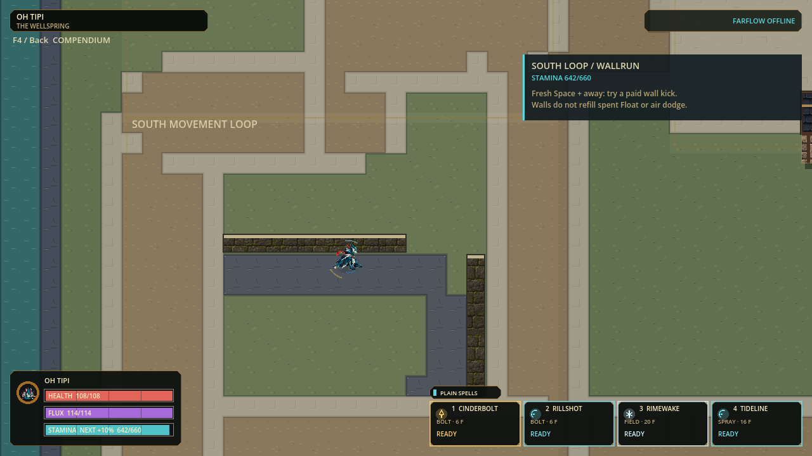
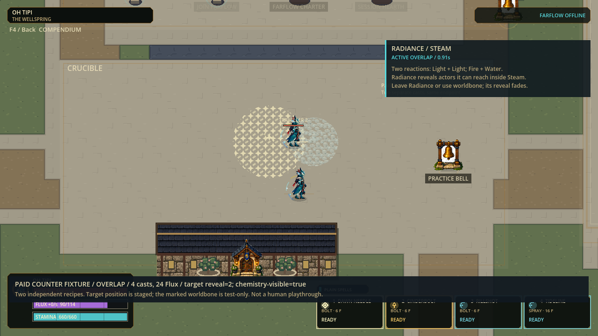

# Counterplay and movement practice checkpoint

Status: Full, strict Windows export and isolated EXE/PCK boot passed, 2026-09-09.
Local verification and payload records distinguish this source from the older installed build.
No commit, push, merge, installer refresh or published release is implied.

## Playable changes

| Area | What changed | What did not change |
|---|---|---|
| Crucible counterplay | Steam's hint now points to Light + Light. A contextual card recognizes active Radiance/Steam overlap and explains conditional reveal, worldbone and expiry. | Two independent existing reactions; no recursive recipe, altered status, larger radius or new effect. |
| Southern movement loop | Two concise lines follow actual grounded, wallrun, airborne and Float state, current Stamina, spent airtime opportunities and rebound controls. | No new action, free protection, wall recharge, changed cost or scripted movement. Walking around remains an option. |
| Personal guidance | Shared gates suppress both cards during menus, focus/rearm interruptions, spectating and non-practice rounds; guests use their own actor. | No host-state fallback or simulation/input-map mutation. Station device selection remains separate. |
| Runtime | Post-cast per-owner material inventory is gathered once for multiplayer worlds, with exact legacy-query equivalence. | Sequential pre-payment admission, reservations, caps, cast outcomes, ordering, protocol and offline fallback unchanged. |
| Test safety | Shared capture harness now disables preference persistence at construction; inherited cleanup remains exercised. | Production settings behavior is unchanged. Earlier unguarded diagnostic captures are superseded, not relabeled safe. |

The movement card uses meaningful gameplay presses or deliberate stick movement
to choose keyboard/mouse or controller labels. Mouse motion, releases, repeated
keys and stick noise do not repeatedly switch its instructions. F4 still holds
the complete rules, timings and costs; the short card is not a replacement.

## Try the two learning loops

Double-click the new standalone developer build on the prepared PC:

```text
C:\Users\sende\AppData\Local\FLUX-dev\playtests\counterplay-practice-20260909\flux2.exe
```

Keep `flux2.pck` beside it. Both files match the strict export by SHA-256 and
booted outside the checkout without a source-path argument or LAN discovery.
The smoke process used separate temporary settings, not the player's settings.
Previous `sandbox-impact-20260909` remains untouched. The installed shortcut and
September8 installer still point to their older payload; neither was refreshed.

| Test | Action | Look for |
|---|---|---|
| Ordinary route | Go south from Canopy into SOUTH MOVEMENT LOOP; walk or sprint around the two low walls. | An ordinary bypass, current Stamina and current binding names. |
| Paid movement chain | Move along a wall and use Technique; freshly press Jump away, then release and press/hold Jump for Float when available. | Card changes with the real wallrun, kick, airborne and Float states. Walls do not refill spent Float/air dodge. |
| Rebinding and controller | Change a movement binding at Controls Lectern, return to the loop, then use a controller. | Hints use that setup; menus hide them and cannot queue a paid movement on return. |
| Steam counter | Equip Light, Fire and Water Bolts. Cast Light twice at one nearby endpoint, then Fire and Water about three floor tiles to the side before Radiance expires. | Separate reaction origins with overlapping active areas; the RADIANCE / STEAM card appears. |
| Counter limitations | Cross the overlap, leave Radiance while remaining in Steam, and try positioning around worldbone. | Radiance reveals only actors it can reach. Reveal expires shortly after refresh stops; Steam's own concealment and close-range rules remain. |
| Reset and repeat | Use the existing Practice Bell. | Clear temporary matter and refill resources; repeat with one changed choice. |

The four-cast automated fixture spends24 Flux from a real character loadout.
It proves open overlap, reveal expiry, reentry and independent decay. A separate
immutable test wall intercepts an actual Light projectile and blocks reveal while
Steam reaches the target. The test actor positions and extra wall are explicitly
staged: these are production-simulation/render fixtures, not a human playthrough
or a new map object. The reveal countdown falls2 ->1 ->0 in120Hz ticks after
refresh stops, not a persistent tracker or wall-penetrating promise.

## Measured runtime result

Same paid input sequences, two repeats on this machine:

| Whole-step CPU metric | Baseline | Candidate |
|---|---|---|
| Mixed median |4.324 /4.429ms |4.107 /4.123ms |
| Mixed p95 |10.819 /10.407ms |11.004 /10.213ms |
| Field-opening median |2.432 /2.449ms |2.191 /2.185ms |
| Field-opening p95 |4.585 /4.443ms |3.873 /3.763ms |

Mixed median saves about0.22-0.31ms; its slow tail has **no consistent improvement**
and still exceeds the8.333ms simulation budget. The Field-opening improvement is
useful but does not certify sustained120Hz or rendered120FPS. The separate helper
microdiagnostic's roughly65% saving is not a whole-game speedup.

The legal Field scenario reaches32 paid Fields, four per owner, holds that cap for
71 ticks and records32 enemy triggers. Eight fifth-Field attempts are refused
before payment; later Heavy casts can naturally fail for insufficient Flux.
It then mixes Rapid/Wave/Heavy while Fields and reactions expire. No injected
Fields, refills, cooldown bypass or raised caps were used. Conditional timings for
saturation/overlap remain in the raw reports; empty tails do not stand in for
Field-heavy behavior. Mixed load peaks at96 projectiles/32 reactions and has no
Fields. Every shared non-timing counter, checkpoint and final hash matches its
baseline, apart from the intended source metadata hash.

## Verification and handoff

| Gate | Result |
|---|---|
| Integrated Full before capture guard |91 suites /462,658 assertions /0 failures /0 stderr;98.525s |
| Final integrated Full |**91 suites /462,661 assertions /0 failures /0 stderr;90.542s**; current-state/inventory/doctor/import/120Hz source boot passed |
| Exact capacity oracle |5,784 assertions /0 failures; seeded fixtures, duplicates, orphan material, pending reservations, order and state purity |
| Mixed profile |16,551 assertions /0 failures; legacy stage sampler matches every measured production step |
| Field-opening profile |14,733 assertions /0 failures; actual32-Field cap and independent phase reports |
| Final GPU captures |Six movement and five counterplay frames at1280x720; paid transitions and normal/reduced views; no human feel acceptance |
| Capture settings guard |Saved preference SHA-256 and last-write time unchanged across both complete reruns, including process teardown |
| Windows payload |Strict Windows release export and SHA-identical copied EXE/PCK boot outside checkout passed;120Hz/protocol47;0 stderr; isolated smoke settings |

[Movement evidence](evidence/counterplay-practice-v1/movement/README.md) ·
[Chemistry evidence](evidence/counterplay-practice-v1/chemistry/README.md) ·
[Runtime comparison](evidence/counterplay-practice-v1/runtime/CAPACITY-CANDIDATE.md) ·
[Capture settings guard](evidence/counterplay-practice-v1/capture-preferences-guard.json) ·
[Final Full receipt](evidence/counterplay-practice-v1/full-receipt.json) ·
[Standalone boot log](evidence/counterplay-practice-v1/isolated-boot.log).

Final PCK:66,209,976 bytes, SHA-256
`3061a3d1fbeae6a91c149ee816a963896e5bbfb2e585cfaaa1ef1c337689c85c`.
The unchanged official executable is109,071,360 bytes, SHA-256
`04baf75cc1d69dd93eb709533ecab4fd7770bb8a530645717017a06a9d9809fc`.





## Next boundaries

Human movement/visual/listening acceptance remains open. Next runtime work should
target the measured mixed projectile/chemistry tail with unchanged-input evidence,
not increase capacity or interaction footprints speculatively. Small neutral
contacts and unmistakable facings remain the art gate, then Middle/Large, then
named-character promotion. This wave changes no character pixels or animation
rules. Refreshing the installer and a physical same-build two-PC test remain
separate delivery gates. The previous sandbox/impact standalone build is retained.
