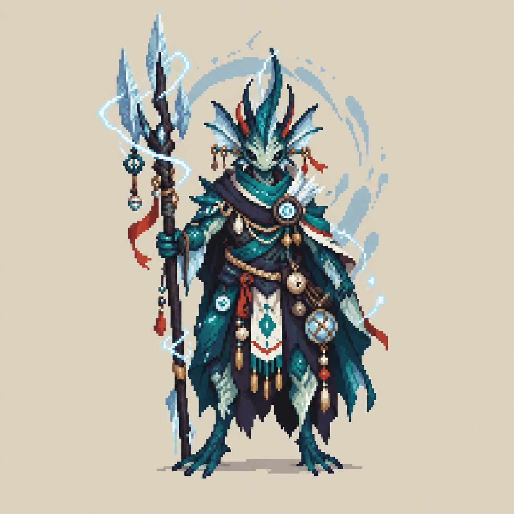

# FLUX current cast contract

Status: current local skeleton rollout, 2026-09-09; human animation acceptance and individual balance remain open.

**29 named champions are playable; one unnamed Angel is reserved.** There are
9 Small,10 Middle and10 Large playable profiles. All now display the matching
shared neutral skeleton, with size-shared front top-third portraits and
eight-direction previews. Historical individual sets, override pages and
fallback declarations remain preserved but are not loaded by the active mode.
Only size sets hurtbox radius (15/18/21px); race and animation cannot modify it.
Wall clearance is identical (18px). Identity, stats and affinities remain intact.
The Gallery groups alphabetical races into columns, orders each race by
Small/Middle/Large then name, and shows details on hover.
It never changes the player until the host validates and confirms selection.

## Current style authority

The original Oh Tipi supports natural proportions, crisp pixel
clusters, layered clothing and restrained material highlights. S. Wayne remains
dark-skinned. Practical, nonsexualized clothes and hand casting apply to everyone.
Reference staffs, magic, auras and shadows are excluded from body sheets.

September9: the newer cast sheet is the race-rework target described in
[RACE-VISUAL-ROLLOUT.md](RACE-VISUAL-ROLLOUT.md). Race production is reopened but
no new page is accepted by the readability checkpoint. Gallery can now inspect
the selected body's actual eight grounded facings with bracket keys, L3/R3 or
the onscreen arrow buttons. Cards still show the front-model top-third portrait.
Angles are S0/360, SE45, E90, NE135, N180, NW225, W270, SW315; viewing labels is
not proof that every source pose has the correct anatomy/yaw.

The [v4 group](../reference/art/cast_sheet_v4/README.md) remains an identity/color/body
reference, not the latest style override. Complete Steezo, Oh Tipi, S. Wayne, Waka Aren Si and Jan Wicked pages from
[character style production](../art_batches/character_style_v1/README.md) are
historical source-playtest candidates, with exact transparency cleanup records;
they are not the active skeleton rollout.
Rejected opaque drafts and incomplete studies remain isolated, never live atlases.

## Complete roster

Affinity numbers spend three points across two or three first-eight elements.
They do not automatically multiply damage or grant racial bonuses.

| Champion | Race | Body | Affinity levels | Runtime art |
|---|---|---|---|---|
| Oh Tipi | Seakin | Middle | Water 2 · Charge 1 | Shared middle skeleton |
| S. Wayne | Hobbit | Small | Dark 2 · Light 1 | Shared small skeleton |
| The Red Baron | Undead | Large | Fire 2 · Ice 1 | Shared large skeleton |
| Steezo | Goblin | Small | Charge 1 · Fire 1 · Light 1 | Shared small skeleton |
| Treevor the Mason | Treefolk | Large | Earth 1 · Wind 1 · Fire 1 | Shared large skeleton |
| Oll' I | Werewolf | Large | Earth 1 · Fire 1 · Light 1 | Shared large skeleton |
| Fluup | Orc | Large | Wind 1 · Charge 1 · Ice 1 | Shared large skeleton |
| Wa Bidi | Goblin | Small | Charge 1 · Wind 1 · Fire 1 | Shared small skeleton |
| Grace Riva | Sylph | Small | Wind 1 · Water 1 · Light 1 | Shared small skeleton |
| Waka Aren Si | Gnome | Small | Charge 2 · Light 1 | Shared small skeleton |
| Spai Si | Demon | Middle | Wind 1 · Earth 1 · Light 1 | Shared middle skeleton |
| Leaf the Hidden | Treefolk | Middle | Water 1 · Earth 1 · Light 1 | Shared middle skeleton |
| Ha Rekt | Wyrmborn | Large | Ice 1 · Wind 1 · Fire 1 | Shared large skeleton |
| Dr. Apex | Stoneborn | Large | Earth 1 · Light 1 · Water 1 | Shared large skeleton |
| Haara | Nymph | Small | Light 2 · Wind 1 | Shared small skeleton |
| Hesus Christo | Elf | Middle | Earth 2 · Water 1 | Shared middle skeleton |
| Grimm Bow | Troll | Large | Earth 2 · Water 1 | Shared large skeleton |
| Biggy Bob | Dwarf | Middle | Earth 1 · Fire 1 · Light 1 | Shared middle skeleton |
| Jan Wicked | Human | Middle | Ice 1 · Dark 1 · Charge 1 | Shared middle skeleton |
| Ba Djoh | Minotaur | Large | Earth 1 · Fire 1 · Water 1 | Shared large skeleton |
| Urzh | Stoneborn | Large | Earth 1 · Fire 1 · Charge 1 | Shared large skeleton |
| Don Doko Don | Dwarf | Middle | Earth 1 · Fire 1 · Water 1 | Shared middle skeleton |
| Djonah Thaan | Vampire | Middle | Dark 1 · Charge 1 · Fire 1 | Shared middle skeleton |
| Unnamed Angel | Angel | Middle | Light 2 · Wind 1 | Reserved; not selectable |
| Luuh I Zeh | Spiderkin | Small | Dark 2 · Water 1 | Shared small skeleton |
| Juul I Yaina | Demon | Small | Ice 2 · Wind 1 | Shared small skeleton |
| Faab I Yaina | Angel | Middle | Fire 2 · Light 1 | Shared middle skeleton |
| Joh Haynes | Orc | Large | Earth 2 · Charge 1 | Shared large skeleton |
| H. Le-ne | Stoneborn | Middle | Earth 1 · Wind 1 · Fire 1 | Shared middle skeleton |
| Fimu Yashiha | Treefolk | Small | Water 1 · Fire 1 · Light 1 | Shared small skeleton |

New female characters: [H. Le-ne portrait](../reference/art/h_le_ne_v1/README.md)
and [Fimu Yashiha portrait](../reference/art/fimu_yashiha_v1/README.md). The user
assigned H. Le-ne to Middle (medium) and Fimu to Small; three listed elements
receive one affinity point each. Both have playable baseline profiles with the
existing shared body presentation. Portrait designs await user acceptance and do
not yet replace those bodies. The previous 28-card overview is a dated snapshot;
the two new portraits are delivered separately.

September 9 user correction: Faab I Yaina is an Angel and Juul I Yaina is a Demon.
Their sizes, affinities, stats, wires and playable availability are preserved.
All 21 races now have a named playable representative; Unnamed Angel remains a
separate reservation. The [complete cast overview candidate](../reference/art/cast_overview_angel_demon_v1/README.md)
is superseded by the [sorted cast and affinity overview](../reference/art/cast_overview_race_size_v2/README.md),
which awaits user visual acceptance and does not replace runtime skeleton art.

Current visual identity corrections: Juul I Yaina is male with curly dark hair;
Faab I Yaina is male with a glorious shiny bald head; Spai Si is male; Wa Bidi is
female. These are stored on the canonical roster. Other characters' genders are
not assigned by this correction. Existing elemental affinities remain unchanged
and are printed on every card in the sorted overview.

The runtime catalog owns availability and wires; the roster owns identity, race
and body intent. Stable technical IDs `grace_reava`, `nico_lai` and `donnok`
remain for Grace Riva, Waka Aren Si and Don Doko Don. Spiderkin replaces the
previously unused Arachnoid vocabulary; archived artwork keeps historical labels.
Grimm Bow's Chaos and Angel's Spirit remain future-element concepts, not active
affinities. No unique racial passive is implemented.

## Playable body-role baselines

| Body | Template | Health | Flux | Stamina | Speed ratio | Role / tradeoff |
|---|---|---:|---:|---:|---:|---|
| Small | S. Wayne | 90 | 123.2 | 594 | 1.06× | Fast tempo/recovery; lowest health and stamina |
| Middle | Oh Tipi | 108 | 114.4 | 660 | 0.98× | Balanced reserves and routing |
| Large | The Red Baron | 132 | 105.6 | 792 | 0.91× | Deep reserves; slower tempo and Flux recovery |

New profiles copy these proven same-size stats; they are conservative baselines,
not individually reviewed balance. The original five profiles and wires1–5 remain
unchanged in core stats. Every body retains universal movement, shared 18 px wall
clearance and its existing finite Float duration. Combat hurt radii are Small
15 px, Middle 18 px and Large 21 px; they never change with action or facing.
Art never defines hitboxes or timing. This is a bounded starting balance, not
proof that all three sizes are competitively balanced.

## Starter spells and customization

Each new profile receives an existing primary Bolt, a Heavy shell and a Wave;
its primary affinity selects Bolt/Heavy and its second affinity selects Wave.
The original five kits remain unchanged. **All57 shared spells are freely
configurable into12 positions** at the Spell Loom, regardless of character.
This is shared-system composition, not27 bespoke abilities or racial kits.

Switching to another character preserves resource percentages but replaces the
starter loadout; the Gallery warns about this. Selecting the current character
is a true no-op preserving custom spells, cooldowns and accounting. Attunement
requires the Gallery in Wellspring/HEARTH, a living grounded free actor and no
active cast, movement commitment, protection or impact recovery.

## Art acceptance and next slice

| Gate | State |
|---|---|
| Identity,2–3 affinities, three body classes | Implemented and cross-validated |
|27 profiles ×3 starter slots ×8 directions |648 actual paid-cast cases pass |
| All movement pose/direction access | Registered body pages;19 effective template profiles;22 retained catalog fallbacks |
| Unique Oh Tipi-style80-cell sheets | Five active overrides listed above; Red Baron, Biggy Bob, Fluup and Treevor candidates held for specific gait/facing defects |
| Race silhouettes and individual balance | Pending, one complete character at a time |
| Source verification boundary | Final five-page Full: 87 suites / 419,651 assertions, zero failures/stderr; isolated Windows release EXE/PCK boot passed; exact receipts in CHARACTER-PAGES-CHECKPOINT.md; not a refreshed installer |
| Selector/runtime/remote evidence | [Original Gallery checkpoint](CAST-GALLERY-CHECKPOINT.md) and [current character-page checkpoint](CHARACTER-PAGES-CHECKPOINT.md); neither is final physical friend/feel acceptance |

Jan's current page retains an explicit visual refinement need: several NE/NW
actions are too profile-like, with brisk stride/coat-shading variation and a
single-pose roll. Fluup's unpromoted80-cell candidate has11 repeated-foot A/B
pairs plus enclosed matte islands/yaw issues; Biggy Bob and Red Baron also remain
held for contact repairs. These candidates do not add effective individual sets.
Use `scripts/current-state.ps1 -Check` for source-derived `character_art` totals;
catalog fallback declarations are intentionally not those totals.

No atlas is promoted from a portrait. Each character needs10 reviewed poses ×8
facings, transparent gutters, one global body scale,96px cells and foot pivot48,84.
Replace a temporary mapping only after source, rendering, gameplay and network
checks. Preserve original art and keep candidate packages separate.
