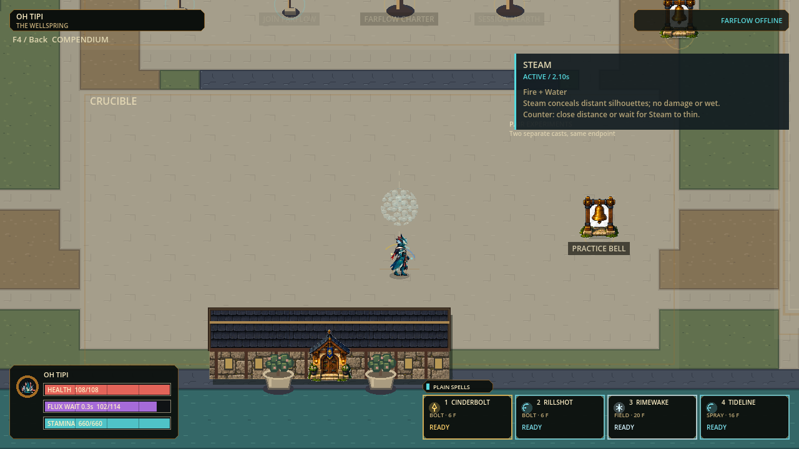

# Delegated clarity checkpoint

Status: source Full and isolated Windows EXE/PCK boot verified locally, 2026-09-09. Human playtest and installer release remain separate.

## Play this checkpoint

On the prepared machine, double-click:

```text
C:\Users\sende\AppData\Local\FLUX-dev\playtests\delegation-coach-20260909\flux2.exe
```

Keep `flux2.pck` beside it. The source export is retained at
`.godot/delegation-coach-export/flux2.exe`; both copies have matching hashes.
This is a direct-run developer test build, not a new installer/updater or public
release. Older installed shortcuts still point to the previous package.

Visit the Crucible, configure two separate depositing spells at the Spell Loom,
and cast both at one nearby endpoint. Fire plus Water is a simple starting pair.
Read the card during matter, formation, active Steam and decay; open a menu or
leave the Crucible and check that it disappears. Try another pair and compare
its effect/counter with F4 Chemistry. Check beams, sprays and fields for correct
spell names and elemental colors at contact.

## Delivered

| Change | Current behavior |
|---|---|
| Combat cue identity | Actual validated spell name/element; no borrowed Tideline/Rime labels or unproven Slow/Launch claims |
| Damage feedback | Carried damage with milli-unit precision; Beam contact does not guess missing guest damage |
| Crucible teaching | Stateless local card: harmless matter, forming warning, active effect/counter, harmless decay |
| Ownership safety | Guest needs its own replicated actor; host fallback never becomes personal coaching |
| Reaction explanation | All 36 pairs, real lifetimes, link requirements, Steam thinning and Crystal Lens capacity/damage caveats |
| Developer preparation | Five validated role TOMLs; pinned local Qwen/runtime download; ten safety checks; inference deferred |

The card is limited to living local players in Crucible free practice and hides
during menus, rounds, spectating, focus interruptions and input rearm. It does
not grant resources, create matter or issue commands. Reaction ownership follows
the oldest deposit; this is not a claim that both contributing casts were local.

No physics, costs, cooldowns, collision, map bounds, protocol, snapshot schema,
spell catalog, chemistry outcome or live character art changed in this wave.
The preceding slower/larger projectile tuning remains in the build.

## Evidence

| Check | Result |
|---|---|
| Integrated Full | 88 suites, 441,503 assertions, zero failures; 94.794 seconds; stderr 0 bytes |
| Source gates | Current-state check, asset inventory, pinned-engine check, import and 120 Hz boot passed |
| Combat focused | 4,359 assertions; eight elements, wire parity, invalid metadata, actual ingestion and cue bounds |
| Coach focused | 4,086 assertions; 36 pairs, UI/session gating, real paid casts, snapshot parity and no mutation |
| Rendering | Six combat fixtures and 13 full-gameplay coach captures at 1280x720; normal/reduced; 50/75/100% world zoom |
| Windows export | Strict release export passed; new modules included, development tools/candidates/evidence excluded |
| Isolated packaged boot | Hash-matched EXE/PCK copied outside checkout and booted at 120 Hz from that folder; zero stderr, no source-path argument |
| Local AI | Published model/runtime digests and all 51 extracted files verified; 10 guard checks; inference not performed |
| Agent configuration | Five unique TOMLs parsed; required strings; no model/effort/permission overrides |

[Full receipt and boot/export logs](evidence/delegated-clarity-v1),
[combat evidence](evidence/combat-feedback-v1/README.md),
[coach evidence and reproduction](evidence/chemistry-coach-v1/README.md).



This is actual scripted gameplay rendering, not a concept mockup. The fixture
suppresses persistence/network sockets and free-running simulation, then advances
real paid casts through ordinary world steps. Human learning, comfort, physical
Internet networking and sustained 120 FPS are not established by these checks.

Payload: `flux2.pck`, 66,190,844 bytes, SHA-256:

```text
63689eeab73cc3e9da0f65aec583d182961c00233e4b9f6553046e8fbc80901f
```

## Held and next

One Small South stand/walk candidate was generated using the built-in image tool.
Its legs alternate but the arms do not; the checkerboard is opaque RGB.
[Original, complete prompt and held review](../art_batches/character_style_v1/template_small/south-pilot-v2/README.md).
No template cells or character pages were approved. Finish the neutral contact
gate before eight-heading expansion and later character promotion.

Audio remains absent. Larger Wellspring routes, wider chemistry, source readiness,
refreshed installer/update testing, eight-player performance and physical friend
play remain open in the single queue. No commit, push, merge or publication.
The weekly work floor is 33% remaining.
