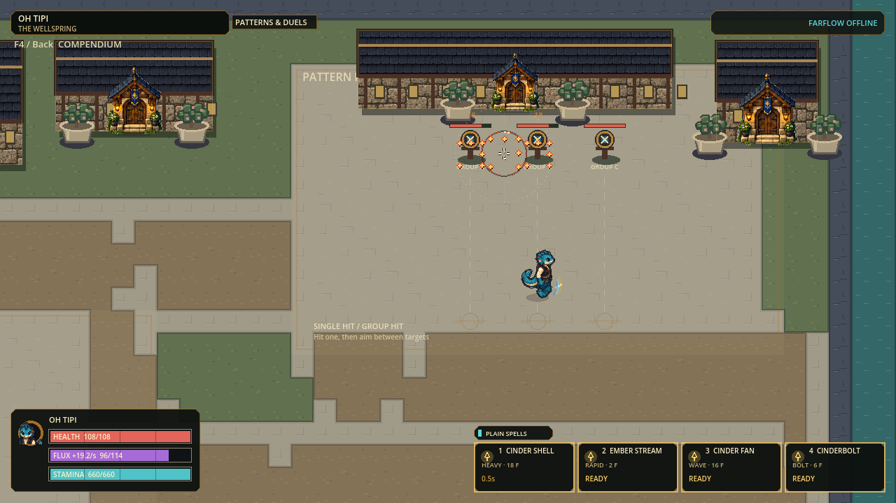
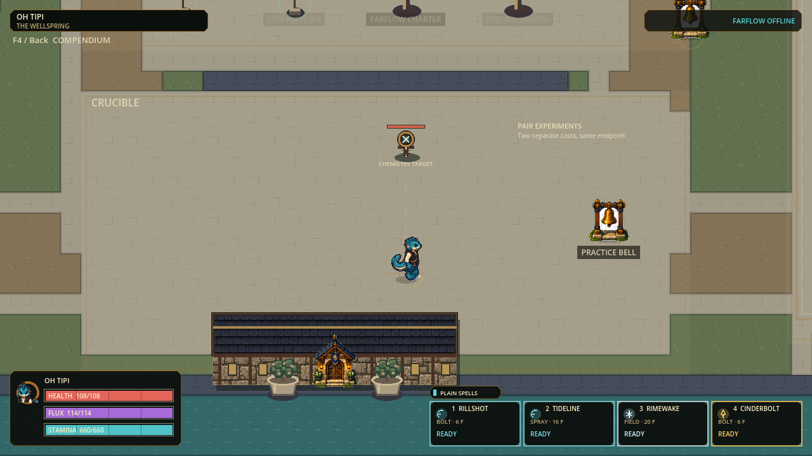
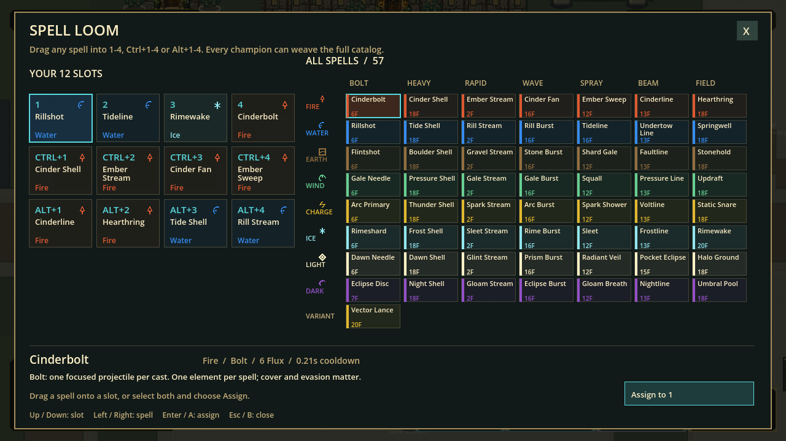
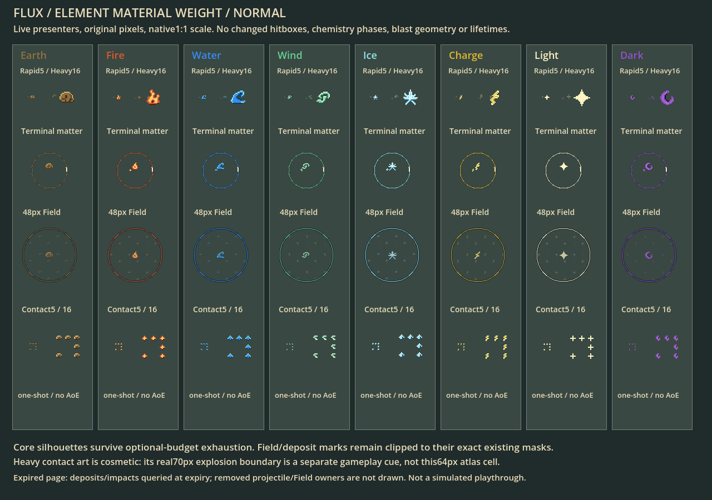

# Spell delivery and practice checkpoint

Status: verified local playtest candidate; human, internet and heavy-load performance acceptance open.

Date:2026-09-08. Authority: local Godot source in `main`; uncommitted playtest candidate.
Protocol46 / snapshot18 / preferences11. Windows120Hz, eight players, five live
champions, three body sizes. No new installer, remote publication or human-feel
acceptance is implied. Preserve the pre-existing dirty checkout and art drafts.

## Outcome and design

Make range, aim tracking and area pressure distinct decisions without inventing
another chemistry system. All eight live elements use the same tested delivery
kernels; palette, native material animation and the existing36 reactions provide
element identity. Every attack still pays positive Flux. Movement and protection
timings remain unchanged, and ordinary jump height does not evade blast damage.

| Family | Input and behavior | Trade-off / baseline tuning |
|---|---|---|
| Bolt | Existing single projectile | Existing balanced timing/cost unchanged |
| Heavy — new | Slow large shell; explodes on actor, wall, temporary cover, locked endpoint or maximum flight; leaves the ordinary element deposit |18Flux,18damage,16px projectile radius,400px/s,200ms startup,1000ms cooldown,70px terminal blast |
| Rapid — new | Hold any equipped1–4 /Ctrl /Alt position, or held primary when assigned there; every accepted shot is paid |2Flux,3damage,5px radius,760px/s,25ms startup,100ms cooldown; bounded matter reservations can pause fire |
| Wave — renamed display | Existing Burst sends all five lanes simultaneously | Existing angles−24/−12/0/+12/+24°, shared cast identity, one paid cast; no new duplicate family |
| Spray | Existing short cone | Existing range, contact and cost unchanged |
| Beam | Existing precise line | Existing obstruction and cost unchanged |
| Field | Existing placed area | Existing radius, arming, damage and lifespan unchanged |

Values are authored base values; existing affinity/cast systems still apply where
defined. Heavy's direct-hit target is excluded from its area pass, so it cannot
take double damage from one shell. Teammates, defeated players, spawn protection
and currently paid movement intangibility remain protected. Worldbone and active
positive-health temporary cover block area damage. A destroyed cover may no
longer shield what was behind it. Optical split damage remains conserved by
capping a child's blast damage at its actual projectile damage.

Rapid release stops further admissions; an already-paid startup still releases.
An explicit press takes priority over held repeat intent. A refused held attempt
does not spam120 events per second or spend Flux. Existing per-owner/global
projectile/material bounds remain authoritative; no unbounded automatic emitter.

## Catalog, controls and usability

| Contract | Current candidate |
|---|---|
| Matrix |8 element rows ×7 family columns =56 cells; Vector Lance is the57th selectable spell |
| Effective catalog |62 definitions; five remain non-runtime |
| Slot layout |12 independently configurable positions:1–4,Ctrl+1–4,Alt+1–4 |
| Spell Loom |Seven aligned columns, unchanged readable name fonts with two-line wrapping, complete drag/drop and keyboard/controller assignment |
| Networking |Held slot bits use existing16-bit held mask; library capacity64, bounded equip requests1–768; protocol45 peers are refused |
| Authoring |Two reusable templates plus16 element extensions; ordinary kernels and persisted schema stay shared |

## Wellspring practice flow

| Area | Purpose | Concrete layout |
|---|---|---|
| Proving Court |Compare tracking, spread and Heavy spacing |Targets900–902 atx2464/2560/2656,y352,96px apart; data-driven group/firing anchor |
| Crucible |Aim at one target, mix terminal deposits and inspect chemistry |Target903 at1568,1248; firing anchor1568,1440 |
| Safety |Preserve existing movement routes and content caps |Four total targets,3s respawn; two validated320×336practice areas; all14 worldbone obstacles unchanged |

The map schema is6. `practice_groups` owns station references, firing anchors,
lane width and purpose. The renderer reads those definitions to draw quiet lanes;
it does not invent collision walls. Buildings, movement-course geometry and
arena/spawn boundaries are not broadly replaced by this small practice slice.

## Presentation boundaries

| Layer | Improvement | Kept truthful |
|---|---|---|
| Deposits |Stronger native identity core and material tiles, including reduced effects |Original32px raw coverage,2–5s lifetime, expiry and clear windows |
| Fields |Essential native clipped core remains visible even after optional decoration budget exhausts |Actual area, phase and lifetime; no extra damage |
| Projectiles / impacts |Compact5px Rapid and weighty16px Heavy; real radius drives reused impact stamp scale |Original finite43tick stamp; terminal contact cue remains24ticks; no new raster source |
| Heavy aftermath |Short cover-clipped radius cue, separate from smaller persistent material |Cosmetic aftermath only; does not create a second hit or ongoing area hazard |

Renderer fixture pages are evidence of actual presenters, not human visual or
gameplay acceptance. A terminal deposit immediately consumed by chemistry no
longer supplies a separate Heavy aftermath cue; the reaction rendering takes over.

## Small slices and acceptance

| Slice | State | Required evidence |
|---|---|---|
|1. Runtime allocation |Implemented; isolated equivalence green |124,640 shape checks;62,743 focused chemistry checks; p95~36% lower, still above120Hz budget |
|2. Paid delivery kernels |Verified in focused and Full gates |All eight elements, one terminal/deposit, direct-versus-splash, cover/protection, repeat input/payment/replay;13,255 dedicated assertions |
|3. Presentation |Verified; actual renderer captures inspected |Normal/reduced/zero-decoration/expired material review, cover-clipped Heavy aftermath, actual720p range and Loom |
|4. Loom and map |Implemented; isolated tests green |All57×12 assignments, seven-column bounds, practice data/respawn/collision checks |
|5. Integrated checkpoint |Passed |87 suites /330,190 assertions, zero failures/warnings/stderr; source boot, current-state/asset audit, local Farflow UDP24938, actual720p interface/map capture |
|6. Human playtest |Open |Tracking versus Wave spacing, Heavy fairness, colors/readability, actual internet host/join and sustained rendered120FPS |

## How to test this verified source checkpoint

From this checkout run `.\flux.cmd play`. Walk to the Spell Loom, press its
displayed Interact binding and assign one element's Heavy/Rapid/Wave to1/2/3.
Visit Proving Court: aim between adjacent targets and compare the area/arc;
holdRapid then release, checking Flux spending and the final already-paid shot.
At Crucible, combine Fire and Water deposits for Steam and compare normal/reduced
effects. F4 opens the source-derived movement/characters/chemistry guide.

Both remote players must use this exact protocol46 candidate. Local host/join
testing is not a substitute for a real internet connection test. No installer
was rebuilt during this slice; older installed releases will not contain it.

Next safe work after acceptance: optimize the measured mixed-spell projectile
hotspot and transient cue delivery, then targeted readability/feel revisions. Do not
start another expansion without enough allowance for validation and handoff;
retain at least75% of the weekly allowance.

## Retained visual and test evidence

[Evidence index and exact receipts](evidence/delivery-practice-v1/README.md).
The range frame comes from a real110-frame paid cast; the other map/interface
frames are actual production rendering, not concept images.

## Mixed-load result and next optimization priority

The paid legal-eight diagnostic ran after the source allocation improvement,
with no concurrent Full/capture job. It does **not** meet the 8.333 ms tick budget.

| Measurement | Repeat1 | Repeat2 |
|---|---:|---:|
| Simulation median |3.951 ms|3.975 ms|
| Simulation p95 / p99 |19.753 /20.682 ms|20.398 /21.241 ms|
| Ticks above8.333 ms |248 /720|255 /720|
| Projectile stage p95 |16.904 ms|17.575 ms|
| Chemistry stage p95 |1.795 ms|1.885 ms|
| Snapshot capture/packing p95, separate |4.526 ms|4.660 ms|

Both runs accepted20 Heavy,137 Rapid and16 Wave casts, releasing20,137 and80
projectiles respectively. Independent peaks were96 projectiles,109 deposits and
32 reactions; these were **not simultaneous totals**. Normal capacity and Flux
refusals remained enforced. Snapshot maximum was16,276 bytes, six fragments of
at most1,296 bytes, with zero rejected snapshots and no persistent-threat overflow.
However, transient-event overflow reached40 at a52-event peak: complete state
does not establish delivery of every combat cue. All state expired naturally
within876 cleanup ticks. Two runs and stage mirrors matched canonical state/events.

Receipt: `.godot/runtime-20260908/legal-eight-mixed-deliveries-v1.log`;
16,621 assertions, zero failures/warnings/stderr. Final hash:
`75887b316597ef39fd093343f84fbcb6eac6a5ac082ebbabda0eaa8dcb378d04`.
These are development/headless CPU results, not rendered FPS or internet proof.

| Next small slice | Acceptance gate |
|---|---|
| Projectile/reaction query cost |Attribute containment/cover query work; preserve existing pure geometry; identical hashes/events in original and mixed paid scenarios before accepting a speed change |
| Transient cue prioritization |Keep the packet bound; preserve essential hit/cast feedback under the observed52-event burst; never truncate authoritative threats |
| Human tuning |Compare Heavy splash fairness, Rapid readability and Wave evasion at the two practice areas; tune only from observed playtest feedback |

Do not expand the spell catalog further until these load/readability limits have
been addressed or explicitly accepted for a narrowly scoped playtest.
