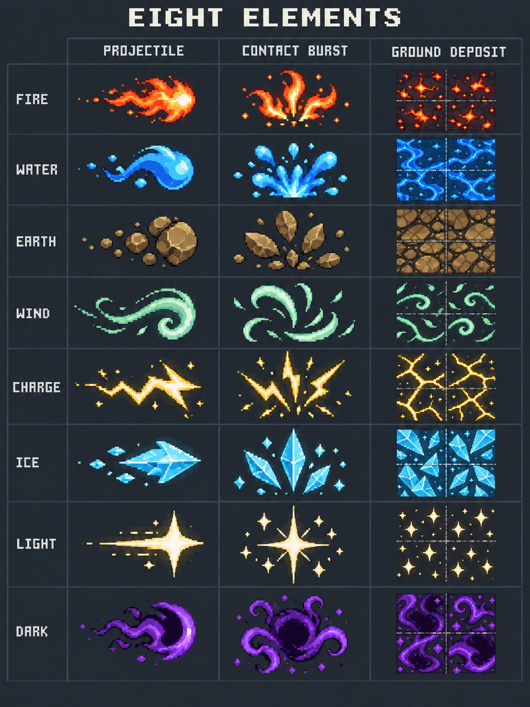

# Awareness, movement tempo and magic readability

Status: verified local Windows portable checkpoint, 2026-09-09; uncommitted and
unpublished. Human play acceptance is pending. Earlier playtests are retained.

## What changes

| Area | New behavior | Boundary |
|---|---|---|
| Sight cone | Explicit 55-degree ground projection; 72px ground-radius nearby awareness (about 72x59px radii on screen at 100% zoom) | World/collision remains screen-cardinal; aim and mask use the same projection; opaque cover still blocks |
| Own character | Body-only overlay above the sight mask, including jump | No rectangular reveal; no re-exposed hidden opponents or double aura |
| Walk / sprint | Base 372.6px/s unchanged; nominal sprint 596.16px/s (1.60x) instead of 476.928 (1.28x) | Size speed modifiers, paid Stamina and 900px/s carry caps retained |
| Animation | Distinct longer-stride/lean sprint poses; walk max 3 cycles/s, sprint max 5; distance phase continues across transitions | Three sizes, 64 travel/aim pairs each, fixed bones and hurtboxes |
| Element matter | Earth 5s, Fire 4s, Water 5s, Wind 3s, Ice 5s, Charge 3s, Light 4s, Dark 4s | Same finite 128 global / 16 owner admission; no lifetime refresh from repeated same-cast contacts |
| Reactions | 31 sustained active windows about 25% longer | Thermal Shock, Plasma Arc, Solar Flare, Overload and Arcflash instant windows unchanged; full phase lifetime remains <=5s |
| Contact | 1.5x finite playback, 18-tick element imprint, 36-tick terminal/Heavy aftermath; cosmetic scale 1.50 versus 1.25 | No damage-radius growth, repeated damage, new particles or infinite residue |

Sustained damaging reactions can deliver more total pulses because their active
window is longer. This is intentional tuning, not a damage-per-pulse buff or an
extension of instant control locks. Source-driven chemistry metadata was rebuilt;
the existing editable pixel drawings remain in use and exact timing checks stay
enabled. Old builds must not join the new tuning build.

## Reusable art

The skeleton system now shares nine textures: three base, three walk and three
sprint, totalling 116.44 MiB decoded. There are no per-character copies. Earlier
base/walk PNGs remain unchanged; new sprint geometry uses the same fixed rig.

Delegated [magic-art reference and prompts](../art_batches/magic_style_v2/README.md)
combine Oracle-era compact pixel forms and Enter the Gungeon-style readable
impacts, using original element silhouettes. The 24 studies are an opaque design
board, not live animation sheets. Alpha, exact palette/pixel grid, tiling, phase
loops and collision-aligned sizes must pass before production promotion.

## Verification

| Gate | Result / evidence |
|---|---|
| Focused motion | 120,857 assertions passed |
| Combined focused magic / Gallery / coaching | 108,709 assertions passed |
| Source-art audit | 279 assertions, 71 cases passed |
| Editable magic pack | 20,484 checks passed; 474 sequences / 1,960 frames |
| Full current source | **93 suites, 507,991 assertions, zero failures/stderr; 92.993s** |
| POV production rendering | 50 screenshots: three sizes, eight headings, narrow/full cone, real jump and rear opaque corner |
| Movement production rendering | Six screenshots of actual paid walk/sprint transitions, independent north aim / east travel |
| Contact rendering | Four synthetic-age production-render boards: Fire/Water at ticks 0, 18, 64 and expired 65; no collision/hit claim |
| Windows release | Strict export, same-pack content audit, isolated raw executable boot and portable ZIP passed; 2,114 source records pinned |
| Independent source review | No blockers; late Large sprint decoded-hash rejection regression added and passed in Full |

See [Full receipt](evidence/motion-awareness-v1/full-receipt.json),
[build and hashes](evidence/motion-awareness-v1/checkpoint.json),
[POV capture receipt](evidence/motion-awareness-v1/pov-projection-render-v1/capture-receipt.json)
and [motion/contact receipt](evidence/motion-awareness-v1/awareness-tempo-render/capture-receipt.json).
Initial failed checks are retained alongside corrected final evidence.

Human movement/visual acceptance, connected-client predicted-body coverage,
sustained 120 FPS and physical friend networking remain separate gates, not
implied by these tests. The renderer still receives client snapshots; the cone
is presentation policy, not anti-cheat/server interest filtering. No installer
retry or security-policy changes were made.

## Run and compare

Open [the new flux2.exe](../exports/windows-awareness-tempo-p47-20260909/windows/flux2.exe)
with its adjacent `flux2.pck`. For a friend, send the complete
[97.43 MB portable ZIP](../exports/windows-awareness-tempo-p47-20260909/release/FLUX2-Windows-x86_64.zip),
extract it fully, and keep the files together. It is a local developer build,
not a published release or newly verified installer.

Use WASD and Shift to compare walking/sprinting while aiming independently.
F8 toggles full/cone view; F9 / Shift+F9 changes angle; F10 / Shift+F10 changes
range. Jump beside a building: your body stays visible, hidden opponents do not.
Use Fire + Water near the Crucible to compare the longer matter overlap window.

Both players need this build. Movement tuning is
`movement-tuning-v14-walk-sprint-contrast`; chemistry timing also changed.
Protocol 47 / snapshot 18 and 120 Hz remain, with normal content-fingerprint
rejection of older incompatible tuning. The previous
[skeleton playtest](SKELETON-MOTION-CHECKPOINT.md) remains available.

The next bounded queue is A6 playtest/prediction/performance, A7 Fire/Water art
pilot, A8 remaining six elements, then A9 first-grade reaction artwork; see
[the single implementation queue](../.agent/OVERHAUL-IMPLEMENTATION.md).
