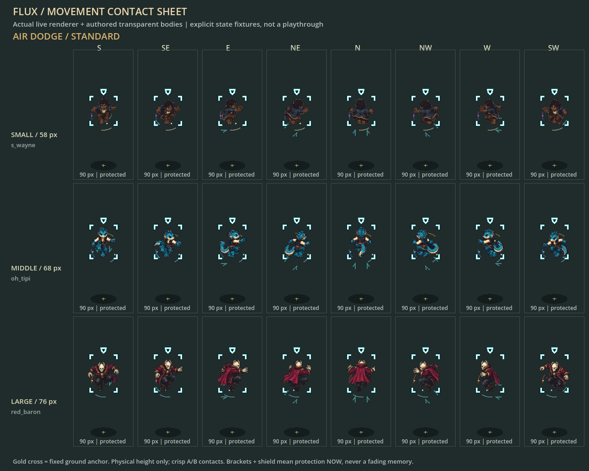
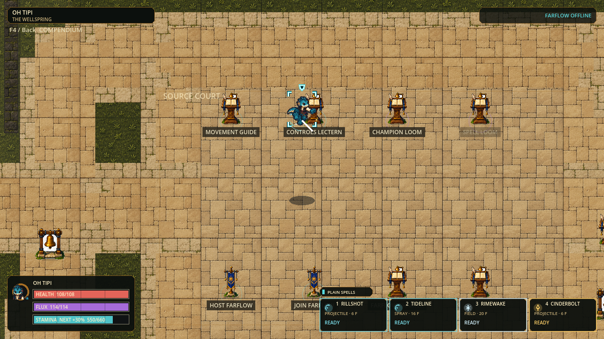
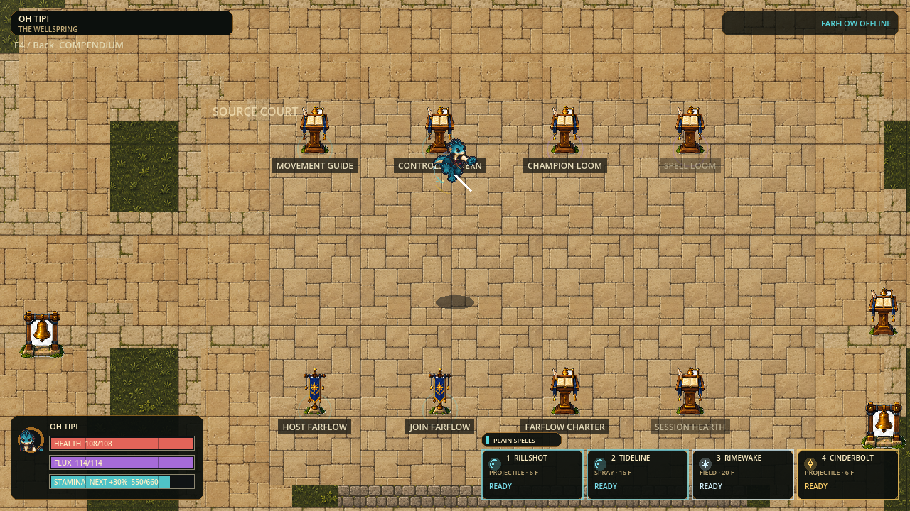

# Movement M1-M5 acceptance

## Expressive airborne feedback

Status: source-verified and ready for the user's movement playtest (2026-09-06).
This user-authorized successor to `fd1898d` supersedes the earlier resource,
speed and timer-only jump decisions below. No new spell, chemistry, map,
roster, installer or Linux scope is included.

| Decision | Current implementation / acceptance |
|---|---|
| More freedom | Every champion Stamina maximum and body envelope is exactly 5x; default 560, champions 594-792; unchanged Health/Flux, recovery and costs |
| Faster, still crisp | Base 372.6 units/s (+15%), sprint x1.28; acceleration/braking +15%, unchanged champion ratios and 900 speed cap |
| Short/full jump | Integer midpoint gravity; real tap apex 35.083 px / 37 ticks, full 90 px / 60 ticks at 120 Hz, identical in all 8 directions |
| Second jump | Fresh press restores upward velocity from current height; apex-timed chain 179.900 px; hard 180 px ceiling; no visual arc reset |
| Air dodge | One per actual airtime, directional 180 ms decaying burst; controlled finite fall, no blanket helpless lockout; walls/cooldown/collision do not replenish |
| Landing expression | Actual landing refreshes jump readiness and next-airtime dodge, preserves low-dodge wavedash and costs; protection never carries into a wavedash |
| Honest protection | White/teal dark-outlined brackets and small shield appear/disappear from authority; no afterglow, no smoothing; reduced effects retain the same status |
| Smooth readable bodies | Stable 58/68/76 templates, all 5 existing champions/eight directions; bounded height interpolation and <=1.5 px fractional gait; nearest sprite sampling, no sprite crossfade |
| Shared multiplayer state | Protocol 41 / snapshot 16 add height, vertical velocity, integration remainder, air-dodge use and fresh-jump history; bounds, round-trip, replay and eight-player capacity are checked |
| Minimal rendering state | At most 8 adjacent actor samples; no extrapolation, instant teleport/death/identity resets, facing/protection untouched; local 120 Hz and remote 60 Hz samples stay distinct |

Protection values are authored in milliseconds and rounded up to the next
120 Hz tick: Jump 11 ticks (~92 ms), Air Dodge 15 (~125 ms), Roll 16 (~133 ms), Slide 6
(50 ms). Early actual landing ends airborne protection; extra held height does
not extend it. Height never lets an actor pass through immutable worldbone.

The old timer-derived HUD drain label was caught during actual frame review:
it said Jump -80/s on descent. It now checks real ascent, held input, control,
dodge/wall state and available Stamina; a regression test covers the mismatch.

### Final verification and actual images

| Gate | Executed result |
|---|---|
| Final Full | `scripts/test.ps1 -Tier Full -ReceiptPath .godot/receipts/expressive-airborne-final-full.json`: 77 suites / 132,698 assertions, zero failures/stderr, import and independent 120 Hz boot; 69,792 ms |
| Local Farflow | `scripts/smoke-farflow.ps1 -TickRate 120 -TimeoutSeconds 60`: host/join, HELLO, movement reconciliation, rounds, late join, exact actor return, rematch and reason-bearing shutdown passed |
| Real source launcher | `flux.cmd play -SmokeTest` passed |
| Eight-player diagnostic | `runtime_stress_probe.gd --quick --require-network-clear`: 6,435 assertions; 2 deterministic repeats, 40 paid projectiles, no lost threat snapshots or rejections; peak datagram 1,364 bytes / 3 fragments |
| Body/protection rendering | 32 actual renderer sheets / 768 fixture cells, three sizes / eight directions, standard and reduced effects; all five live champion recipes tested |
| Actual input recording | 192 final v2 frames: real jump -> fresh double jump -> air dodge -> landing; shield visible on frame 44 and absent on 56 in both effects profiles, HUD drain corrected |
| Compendium | 24 actual rendered frames; Jump/Air Dodge and the small/middle/large champion stats read correctly at 1280x720; isolated harness selects UI rows only |

[Actual Air Dodge guide](evidence/expressive-airborne-v1/air-dodge-guide.png).
Full final recordings are in `.godot/visual-captures/physical-air-chain-standard-20260906-v2/`
and the corresponding `reduced` directory. Earlier v1 recordings contain the
now-fixed HUD label and are not final evidence. Fixtures are not legal-input
playthroughs; compendium row selection is not a physical controller test.

The eight-player probe measures simulation separately from snapshot packing,
not rendered FPS or internet capacity. Medians were 2.161 / 2.267 ms, p99
4.424 / 3.900 ms, worst 9.983 / 4.249 ms; one tick exceeded 8.333 ms. This
does not establish uninterrupted 120 FPS. The checkpoint remains Windows source
only; no installer rebuild, internet proof or GitHub publication is claimed.

### Reference interpretation

Use reference games as design principles, not copied assets or exact balancing.
Melee contributes short/full-hop and directional aerial-evasion decisions;
Nintendo confirms universal mid-air dodge in its
[official Melee overview](https://www.nintendo.com/en-gb/Games/Nintendo-GameCube/Super-Smash-Bros-Melee-268951.html).
Respawn's [Titanfall 2 movement advice](https://blog.playstation.com/?p=184604)
motivates combining wallrun, slide and double jump into alternate routes.
FLUX retains independent top-down aim, controllable post-dodge descent and
paid magical combat; no source game is reproduced frame-for-frame. The other
requested references inform our own goals of momentum expression, clean threat
lanes, grounded shadows and systemic combinations; this slice does not add
their mechanics, art, or chemistry features.

### Playtest route

Start `C:\Users\sende\Projects\flux\flux.cmd`. Tap/hold Space, release and
press Space again near the apex, then Q with direction; observe the small shield
vanish while still airborne. C pressed afresh fast-falls. Land, jump immediately,
and verify a new air dodge is available. Compare all 3 body roles with Shift/C,
wall V and F2/F3 practice. F4 explains costs, opening protection and counters.
Body art remains the existing transparent atlas, not a new hand-drawn animation
set. Physical controller, human feel and real internet play remain open.

## Historical M1-M5 checkpoint

Status: source-verified M1-M5 checkpoint,2026-09-06; original acceptance follows.

This supersedes the paused six-stream queue for the current task. Preserve a
launchable Windows source checkpoint. No chemistry, map expansion, new roster,
spell rebalance, or installer publication is included in this movement slice.

| Slice | Required outcome | Acceptance |
|---|---|---|
| M1 - source verified | Continuous simulation direction, 100 ms newest-intent buffer, short commitments and 120 ms wheel-gesture grouping | Keyboard eight-way/controller angles, tiny vectors, held/synthetic events, no carried-slide fast fall, accidental wheel brake or duplicate payment |
| M2 - source verified | Unified airborne steering, wall transitions and slow handling | All hop families x 8 directions x 3 slow ratios; neutral coast, finite wall exits/budgets, canonical state and prediction round-trip |
| M3 - source verified | Carved slides, momentum retention and landing expression | Slides retain entry speed and lose 1 unit/tick; slide-jump preserves it; low same-direction dodge can wavedash without adding protection |
| M4 - source verified | Useful paid chains with finite protection | Real small/middle/large champion chase/reverse routes; exact per-tick canonical replay and world hashes; reserves remain positive |
| M5 - source verified, human acceptance open | Readable movement across all body sizes and facing directions | Stable 58/68/76 px templates, live shared animation route, 3 sizes x 8 directions, 14 rendered sheets, source-derived guide and optional F2/F3 practice status |

## Design contract

- Physical direction and velocity remain fixed-point continuous vectors. Only
  presentation selects eight facing sectors.
- Ground movement remains available without Stamina. Keep the 324-unit baseline,
  1.28 sprint ratio and current champion reserves until route evidence justifies
  isolated tuning.
- Jump adds lift, not free planar launch. Air control is coast, steer, brake;
  paid redirects purchase a sharper change, never a no-op.
- Inputs execute once, only in a meaningful context, with explicit commitment;
  failed actions do not pay or increase the chain premium.
- Sustained movement, action lifetime and protection are separate. More held
  height or distance does not extend protection. Forced control cannot silently
  keep charging optional sustain.
- Wall contact changes the route, not the remaining air-action budget. No vault,
  material drift/grip or automatic speed farming is reintroduced.
- Reuse body-only transparent art, stable feet pivots and all three size templates.
  Shared motion/effect layers convey travel, braking, landing and vulnerability;
  they never own simulation rules.

## Verification ledger

| Command / check | Actual result |
|---|---|
| `./scripts/test.ps1 -Tier Full -ReceiptPath .godot/receipts/movement-m1-m5-full.json` | 75 suites / 102,863 assertions, zero failures, zero stderr, import and 120 Hz boot; 49,255 ms |
| `./scripts/smoke-farflow.ps1 -TickRate 120` | Local host/join, greeting, movement reconciliation, rounds, late-join, rematch and reason-bearing host shutdown passed |
| `./flux.cmd play -SmokeTest` | Actual source launcher passed; protocol 40 / snapshot 15 |
| `runtime_stress_probe.gd --quick --require-network-clear` | 6,359 assertions; 2 repeats, 40 paid projectiles, no omitted threats/rejected snapshots, identical hashes; peak datagram 1,368 bytes |
| Movement-focused | 34,452 assertions including the new 31,554-assertion overhaul suite |
| Presentation-focused | 4,513 assertions; three body templates x eight directions x nine actions x standard/reduced effects, plus timing/contact checks |
| Input/guide-focused | 1,625 assertions through the canonical deferred runner, with actual synthetic engine-event delivery |

The full gate initially caught the old Conservatory fixture expecting an
immediate redirect one tick after slide-jump. It now proves the same single
buffered press reaches the original expected redirect after the commitment;
the event expectation was not weakened. Full was then rerun successfully.

The eight-player diagnostic measures simulation and snapshot packing separately,
not rendered FPS. Simulation median was 1.802/1.808 ms; one repeat had two
simulation ticks above 8.333 ms (maximum 23.452 ms), and packing had a 31.902 ms
outlier. This is not an unconditional 120 FPS acceptance or an internet test.

### Body and movement evidence

The sheet uses the real live presenter with explicit states; it is not a legal
transition playthrough. The reusable `scripts/capture_movement_specimen.gd`
produced 14 1280x720 sheets / 336 fixture cells, covering idle, alternating walk
and sprint contacts, jump opening/apex, slide, roll, air turn, wallrun, wall exit,
landing and reduced landing. Full originals are in
`.godot/visual-captures/movement-templates-20260906-v2/`.

The separate `.godot/visual-captures/movement-jump-live-20260906/` capture contains
64 frames driven by actual gameplay commands; frames 18, 38 and 50 were inspected
for rise, descent and landing. Body sprites stay on their authored feet pivots;
floor puffs/skids use the ground anchor while bodies lift independently.
Protection is a one-shot authoritative window, not a repeating decoration.
Existing transparent body atlases were reused, not replaced with a claimed new
hand-drawn animation set. Physical controller and human feel acceptance remain open.

### Economy decision

| Real body fixture | Minimum Stamina after sprint approach then Slide -> Jump -> Evade |
|---|---:|
| Small / S. Wayne | 29.867 |
| Middle / Oh Tipi | 43.067 |
| Large / The Red Baron | 69.467 |

All eight directions and chase/reversal exits remain affordable. Therefore
retain the current reserves, ground speed 324, sprint ratio 1.28 and chain
premium 10% per step capped at 40%, resetting after 333 ms. No extra movement
resource or neutral-dodge button was added. Existing Controls Lectern rebinding
remains supported; new ergonomic presets need a separate physical-device review.

## Run and playtest

Double-click `C:\Users\sende\Projects\flux\flux.cmd`, or run `./flux.cmd play`
from that directory. Do not use the older `Documents\FLUX` checkout or an old
exported executable. No new installer was produced. Friends need the same build.

| Trial | Execution / expected read |
|---|---|
| Ground precision | WASD / stick; diagonals equal cardinal speed, release brakes, opposite input reverses |
| Momentum chain | Shift + direction, C, then Space; keep C held to verify it does not cause fast fall |
| Air choice | Release direction to coast; oppose to brake/reverse; V + a meaningfully different direction buys a sharp turn |
| Deliberate descent | Release carried C, then tap C in air; wheel down is also a fresh short intent |
| Evasion / landing | Q on ground rolls; Q airborne dodges; a low dodge can wavedash straight ahead without a forced angle |
| Wall route | V along real runnable wall; direction away detaches into finite unprotected descent; consumed air actions stay consumed |
| Compare body roles | Switch S. Wayne / Oh Tipi / The Red Baron; repeat a route with F2 trace and F3 retry |
| Understand costs | F4 / controller Back opens the source-derived guide; F2 adds actual speed, Stamina and next-action premium |

Pause here. Collect player feedback on turn speed, slide distance, jump hold,
wall control and readability before selecting another implementation slice.
