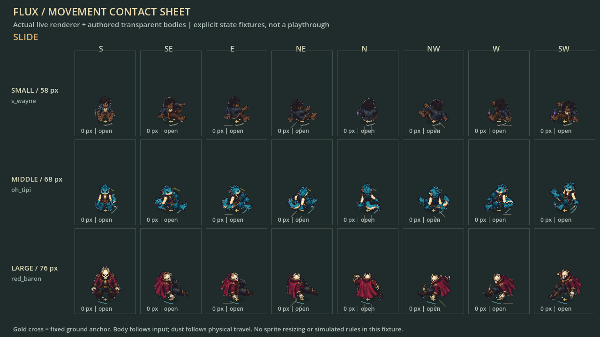
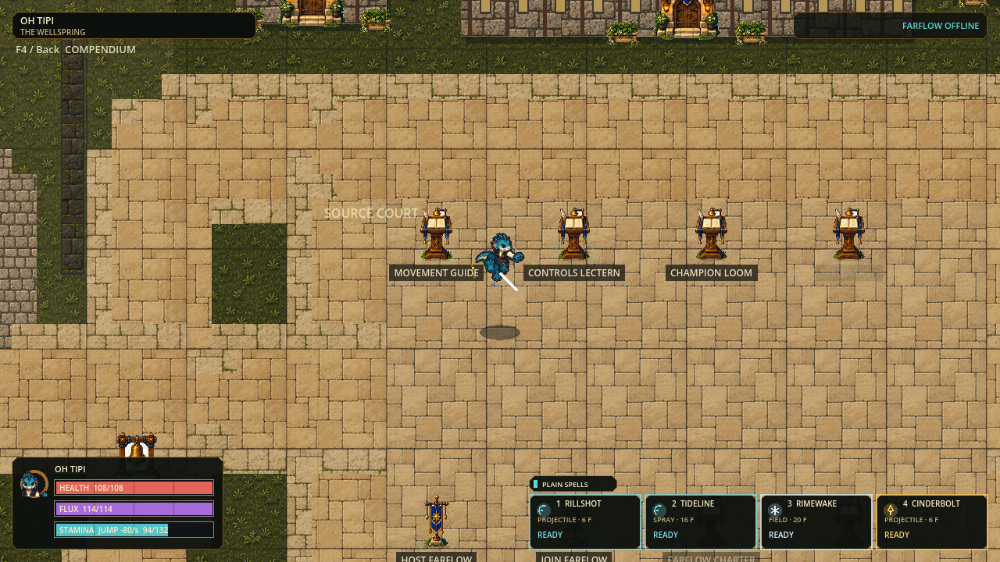

# Movement M1-M5 acceptance

Status: source-verified M1-M5 checkpoint, 2026-09-06; paused for the user's movement playtest.

This supersedes the paused six-stream queue for the current task. Preserve a
launchable Windows source checkpoint. No chemistry, map expansion, new roster,
spell rebalance, or installer publication is included in this movement slice.

| Slice | Required outcome | Acceptance |
|---|---|---|
| M1 - source verified | Continuous simulation direction, 100 ms newest-intent buffer, short commitments and 120 ms wheel-gesture grouping | Keyboard eight-way/controller angles, tiny vectors, held/synthetic events, no carried-slide fast fall, accidental wheel brake or duplicate payment |
| M2 - source verified | Unified airborne steering, wall transitions and slow handling | All hop families x 8 directions x 3 slow ratios; neutral coast, finite wall exits/budgets, canonical state and prediction round-trip |
| M3 - source verified | Carved slides, momentum retention and landing expression | Slides retain entry speed and lose 1 unit/tick; slide-jump preserves it; low same-direction dodge can wavedash without adding protection |
| M4 - source verified | Useful paid chains with finite protection | Real small/middle/large champion chase/reverse routes; exact per-tick canonical replay and world hashes; reserves remain positive |
| M5 - source verified, human acceptance open | Readable movement across all body sizes and facing directions | Stable 58/68/76 px templates, live shared animation route, 3 sizes x 8 directions, 14 rendered sheets, source-derived guide and optional F2/F3 practice status |

## Design contract

- Physical direction and velocity remain fixed-point continuous vectors. Only
  presentation selects eight facing sectors.
- Ground movement remains available without Stamina. Keep the 324-unit baseline,
  1.28 sprint ratio and current champion reserves until route evidence justifies
  isolated tuning.
- Jump adds lift, not free planar launch. Air control is coast, steer, brake;
  paid redirects purchase a sharper change, never a no-op.
- Inputs execute once, only in a meaningful context, with explicit commitment;
  failed actions do not pay or increase the chain premium.
- Sustained movement, action lifetime and protection are separate. More held
  height or distance does not extend protection. Forced control cannot silently
  keep charging optional sustain.
- Wall contact changes the route, not the remaining air-action budget. No vault,
  material drift/grip or automatic speed farming is reintroduced.
- Reuse body-only transparent art, stable feet pivots and all three size templates.
  Shared motion/effect layers convey travel, braking, landing and vulnerability;
  they never own simulation rules.

## Verification ledger

| Command / check | Actual result |
|---|---|
| `./scripts/test.ps1 -Tier Full -ReceiptPath .godot/receipts/movement-m1-m5-full.json` | 75 suites / 102,863 assertions, zero failures, zero stderr, import and 120 Hz boot; 49,255 ms |
| `./scripts/smoke-farflow.ps1 -TickRate 120` | Local host/join, greeting, movement reconciliation, rounds, late-join, rematch and reason-bearing host shutdown passed |
| `./flux.cmd play -SmokeTest` | Actual source launcher passed; protocol 40 / snapshot 15 |
| `runtime_stress_probe.gd --quick --require-network-clear` | 6,359 assertions; 2 repeats, 40 paid projectiles, no omitted threats/rejected snapshots, identical hashes; peak datagram 1,368 bytes |
| Movement-focused | 34,452 assertions including the new 31,554-assertion overhaul suite |
| Presentation-focused | 4,513 assertions; three body templates x eight directions x nine actions x standard/reduced effects, plus timing/contact checks |
| Input/guide-focused | 1,625 assertions through the canonical deferred runner, with actual synthetic engine-event delivery |

The full gate initially caught the old Conservatory fixture expecting an
immediate redirect one tick after slide-jump. It now proves the same single
buffered press reaches the original expected redirect after the commitment;
the event expectation was not weakened. Full was then rerun successfully.

The eight-player diagnostic measures simulation and snapshot packing separately,
not rendered FPS. Simulation median was 1.802/1.808 ms; one repeat had two
simulation ticks above 8.333 ms (maximum 23.452 ms), and packing had a 31.902 ms
outlier. This is not an unconditional 120 FPS acceptance or an internet test.

### Body and movement evidence

The sheet uses the real live presenter with explicit states; it is not a legal
transition playthrough. The reusable `scripts/capture_movement_specimen.gd`
produced 14 1280x720 sheets / 336 fixture cells, covering idle, alternating walk
and sprint contacts, jump opening/apex, slide, roll, air turn, wallrun, wall exit,
landing and reduced landing. Full originals are in
`.godot/visual-captures/movement-templates-20260906-v2/`.

The separate `.godot/visual-captures/movement-jump-live-20260906/` capture contains
64 frames driven by actual gameplay commands; frames 18, 38 and 50 were inspected
for rise, descent and landing. Body sprites stay on their authored feet pivots;
floor puffs/skids use the ground anchor while bodies lift independently.
Protection is a one-shot authoritative window, not a repeating decoration.
Existing transparent body atlases were reused, not replaced with a claimed new
hand-drawn animation set. Physical controller and human feel acceptance remain open.

### Economy decision

| Real body fixture | Minimum Stamina after sprint approach then Slide -> Jump -> Evade |
|---|---:|
| Small / S. Wayne | 29.867 |
| Middle / Oh Tipi | 43.067 |
| Large / The Red Baron | 69.467 |

All eight directions and chase/reversal exits remain affordable. Therefore
retain the current reserves, ground speed 324, sprint ratio 1.28 and chain
premium 10% per step capped at 40%, resetting after 333 ms. No extra movement
resource or neutral-dodge button was added. Existing Controls Lectern rebinding
remains supported; new ergonomic presets need a separate physical-device review.

## Run and playtest

Double-click `C:\Users\sende\Projects\flux\flux.cmd`, or run `./flux.cmd play`
from that directory. Do not use the older `Documents\FLUX` checkout or an old
exported executable. No new installer was produced. Friends need the same build.

| Trial | Execution / expected read |
|---|---|
| Ground precision | WASD / stick; diagonals equal cardinal speed, release brakes, opposite input reverses |
| Momentum chain | Shift + direction, C, then Space; keep C held to verify it does not cause fast fall |
| Air choice | Release direction to coast; oppose to brake/reverse; V + a meaningfully different direction buys a sharp turn |
| Deliberate descent | Release carried C, then tap C in air; wheel down is also a fresh short intent |
| Evasion / landing | Q on ground rolls; Q airborne dodges; a low dodge can wavedash straight ahead without a forced angle |
| Wall route | V along real runnable wall; direction away detaches into finite unprotected descent; consumed air actions stay consumed |
| Compare body roles | Switch S. Wayne / Oh Tipi / The Red Baron; repeat a route with F2 trace and F3 retry |
| Understand costs | F4 / controller Back opens the source-derived guide; F2 adds actual speed, Stamina and next-action premium |

Pause here. Collect player feedback on turn speed, slide distance, jump hold,
wall control and readability before selecting another implementation slice.
