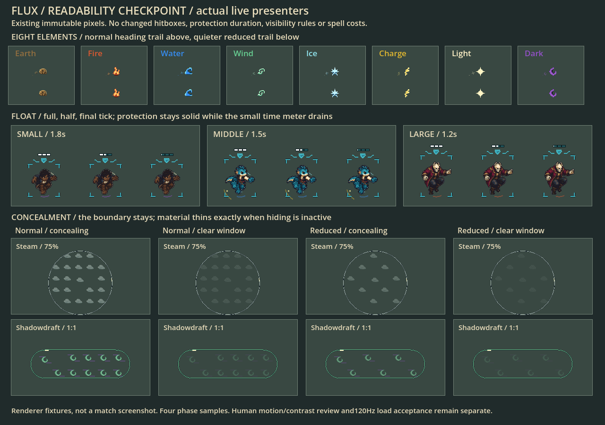
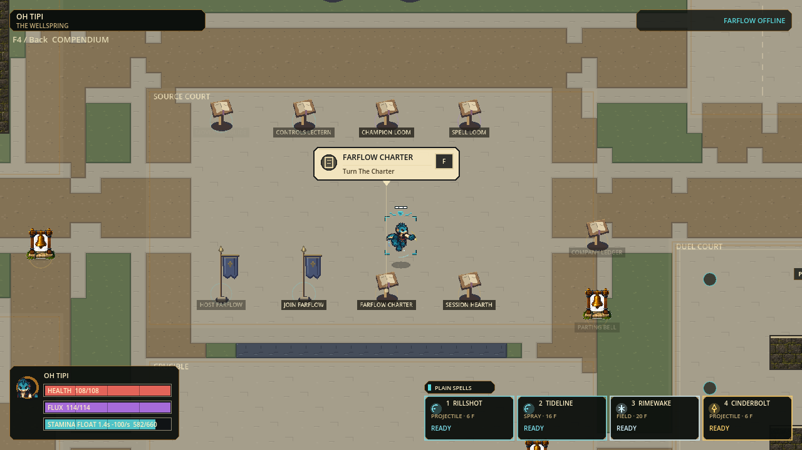
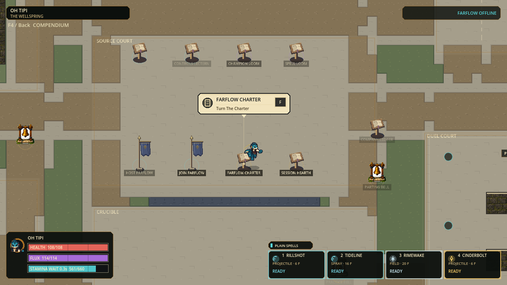
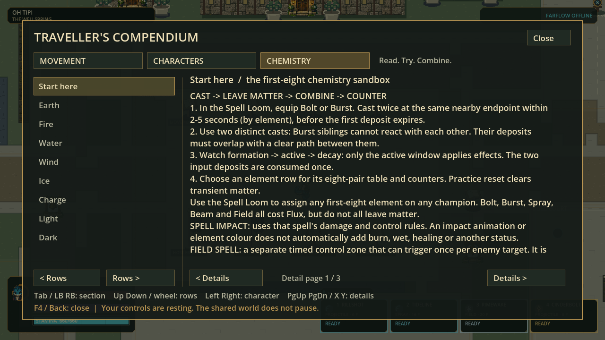
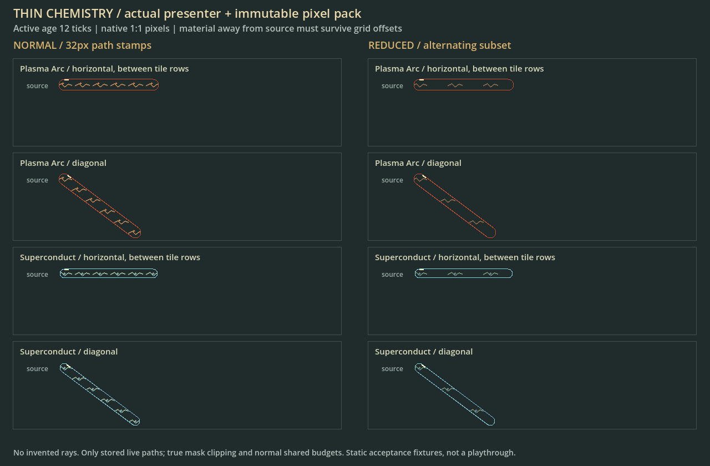
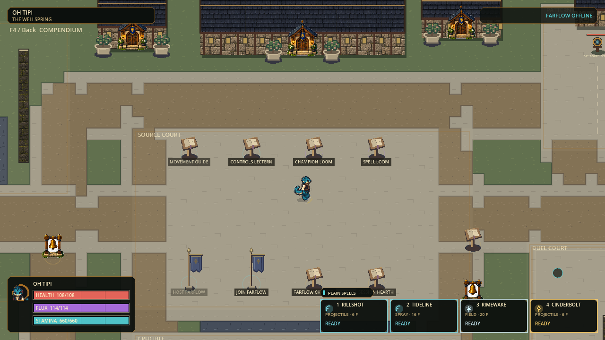

# Pixel asset integration checkpoint

Status: **local source candidate; delivery integration verified, human visual acceptance pending** (2026-09-08).

## Element weight and delivery readability, 2026-09-08

The [delivery/practice checkpoint](DELIVERY-PRACTICE-CHECKPOINT.md) adds gameplay
families, but this presentation slice still derives every visual from simulation.
No original raster, pack manifest or authoring reference was overwritten.

| Presentation slice | Observable result | Contract |
|---|---|---|
| Deposit material | Stronger native elemental identity and clipped material | Same area, age, lifetime and chemistry ownership |
| Field identity | Native flame, curl, rock, swirl, snowflake, bolt, star or crescent remains at the center even with no optional decoration | One unscaled32px cell clipped to the actual field; optional budget unchanged |
| Heavy/Rapid impact | Actual16px/5px projectile radii scale the existing contact stamp | Same finite animation; contact art is not blast damage geometry |
| Heavy blast cue | Quiet cover-clipped70px aftermath, fading over24 simulation ticks | Cached bounded ray geometry, no extra hit or expanding hazard; identical reduced-effects information |
| Spell interface | Seven family columns and explicit hotbar family labels | All57 spells and12 assignments remain visible/usable; same input and price rules |

Actual-renderer fixture pages: `.godot/artwork-20260908/material-render-v2/`.
Normal, reduced, zero-decoration and expired pages were inspected. The Field
identity core survives budget exhaustion; expired fixtures are empty. These are
controlled renderer fixtures, not a recorded multiplayer match or human approval.
Production capture `.godot/visual-captures/delivery-range-v1/` demonstrates an
actual paid Heavy aimed between two targets: both take18 damage and the shell
creates one terminal deposit. The Loom capture verifies the entire57-cell picker
at1280×720. Final retained evidence is linked from the delivery checkpoint.

The Heavy cue is driven by the surviving terminal deposit. If chemistry consumes
it immediately, the resulting reaction renders instead; current cover geometry
clips the short aftermath, rather than reconstructing historical hit eligibility.

## Visual readability, 2026-09-07

Status: **verified source checkpoint; rendered evidence inspected**.
This pass follows protocol45 foundation hardening and does not change simulation.

| Cue | What players can distinguish | Preserved boundary |
|---|---|---|
| Float time | Three compact native-pixel slots drain above the winged shield; full/half/final-tick states differ. Obsolete static budget marker no longer competes with the meter. | Shield remains solid while paid protection is active. Timer, stamina exhaustion, release and overlapping spawn protection come from current state. All3 bodies/8 directions; essential cue identical in normal/reduced. |
| Concealment windows | Steam becomes wispy350ms before decay; Shadowdraft's existing300ms off bands use25% material opacity. | Exact authority predicate, no duplicated visual timer. Boundary, occupied mask, phase art and the other34 reactions are unchanged; thinning does not mean all other reaction effects have ended. |
| Reduced projectile heading | All8 elements keep a short, low-opacity tail from their existing reduced atlas entry, aligned with continuous real travel. | Unrotated element core, hit radius, interpolation and expiry unchanged. Tail remains optional/budgeted; exhausting decoration cannot remove the core. |

No new PNGs/atlases were authored or promoted. The original distinct element
silhouettes/palettes, body-only animation layers and approved source assets remain.
Visual information consumes authoritative state; protocol45/snapshot18/preferences11
and all gameplay hashes remain unchanged from the foundation checkpoint.

Full Windows: **85 suites /282089 assertions**, zero failures/warnings/stderr;
source120Hz boot, current-state and asset-inventory checks pass. Final gate60.6s.
Evidence: `.godot/receipts/visual-readability-20260907-final.json`,
`.godot/diagnostics/readability-20260907-reviewed/` (four actual renderer samples),
and `.godot/visual-captures/readability-float-20260907/` (production command route).
The96-frame1280x720 route uses real movement commands at75% camera zoom; inspected
active Float frame38, released/descending frame70 and grounded frame95. No state
was injected into the production capture. The comparison below deliberately uses
explicit presenter fixtures so all body budgets and clear-window pairs can be
seen simultaneously; it is not a match screenshot.

The reusable fixture is `tests/visual/capture_visual_readability.gd`; invoke with
a new `--output=res://.godot/diagnostics/readability-NAME` directory.
Rendering checks are not human art/feel approval or sustained120FPS evidence.
The measured runtime spike issue remains open in `FOUNDATION-HARDENING.md`.
No installer rebuild, commit or push occurs in this slice.

## Chemistry refinement, 2026-09-07

Status: **R1-R4 source-verified; ready for a bounded playtest**.
This explicit resumption is limited to the existing eight elements and all 36
bounded first-level reactions. The new basic-element animation studies remain
review candidates; no interaction bitmap generation or draft promotion occurs.

| Slice | Outcome and authority | Acceptance |
|---|---|---|
| R1 complete: temporary cover | Thermal Shock only fractures active reaction cover; Grounding Network stops residual Charge projectiles consistently with rays | Red: 8 expected failures. Green: 1,733 chemistry + 9,538 paid-cast integration assertions; all-36 boundaries/replay, live-link expiry, pulse budgets |
| R2 complete: truthful teaching | F4 distinguishes spell impact, placed Field and terminal matter; all 36 effects/counters match executable rules; first page teaches the practical cast sequence | 1,639 compendium assertions, including real-font first-page placement and all-eight Prism projectile/ray routing; actual1280x720 capture inspected |
| R3 complete: thin-path material | Existing pixel material remains visible on narrow linked paths independently of grid offset | 10,477 presenter assertions; translated/diagonal normal/reduced paths, exact masks, safe holes, LOS and budgets; four rendered1280x840 fixture frames inspected |
| R4 complete: integrated checkpoint | Protocol 44 excludes old peers with different cover rules; snapshot 18 and preferences 11 unchanged | Full85/279661; realENet protocol43 refusal; local Farflow; source and Windows export120Hz boot; no warning/error output |

### Reproduce and inspect this checkpoint

| Evidence | Location / command |
|---|---|
| Full source receipt | `.godot/receipts/chemistry-refinement-20260907-checkpoint.json`; rerun `scripts/test.ps1 -Tier Full` |
| Local network | `.godot/farflow-smoke/`; rerun `scripts/smoke-farflow.ps1 -TickRate 120` (last run port24936) |
| Windows export smoke | `.godot/chemistry-release-r44/{export.log,BUILD-STATE.json,boot.log}`; actual release executable, not editor-with-PCK substitution |
| Pack identity | SHA-256 `ce4c0aa4c0821f326f167309caf8c493b4f8b009bc9e53b5f96af8c262b9cbb1`; runtime report confirms protocol44, 36 reactions, 41 spells, five champions |
| Full-scene primer capture | `scripts/capture-visual.ps1 -Name chemistry-primer-NEW -Frames 4 -GameArguments @('--capture-compendium=chemistry','--no-lan-discovery')` |
| Thin-path render fixture | `tests/visual/capture_thin_chemistry.gd`, run with Godot `--script` and `--output=res://.godot/diagnostics/thin-NEW`; refuses existing output |

The original magic manifest and all PNGs remain byte-for-byte unchanged. The
source-audit regression explicitly pins reviewed kernel SHA-256
`366427f660f2fd0d4a10cbd200b08484047403435efcec8d7d541f83fb3277b2`;
future drift still fails. Only two cover guards changed, not recipe geometry or
timing. No art-integrity check was disabled to pass the gate.

The second image is an explicit renderer fixture, not a simulated playthrough
or a new artwork pack. These captures establish visible placement/readability,
not final human charm approval or sustained120FPS. No installer was rebuilt or
published; the isolated export is local test evidence only.

Unchanged: 120 Hz authority, eight-player cap, movement/balance, five playable
champions, three bodies, 40 grid spells plus one variant, immutable worldbone,
source art/manifest bytes and optional-decoration budgets. The original source
hash in the immutable magic manifest remains provenance; structurally validated
geometry and timing, not a rewritten provenance hash, govern compatibility.

Playtest route: start `flux.cmd play`, open **F4 -> Chemistry**, assign Bolt/Burst
through the Spell Loom and place two different casts at overlapping endpoints.
The casts' terminal matter combines; Beam, Spray and the separate control Field
do not currently deposit chemistry matter. Try Charge against a grounding node
and Thermal Shock beside forming/active/decaying temporary cover. Reuse F3
practice reset. Both remote players need the same protocol-44 source build;
old installers are not updated by these local changes.

Next outside this batch: human readability/feel review, material-motion approval
and measured heavy-load 120 Hz profiling. Do not silently add generic Burn, Wet,
healing, lifesteal, recursive chemistry or mutable-world terrain behaviours.

## Historical integrated asset checkpoint

**Character reference supersession, 2026-09-07:** the current visual reference is
the [28-character slight-left size-band group sheet and matching Oh Tipi](../reference/art/cast_sheet_v4/README.md).
The original Oh Tipi source and integration evidence below remain historical provenance.
This reference-only update adds four proposed identities, not new playable champions,
and does not change the verified magic/map runtime or its recorded test results.

This presentation-only slice follows the verified low-hop/first-eight chemistry
checkpoint `286bd8f`. The user's finished packs replace material/movement effect
drawing and selected Wellspring terrain/props, not the simulation or layout.

| Source | Authority and use | Deliberate boundary |
|---|---|---|
| [Original Oh Tipi](../reference/art/oh_tipi_authority_v1/README.md) | Preserved source identity illustration; latest styling follows the v4 group reference linked above | One illustration, not an eight-direction action atlas; preserve live characters until replacement passes motion review |
| [Magic pack](../art_batches/pixel_v1/magic/integration.md) | 474 normal/reduced sequences, 1,960 frames, three shared RGBA pages; phase timing from 120 Hz authority | Frame availability is not user visual acceptance; source metadata remains original candidate evidence |
| [Map pack](../art_batches/pixel_v1/map/integration.md) | User ZIP, 250 asset IDs / 274 frames, four category atlases; terrain/prop presentation on existing campus | Original provisional material palette reviewed as a test candidate, not a canonical shared palette rewrite; sample courtyard is not production geometry |

The reference trident and atmospheric aura are not instructions to restore
weapons or bake effects into body sprites. Hands cast; shadows/magic remain
separate. Small/middle/large and all eight motion directions stay unchanged.

## Ordered acceptance slices

| Slice | Implementation | Proof required |
|---|---|---|
| P1 shared magic | Hash-checked immutable manifest/pages, nearest lossless sampling, exact 120 Hz frame timing | Authored validator, malformed metadata and exact imported RGBA tests |
| P2 spells/movement | Pixel flight, tails, impact, hand cues, beam/spray/field materials, actual jump/slide/landing/protection accents | No changes to hit shapes, paid admission or invulnerability; reduced/expired cues and body-only masks tested |
| P3 chemistry | Native pixel material in exact occupied masks; safe holes, connected paths, worldbone clipping and single Hail pulse | All 36 reactions, live-link expiry, phase cancellation, bounded optional decoration and real paid casts |
| P4 Wellspring | Existing surface classifications and real prop slots use map pack; existing worldbone footprints retained | Terrain seams, pivot/atlas bounds, exact import pixels, gameplay-scale screenshot |
| P5 combined checkpoint | Full source gate, representative rendered capture, export resource check, local host/join and source launch | Record exact evidence below; do not claim installer/internet/120 FPS acceptance |
| Later character work | Oh Tipi middle-body pilot, complete eight-way extension, then remaining bodies | User visual approval and stable action extents before replacing live sheets |

## Asset safety and maintainability

- Original pack manifests, QA reports and source art remain unchanged; this
  separate integration record distinguishes candidate authorship from runtime use.
- User map ZIP SHA-256:
  `21829cb6619d4f8f7caf7e4049bad4f4d51a82ff803237ef8a51db35a7e67486`;
  316 validated unique paths / 4,625,775 expanded bytes, no existing files overwritten.
- Map and magic use cached atlas textures, not one scene node per grain or tile.
  Pixel textures never define collision, timing, spell admission or damage.
- Connected matter ends when its actual required links die. Empty ring centres,
  worldbone shadows and actual optical segment origins must stay honest.
- Original map architecture parts remain available for a later facade-composition
  slice; arbitrary existing buildings are not stretched to a mismatched sample facade.
- Editable sources and previews stay in `art_batches/pixel_v1`; player exports
  should contain only required metadata and runtime resources, never reference art.

## Test and launch

| Final check | Result / evidence |
|---|---|
| Full Windows source gate | 85 suites / 270,135 assertions; zero failures/warnings, stderr 0 bytes; `.godot/receipts/pixel-assets-integration-final.json` |
| Real paid chemistry capture | Fire + Water form Steam at tick 65 through ordinary paid casts; 120 captured frames each in normal100% and reduced75% modes |
| Map capture | Actual1280x720 at75%; new paving/earth/grass transitions, lecterns, banners and planters; unchanged layout |
| Local Farflow | Host/join, shared greeting, reconciliation, round transition, late join, spectating, rematch and stewardship pass; `.godot/farflow-smoke/` |
| Exported resources | Nine required files present; all474 magic sequences/3 pages and250 map assets/4 pages pass exact loader integrity; `.godot/pixel-assets-export/audit-v3-pack.log` |
| Windows player boot | Real exported Windows executable starts from an isolated directory at120Hz, no source checkout dependency; `.godot/pixel-assets-export/boot-v3-isolated.log` |

[Normal Steam capture](evidence/pixel-assets-v1/steam-standard.png) and
[reduced-effects capture](evidence/pixel-assets-v1/steam-reduced.png) are actual
rendered frames, not art targets. Movie recording time includes PNG encoding and
does not establish live performance. Heavy-load120FPS and human charm/readability
approval remain open from the previous checkpoint.

The first export audit caught Godot omitting original PNGs despite include filters.
`addons/pixel_assets_export` now atomically adds the seven exact hash-checked
originals (118,849 bytes) while preserving normal imported textures. The addon
and authoring previews/sources are excluded from player payloads. Source file
hash checks remain source-only where appropriate; no loader integrity was weakened.

An editor binary running a PCK still reports the editor feature and is not a
valid substitute for a release executable boot. The final boot used the actual
Windows release template, with no unsupported path-override flags.

Run `flux.cmd play` from the checkout for this source checkpoint.
Already-downloaded installers do not gain these assets automatically.
