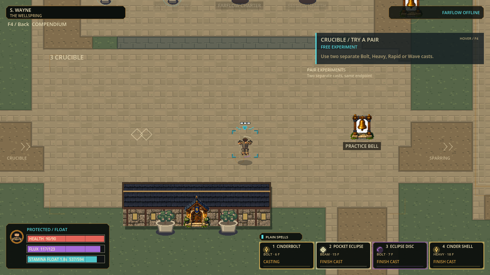

# Playtest clarity checkpoint

Status: ready for a Windows playtest, 2026-09-09; local source and portable,
not a published release or human acceptance claim. The exact verified portable
is selected by [current-checkpoint.json](current-checkpoint.json).

Open [flux2.exe](../exports/windows-playtest-clarity-p47-20260909/windows/flux2.exe)
with its adjacent flux2.pck; no installation or Godot editor is needed. To send
the same build to a friend, share the [97.7MB portable ZIP](../exports/windows-playtest-clarity-p47-20260909/release/FLUX2-Windows-x86_64.zip).
Extract it completely, then open PLAY-FLUX.cmd. Older installed shortcuts still
point to older builds. Close normally; the previous portable remains untouched.

## What changed

| Area | Implemented slice | Deliberate boundary |
|---|---|---|
| Workflow | One W0-W5 queue, archived history, exact current-build pointer and verifier | No deletion of useful source/history or automatic publication |
| Cast admission | Successful paid casts reclaim only the minimum eligible own optional trails | Refusals, other owners, terminals and reaction-linked anchors are protected |
| HUD | Quiet resource labels, four spell readiness/progress cells, explicit protection state | Read-only queries; recovery details on hover; no new input gate |
| Practice | Compact action/effect cards, source-derived details on hover/F4, four floor stages | No artificial tutorial state, changed walls or larger map |
| Bodies | Clearer shared Small/Middle/Large shading and alternating arm counter-swing | Existing bones, sizes, hurtboxes, foot registration and nine textures retained |
| Magic | Quieter harmless terminal/trail material; active effects retain their existing visual weight | All footprint cells, element silhouettes, damage and timings retained |

## Playtest route

| Stop | Try | Watch for |
|---|---|---|
| Commons | Switch between Small, Middle and Large; walk, sprint, strafe and backpedal while aiming elsewhere | Stable body size, alternating legs/arms, clear facing; current bodies are shared templates |
| Movement | Jump, hold Float, dodge, slide and use the southern wall route | Immediate protection indication and expiry; moving should stay responsive while casting |
| Crucible | Compare Fire/Water Bolt and Rapid at the same near and far aiming points | Rapid leaves no flight trail; terminal matter is harmless until a valid pair forms; reactions are visually stronger |
| Sparring | Try four spell buttons and their Ctrl/Alt banks with a same-build friend | Readable readiness, cooldown/resource refusal and projectile/reaction impacts |

Move the pointer onto the resource panel for recovery rates and onto a practice
card for its full explanation. F4 opens the full compendium. The floor route
offers suggestions, not locked progression; ordinary walking bypasses the walls.

## Evidence and follow-ups

| Gate | Result |
|---|---|
| Fresh unfiltered Full | 94 suites /537,041 assertions /zero failures and stderr |
| Actual-game rendering | 26 captures: all8 Bolt flight/terminal pairs, Rapid no-flight-trail, all3 bodies, paid Steam/spent expiry, paid Float/cast/protection expiry; draw never changes world hashes |
| Map-specific rendering | 3 additional normal/reduced/native production-campus views; map/collision hash unchanged |
| Portable | Strict Windows export, exported-PCK content inspection and isolated raw-EXE boot passed |
| Source-to-build identity | 3,079 actual filesystem/runtime/test/package records unchanged before/after export |
| Local network | Exact exported EXE passed host/join, movement reconciliation, round, late join, rematch, reconnect and stewardship smoke with isolated settings |
| Workflow regressions | 104 portable-builder checks, 105 scope-guard checks and87 current-pointer checks; independent of gameplay assertion count |

[Immutable build receipt](evidence/windows-playtest-clarity-p47-20260909/checkpoint.json)
and its inputs preserve exact Full, capture, source, export and boot evidence.
The first Full also passed; an initial builder preflight exposed a typed-UTC
roundtrip bug. That was fixed with regression cases, followed by a fresh source
freeze and Full. No failed builder destination or older build was overwritten.

The paid economy probe found that Rapid can create a full reaction more cheaply
than Bolt. At 120px, Rapid -> Rapid costs 4 Flux and forms Steam on tick 43;
Bolt -> Bolt costs 12 and forms on tick 53, catching an older trail for a shorter
active interval. At 400px both get the full interval. These empty-lane setup
results are **not** a general damage/duel ranking. No speculative nerf was made.
See [measurement and tested reclamation rules](evidence/chemistry-agency-v1/README.md).

The [current eight-player paid-load diagnostic](evidence/playtest-clarity-runtime-v1/README.md)
passed deterministic/danger-state checks but **missed the8.333ms CPU budget**:
simulation p95 was9.868-10.606ms on this PC, before separate snapshot costs.
Treat this as a known performance follow-up, not a120FPS certification.

Next after human testing: reduce measured projectile/chemistry/snapshot costs
without changing outcomes, choose a deliberate Rapid-versus-Bolt chemistry role,
and accept or revise the three shared body templates. A moving-cast candidate
fits the existing page but fails the padded CPU-image contract; it is isolated,
not live. Resolve that contract before promoting it or detailed skins. No extra element,
recursive chemistry, lobby expansion or runtime texture-bank growth is admitted
by this checkpoint.

Not certified by automated checks: human style/feel acceptance, real Internet
two-PC play, accessibility perception, and sustained rendered 120 FPS. Source,
candidate, exported, installed and published states remain separate.
