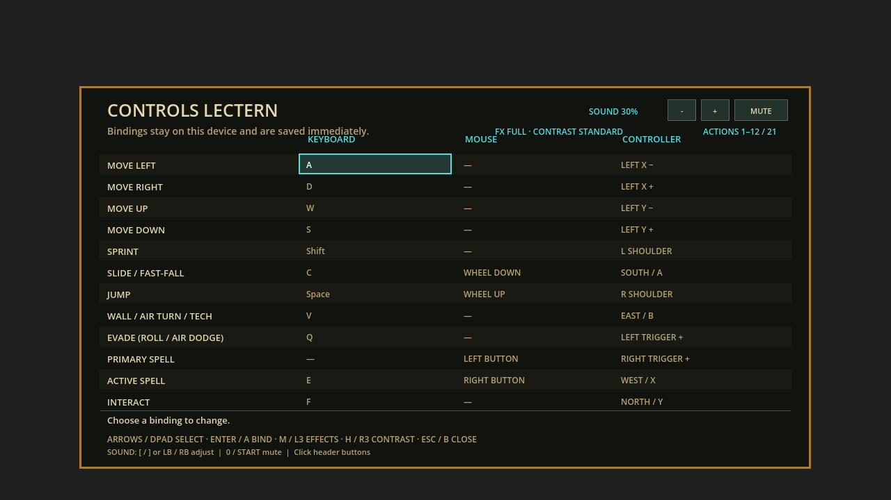
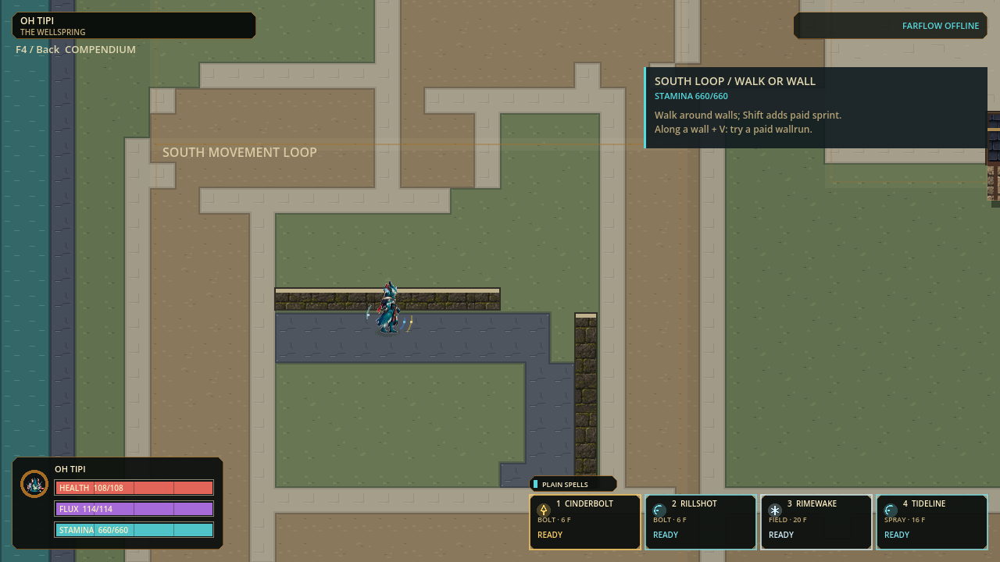

# V Technique defaults and delegated runtime checkpoint

Status: local source, strict Windows export and isolated payload boot verified,
2026-09-09. Final Full passed91 suites /463,294 assertions /zero failures and
stderr in79.550s. Current render evidence is recorded below. No commit,
push, new installer or publication is implied.

## Controls: requested V default without a duplicate action

| Action | Previous default | Current default |
|---|---|---|
| Wallrun / air turn / impact Technique |Q |**V** |
| Ground roll / air dodge |V |**Q** |
| All other keys, mouse and controller |Existing setup |Unchanged |

The Controls Lectern, F4 movement guide and southern practice card derive their
labels from the same saved bindings. These are default changes, not locked keys.
Custom keyboards, explicit unbinds and partial legacy profiles retain their
meanings. Only a complete, untouched, unrevisioned old schema11 keyboard profile
automatically swaps the two keys. Custom mouse/controller layouts are untouched
even if the keyboard qualifies. New saves include optional
`keyboard_defaults_revision=1`; the overall settings schema remains11.

An intentional old Q-Technique/V-Evade setup saved by the current version remains
intentional. Older builds can ignore and discard the additive marker. Ordinary
new V-Technique/Q-Evade defaults do not oscillate when that happens; however, an
older build re-saving the exact intentionally restored old-default keyboard map
loses the marker that distinguishes it from an untouched legacy map. The next
new load can then migrate it once. This narrow downgrade ambiguity is tested and
documented; no schema bump or silent deletion of customized settings is used.

## Delegated next slices

| Lane | Delivered | Still open |
|---|---|---|
| Input and migration |Frozen historical defaults, revisioned current defaults, schema1-11/custom/partial/JSON/atomic-failure tests and physical Q/V press paths |Human comfort and physical-controller use |
| Runtime |Nine-line stateless bounds rejection before unchanged integer projectile/actor contact query; exact every-tick differential and legal mixed replay |Consistent8.333ms slow-tail budget |
| Independent review |Migration/dynamic-help audit; identified and corrected stale editor expectations and current README rows |Small neutral art acceptance |
| Root integration |Source-derived guide assertions, historical controls docs clearly labeled, Full and runnable-checkpoint handoff |Refreshed installer and physical two-PC play |

Next art artifact is deliberately small: one **Small South grounded + walk A +
walk B source board**, correcting opaque matte and repeated arm bias in v2.
Reuse the existing neutral-aware assembler and real standing calibration. It is
proposed, not generated or accepted; no new race/character sprites were promoted.

## Runtime measurement, not a frame-rate claim

Same mixed-eight paid command sequence, two repeats on this machine:

| CPU metric | Before | Retained guard |
|---|---|---|
| Whole-step median |3.853 /4.022ms |3.592 /3.668ms |
| Whole-step p95 |9.376 /10.118ms |9.977 /9.626ms |
| Projectile-stage median |2.667 /2.845ms |2.463 /2.465ms |
| Ticks over8.333ms |141 /135 |136 /128 |

Median step savings are about0.26-0.35ms (6.8-8.8%). P95 moves in opposite
directions: this **does not complete the slow-tail goal**. In a deliberately
close-cluster helper microbenchmark, the guard adds about0.58-0.63 microseconds
per call; far-miss samples save about0.57-0.68 microseconds. Neither is a universal
whole-game improvement. The small stateless change is retained for its measured
typical-load saving, without widening scope or claiming sustained120FPS.

Strict separation preserves tangencies; negative radii use the unchanged old
behavior. There is no state cache, changed hurtbox, cover rule, ordering, cost,
capacity or network protocol. Across1,582 warmup/measured/cleanup/idle ticks,
canonical state plus ordered events match exactly. All non-timing stress report
counters/checkpoint/final hashes match. No source provenance gate was relaxed.

## Verification

| Check | Result |
|---|---|
| Input/preferences focused |1,442 assertions /0 failures; final six extra cases covered in Full |
| Full relevant suites |Input593; preferences855; editor32; guide344; movement-coach252; inherited integration127; new contact regression39 |
| Contact differential plus combat/chemistry |157,458 assertions /0 failures;40,254 direct frozen-old/candidate/production comparisons |
| Mixed stress |16,551 assertions /0 failures; zero legal network-gap samples |
| Integrated Full |**91 suites /463,294 assertions /0 failures /0 stderr;79.550s**; current-state/inventory/doctor/import/120Hz boot passed |
| Actual UI renders |Six Controls frames at720p/1080p plus six paid movement-practice frames; representative Controls and grounded card inspected; saved settings SHA+mtime unchanged through both complete processes |
| Windows payload |Strict release export, SHA-matched copied EXE/PCK and isolated120Hz/protocol47 boot outside checkout passed; zero stderr; fresh standalone profile confirms Technique V / Evade Q / settings11 + revision1 |

The first focus attempt had a test-only parenthesis error; a first contact run
had an incorrect handwritten radius-zero expected value. Both were corrected
against the actual source/legacy oracle, not by weakening production behavior.
Failed attempts remain separate from the passing evidence.

[Runtime evidence](evidence/qv-runtime-v1/runtime/README.md) ·
[Independent review](evidence/qv-runtime-v1/review.md) ·
[Final Full receipt](evidence/qv-runtime-v1/full-receipt.json) ·
[Payload/source/capture manifest](evidence/qv-runtime-v1/checkpoint.json).

## Run the current build

Double-click this new standalone developer build on the prepared PC:

```text
C:\Users\sende\AppData\Local\FLUX-dev\playtests\qv-runtime-20260909\flux2.exe
```

Keep `flux2.pck` alongside it. The copied PCK is66,211,176 bytes, SHA-256
`9d8cc66320a73c3f544c70489f443709807d84128a12b82d5fa322d07869e967`.
The official executable is109,071,360 bytes, SHA-256
`04baf75cc1d69dd93eb709533ecab4fd7770bb8a530645717017a06a9d9809fc`.
Source and payload hashes are bound to the receipt manifest. The separate smoke
settings folder is test evidence, not the player's live settings directory.

Previous `counterplay-practice-20260909` remains the retained standalone fallback.
The September8 installer and installed shortcut are not this new source build.




