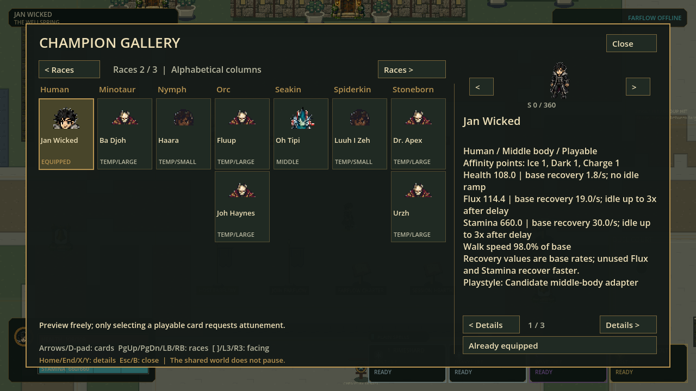
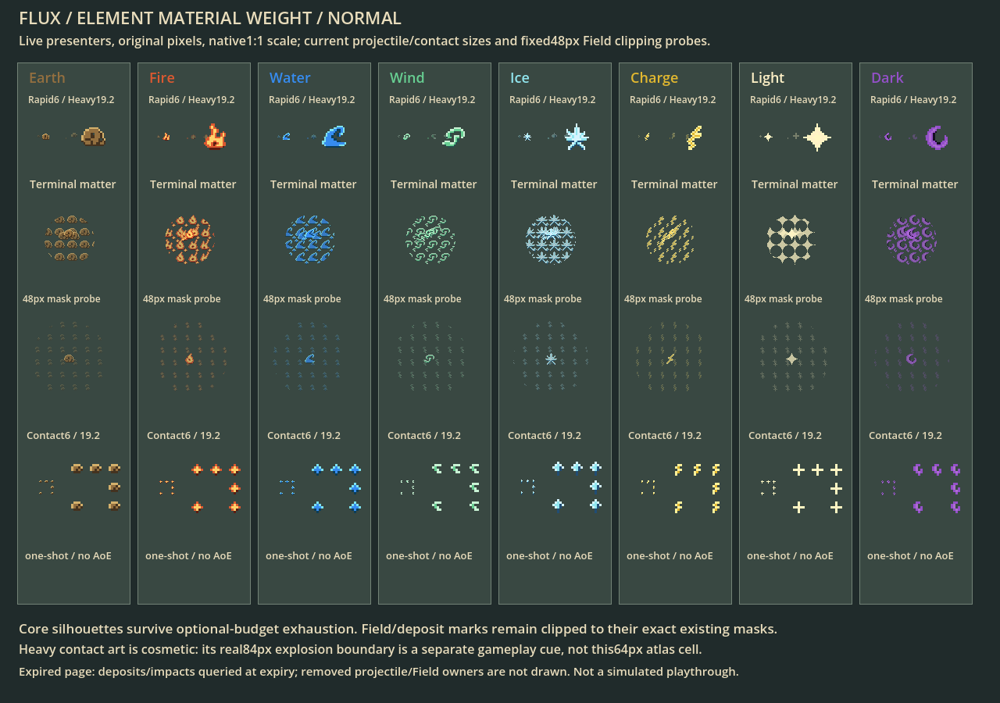

# Race clarity and combat readability

Status: September9 local candidate; Full87/436,991 passed, visual fixtures reviewed.
This document separates implemented tools/tuning
from unfinished sprite production. The authoritative roster is CURRENT-CAST.md.

## Current checkpoint

| Aspect | Implemented change | Boundary |
|---|---|---|
| Gallery | Selected character has an actual full-body eight-way turntable; use arrows beside the body, bracket keys or L3/R3 | Cards retain the front-model top-third portrait; no attunement or gameplay mutation |
| Facing | S0/360, SE45, E90, NE135, N180, NW225, W270, SW315; exact atlas cells, no rotation/blending | Some source sprites remain ambiguous; this inspector exposes rather than repairs them |
| Moving spells | All33 move20% slower, collision radius20% larger; lifetime about25% longer | Terminal travel differs at most3.4 world units from prior candidate due120Hz quantization; aim/range rules unchanged |
| Contact | Existing element-colored one-shot sprite25% stronger in scale, bounded at3x; stronger reduced-mode opacity | No new flash, circle outline, persistent layer or extra damage |
| Heavy | Eight blast radii70 ->84 units | Actual damage footprint and existing clipped material presenter agree; damage unchanged |
| Field | Seven matrix radii85 ->102; Rimewake72 ->86.4 units | Larger whole circles require more placement clearance; costs, lifetime and effects unchanged |
| Race art | Existing8 individual sets and19 temporary profiles retained | No new raster sprite or animation was generated/promoted in this checkpoint |
| Map / chemistry | Existing3072x1728 map and deposit/reaction footprints retained; comparison target gaps96 ->120 | This small range-spacing repair preserves single-target versus midpoint group-hit practice; overall campus expansion remains pending |

Gallery inspection borrows at most one extra verified body page, independently
of the bounded eight admitted actor pages, so nonresident overrides never show
obsolete fallback art. Invalid headings/identities fail closed; reloading clears it.

The ability content hash changes automatically and is part of session admission;
both friends must use the same new payload. Protocol47 and snapshot18 unchanged.
Longer flights increase concurrent projectile occupancy; large-load120FPS and
human combat-feel acceptance remain open even after automated tests pass.

## Race visual production briefs

Use the supplied [cast style](../reference/art/cast_style_post_templates_v1/cast-style-reference.png)
for clothing/material charm, and shared Small58/Middle68/Large76 construction.
These are art requirements, not claims of implemented silhouettes or racial passives.
Each row needs body-only true-alpha eight-way pages, genuine alternating contacts
and every live action mapping, followed by native-size/world/selection review.

| Race | Canonical characters | Distinct anatomy / body-only silhouette |
|---|---|---|
| Angel | Faab I Yaina; reserved Unnamed Angel | Faab is male with a glorious shiny bald head; feathered anatomical wings, practical layered robe; distinguish his Fire/Light identity from the reserved figure; no magical halo baked into runtime bodies |
| Demon | Juul I Yaina; Spai Si | Both male; Small Juul has curly dark hair, Middle Spai Si keeps his own identity; compact horns, angular ears, expressive faces and tails |
| Dwarf | Biggy Bob; Don Doko Don | Stocky torso, short strong limbs, layered beard; Biggy Bob brown hair |
| Elf | Hesus Christo | Long tapered ears, lean limbs, tailored practical clothing |
| Gnome | Waka Aren Si | Fine build, prominent ears/nose, readable goggles and white hair |
| Goblin | Steezo; Wa Bidi | Wa Bidi is female; large pointed ears, compact athletic limbs; distinguish clothes/hair, not palette alone |
| Hobbit | S. Wayne | Small grounded proportions, broad feet, dark skin and curly dark hair |
| Human | Jan Wicked | Human ears/proportions, distinct hair and coat; repair rear-quarter profile ambiguity |
| Minotaur | Ba Djoh | Bovine muzzle/horns, broad neck, readable cloven hooves |
| Nymph | Haara | Rounded organic silhouette, practical leaf-pattern clothing, expressive face |
| Orc | Fluup; Joh Haynes | Lower tusks, strong jaw/forearms; distinct builds/clothing within Large envelope |
| Seakin | Oh Tipi | Aquatic cheek fins, scaled anatomy and tail; no spell/water baked in |
| Spiderkin | Luuh I Zeh | Clear primary biped movement plus paired folded auxiliary limbs and eye clusters |
| Stoneborn | Dr. Apex; H. Le-ne; Urzh | Articulated stone plates, visible joints, unique plate geometry and clothing; H. Le-ne is female with an expressive stone face and a softer limestone/granite silhouette |
| Sylph | Grace Riva | Light frame and clearly attached translucent anatomical wings |
| Treefolk | Fimu Yashiha; Leaf the Hidden; Treevor the Mason | Jointed bark limbs and branch crown; Fimu is female with an open bark face and leaf canopy; distinguish her Small silhouette from Middle hooded Leaf and Large mason Treevor |
| Troll | Grimm Bow | Heavy shoulders, long arms, blunt tusks and broad expressive face |
| Undead | The Red Baron | Skeletal face, defined ribs/armor layers, unmistakable collar silhouette |
| Vampire | Djonah Thaan | Living-looking pale face, small fangs, formal collar; distinct from skeletal Undead |
| Werewolf | Oll' I | Canine muzzle/ears, fur breaks, articulated hindlegs; preserve the Large body envelope |
| Wyrmborn | Ha Rekt | Anthropomorphic dragon head/horns, scaled limbs and tail, anatomical wing silhouette |

No weapon, spell, aura, ground shadow, scenery or parchment is part of the body.
Keep S. Wayne's skin and individual identities; do not infer affinities from the
unlabeled reference. Hurt radii15/18/21 and common wall clearance18 stay unchanged.

## Facing acceptance

| Heading | Visible evidence required |
|---|---|
| S0/360 | Symmetric front-facing head/shoulders/hips; both feet aligned toward camera |
| SE45 / SW315 | Genuine front-quarter anatomy; both eyes may be visible, asymmetric depth |
| E90 / W270 | True side profile, coherent near/far limbs; no accidental quarter-view head |
| NE135 / NW225 | Genuine rear-quarter skull/back/hip construction; not a mirrored side sprite |
| N180 | Back of head and torso centered; feet point away |

Yaw is a world-plane heading under the fixed camera, not the angle of a tilted
head on screen. Do not rotate the raster to fake another view. Review direction
and identity separately from timing: occupied80cells alone are not acceptance.

## Next bounded work

Finish the Small neutral facing/contact proof, then Middle/Large, and reuse it
for one complete race page at a time. Apply accepted pages through the existing
override registry so world, Gallery and remote actors all use the same source.
Expand Wellspring through connected practice spaces rather than blank perimeter:
wide turning/dueling court, long movement circuit, separated element lanes, and
safe travel between stations. Update collision, bounds, camera/minimap, spawn
safety, field placement and multiplayer tests together; do not stretch the art.

## Verification and local test build

Full gate:87 suites /436,991 assertions /zero failures /zero stderr,97.537s;
strict import and120Hz source boot passed. Receipt and exact logs are in
[readability-race-v1](evidence/readability-race-v1/full-receipt.json).
Initial Full exposed stale70px blast assertions, then fixed fixtures checked84px
without weakening clipping tests; the target-spacing regression was corrected
in layout rather than weakening single-target practice acceptance.

Actual renderer captures cover normal, reduced, exhausted-decoration and expired
materials; Gallery capture shows the real selected Jan body and existing temporary
art labels. These are rendered fixtures, not human gameplay/animation acceptance.

Local Windows test payload: `.godot/readability-race-export/flux2.exe` with its
adjacent `flux2.pck`. Keep both together. This is a direct-run developer checkpoint,
not a refreshed installer or online release. Older installed shortcuts still point
to the previous package. No commit, push, branch merge or public release performed.

Export and isolated actual release-EXE/PCK120Hz boot passed, without a source-path
fallback. PCK66,179,932bytes; SHA-256:
`306aed27ad554e36a6b130ffaa1843a64ca7a5dd352ecf70ae8184e88ac793c7`.
Exact export/pack-boot logs are beside the Full receipt. Both friends must use this
same package; physical Internet hosting/joining has not been retested in this slice.
