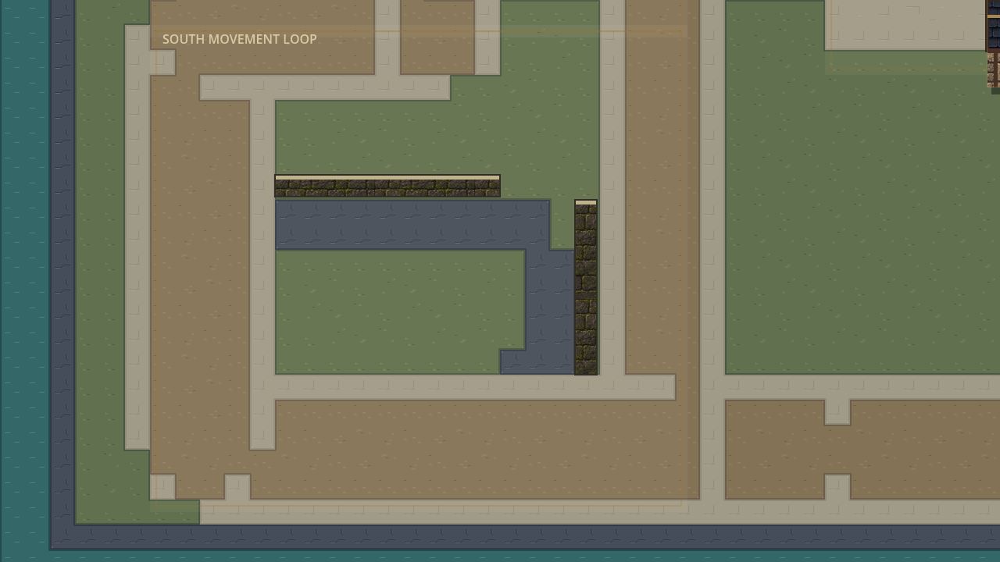
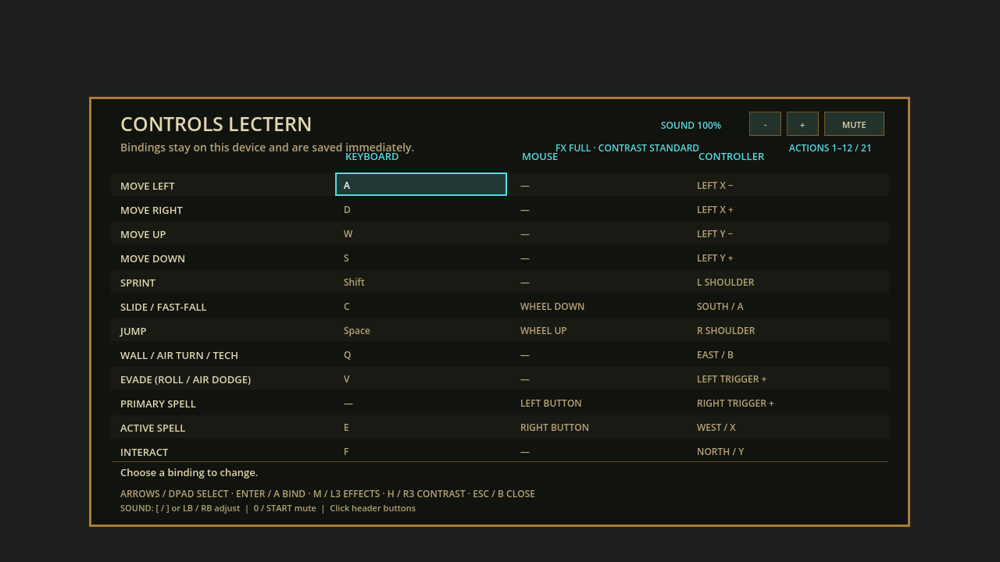

# Sandbox, impact and sound checkpoint

Status: Full, strict Windows export and isolated EXE/PCK boot passed, 2026-09-09.
Local, uncommitted checkpoint; not a new installer, published release or
human-accepted gameplay milestone.

## What changed

| Area | Playable change | Boundary |
|---|---|---|
| Wellspring | 3072x2304 campus; southern movement loop, two optional wallrun surfaces, wide cross-campus return | Original stations, spawns, targets and duel rules preserved; no new move, timed trial or minimap |
| Spell contact | Each element briefly keeps its own flight silhouette at impact, then contracts into the existing breakup | 12 ticks/0.10s; original lifetime/anchor/scale; at most two stamps; no new effect radius or particles |
| Element audio | Eight editable short cast/contact identities; default 30%, volume/mute at Controls Lectern | Local only; four voices; no positional enemy audio, music, reaction sounds or voice acting |
| Runtime | Conservative current-geometry rejection before sampled chemistry contact testing | Same exact results and state; no cache, changed damage, ordering, capacity or protocol |

The annex increases map height by 576 px (+33.3%). The ordinary route is 160 px wide;
the optional 64 px line approaches two new non-vaultable low worldbone walls.
Walking around is always an alternative. The underlying ground texture grows
by 6.75 MiB to 27 MiB, still within the existing 128x128-tile limit. This is more useful
practice space built from existing tiles, not a new environment-art pack.

Impact improvement is deliberately modest at 50% zoom. Heavy contacts and zero
optional-decoration-budget cases retain stronger identity; no universal visual
acceptance is claimed. Sound sketches are synthesized once as 16 short mono PCM
clips from editable recipes in `src/presentation/element_audio.gd`; nothing is
downloaded or generated by a model during play. Numerical signal tests are not
evidence that the player will find them charming or comfortable.

## Test it

Double-click this new standalone developer build on the prepared machine:

```text
C:\Users\sende\AppData\Local\FLUX-dev\playtests\sandbox-impact-20260909\flux2.exe
```

Keep `flux2.pck` beside it. Both files were copied outside the checkout, matched
by SHA-256 and booted there without a source-path argument or LAN discovery.
The preceding verified build remains in `FLUX-dev/playtests/delegation-coach-20260909`.
The installed shortcut and September 8 installer still target their older build.
This checkpoint does not update them or supply an automatic online updater.

| Test | What to do | Acceptance question |
|---|---|---|
| Movement choices | Follow Canopy south to SOUTH MOVEMENT LOOP; sprint, brake, slide and jump around the wide loop | Can you anticipate turns and choose the optional wallrun/kick line without fighting the camera? |
| Ground versus air | Run/kick from either wall, redirect in air, or take the ordinary bypass; compare all three body roles | Are route choices readable while retaining identical 18 px wall clearance? |
| Impact identity | Compare elements using Rapid, Bolt and Heavy at 50/75/100% world zoom | Is the instant of contact recognizable without confusing it with persistent matter? |
| Sound | Compare cast/contact sounds; Controls Lectern header -/+, brackets or LB/RB adjust; 0/Start mutes | Are eight identities distinguishable, restrained and comfortable? Unmute restores 30%, not the last gain. |
| Chemistry | Use the existing Crucible lesson and F4 pair Details; combine two paid deposits | Are formation, active effect, counter and harmless decay understandable? |

Sound contact admission requires an on-screen, chemistry-visible target. Cone
mode deliberately suppresses contact sounds until exact sight-mask parity exists;
local cast cues remain. Menus, focus loss, spectating and exit silence playback.
The optional persisted volume field keeps schema 11 and existing custom bindings.
Older clients ignore the field and may forget only volume when rewriting settings.

## Verification

| Gate | Evidence |
|---|---|
| Map focused | 15,739 assertions, zero failures; real 120 Hz ordinary traversal, wallrun/kick/air redirect, three bodies and camera 50/75/100% |
| Impact focused | 13,944 assertions, zero failures; original lifetime, no fallback resurrection, shape/anchor and zero-budget cases |
| Audio/preferences focused | Audio 2,673 + preferences 317 assertions, zero failures; 16 PCM clips; 8 elements x 4 real paid spell/contact families; ownership/privacy/lifecycle, mouse/key/capture and migration checks |
| Exact contact differential | 23,760 old/new query comparisons; combined 84,312 assertions, zero failures including existing chemistry/projectile/combat suites |
| Graphical evidence | Three map renders, ten impact comparisons, six actual Controls renders at 1280x720/1920x1080; no listening test |
| Actual sound-node route | 16 AudioStreamPlayer starts/mutes and cleanup, through silent Dummy output; warnings rejected |
| Magic asset provenance | Explicit re-audit against exact-equivalent kernel; 20,484 asset assertions, zero failures; no pixel/recipe/phase changes |
| Integrated Full | **89 suites, 462,144 assertions, zero failures; 87.624 seconds; stderr 0 bytes** |
| Source gates | Current-state, inventory, pinned-engine doctor, strict import and 120 Hz boot passed |
| Windows payload | Strict export passed; exact copied EXE/PCK boot at 120 Hz outside checkout; zero stderr |

[Map evidence and reproduction](evidence/sandbox-impact-v1/map/README.md) ·
[Impact evidence](evidence/impact-identity-v1/README.md) ·
[Audio focused evidence](evidence/sandbox-impact-v1/audio/README.md) ·
[Runtime evidence and comparison JSON](evidence/sandbox-impact-v1/runtime/README.md).

### Measured local CPU improvement

Same eight-player burst fixture, seed 608120, two 720-tick repeats:

| Metric | Before | After |
|---|---|---|
| Step p95 | 10.033 / 10.207 ms | 6.726 / 6.792 ms |
| Projectile-stage p95 | 7.548 / 7.614 ms | 4.035 / 4.129 ms |
| Ticks exceeding 8.333 ms | 162 / 164 | 16 / 18 |

All 12 checkpoint hashes, final hash and every non-timing report field match in
both repeats. The fixture peaks at 40 projectiles, 29 reactions and **zero Fields**.
Median stayed roughly flat and p99/max remain noisy. This is about 33% lower slow-end
step cost in this particular CPU workload, not a rendered FPS, field-heavy-load,
remote networking or sustained 120 Hz guarantee.

The initial Full run found exactly two stale source-provenance assertions; its
receipt/log are retained beside the passing final receipt. The reviewed kernel
digest was updated in the magic manifest, source snapshot and strict test after
the independent differential audit. Drift rejection was not removed or relaxed.

Final payload `flux2.pck`: 66,202,680 bytes; SHA-256:

```text
bbd3268bb1c2de012b2283f04b74d42b83a50ee352bf24066fcd7ca13d23c7b7
```

[Final Full receipt](evidence/sandbox-impact-v1/full-receipt.json),
[isolated boot log](evidence/sandbox-impact-v1/sandbox-impact-isolated-boot.log),
[strict export log](evidence/sandbox-impact-v1/sandbox-impact-export.log).

## Next boundaries

Human play/listening acceptance comes before further feedback embellishment.
Then prove an existing multi-reaction counter with real paid casts (Radiance
overlapping Steam), and profile mixed/Field-heavy eight-player loads before widening
chemistry. The Small neutral art contact gate remains open; Middle/Large and
named-character promotion must follow accepted templates. No art gate was waived.
Installer refresh and physical two-PC play remain separate. No commit, push,
merge, publication, new element or recursive chemistry was performed.




