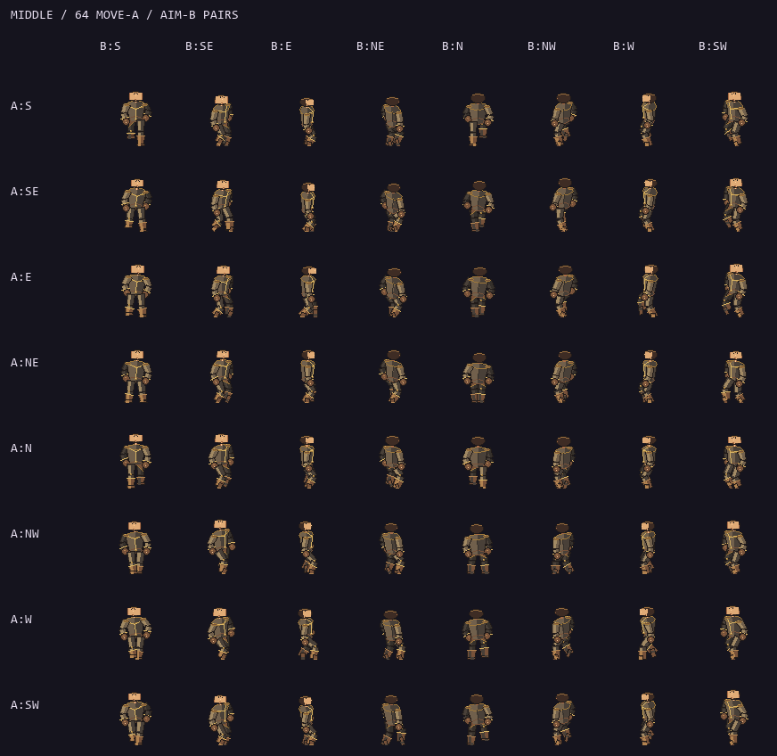

# Shared skeleton motion checkpoint

Status: local Full-verified source and portable Windows playtest, 2026-09-09; uncommitted and unpublished. Human acceptance pending.

## Play

Open [flux2.exe](../exports/windows-skeleton-motion-p47-20260909/windows/flux2.exe)
with its adjacent PCK. For another PC, extract the entire
[portable ZIP](../exports/windows-skeleton-motion-p47-20260909/release/FLUX2-Windows-x86_64.zip).
This is the latest local skeleton build, not a published release or new installer.
Use the same build when hosting/joining. Physical remote play was not retested here.

Try S. Wayne (Small), Oh Tipi (Middle), then The Red Baron (Large). Move in one
direction while aiming/firing in another; compare forward, sideways and backward
travel. Open the Gallery to verify names/stats and the shared size portraits.

## Current change

All 27 playable identities use their matching neutral Small / Middle / Large
skeleton in gameplay and the race-column Gallery. Names, affinities, stats and
selection authority remain intact. Detailed skins are retained but not loaded
or silently used as fallback. This supersedes the candidate-only status in the
[earlier wireframe checkpoint](AIM-CONE-WIREFRAME-CHECKPOINT.md).

| Contract | Result |
|---|---|
| Three reusable bodies | 58 / 68 / 76px front heights; 96px cells; pivot 48,84 |
| Direction | S0, SE45, E90, NE135, N180, NW225, W270, SW315; 360=0 |
| Move A / aim B | 64 pairs x8 stride phases x3 sizes =1,536 locomotion cells |
| Other poses | 240 base cells; same size and pivot across ten key/contact states |
| Anatomy | Fixed bone lengths; planted/non-crossing feet; volumetric profile torso; no waist reversal |
| Hurtboxes | Small15 / Middle18 / Large21px, exclusively size-driven |
| Wall clearance | 18px for everyone; no race/skin/frame modifier |
| Gallery | Three shared top-third front portraits; explicit SKEL labels; same host-validated selection |
| Preserved rules | 120Hz, protocol47, snapshot18, 8 players,27 profiles,57 spells,36 reactions |

[Editable generator, atlases and anatomy evidence](../art_batches/character_style_v1/wireframe_motion_v2/README.md).
Raster import preserves exact binary alpha and source RGBA; six shared textures
replace loading individual race pages in the active mode. Locomotion arms hold
an aim-aligned ready pose. Moving casts retain movement; a dedicated arm-release
or recoil layer is not implemented in this slice.

## Verification and limits

Focused integration passed6 suites /65,066 assertions /zero stderr. Independent
read-only review found no size/race coupling or geometric blocker. Thirty-two
engine captures passed: six gameplay, three cone, three Gallery, eight
controlled production-presenter phase boards and twelve actual paid moving-cast
startup/delivery frames. Each cast required a real start event, exact Flux
payment, matching spawned projectile ID and projectile direction; actor velocity
remained east while aim was north/south. Drawing preserved canonical state;
the fixture uses transient settings and no network/audio. Final Full passed
92 suites /485,395 assertions /zero failures /zero stderr in88.992s. This includes
the occupied-cast matrix, all27 size/hurtbox mappings and retained legacy asset
tests running in explicit historical mode. Strict Windows export and isolated
standalone EXE/PCK boot passed with zero stderr;1610 source records remained
unchanged across the build. [Payload hashes](evidence/skeleton-motion-v2/checkpoint.json),
[Full receipt](evidence/skeleton-motion-v2/full-receipt.json),
[render receipt](evidence/skeleton-motion-v2/render/capture-receipt.json).

Final handoff inspection found the broad `*.import` ignore rule hid the six new
lossless import settings. A narrow exception now keeps them eligible for source
control; all six settings were separately verified/pinned after export. No
runtime texture or game file changed in that packaging-rule correction.
[Import settings](evidence/skeleton-motion-v2/import-settings.json).

The current-state source audit also passed218 assertions across60 cases. It now
reports27 live size skeletons, zero individual live skins and three shared bodies;
the old8-individual/19-template audit remains intact under historical provenance.
An early south-cast capture hit real nearby cover and was retained as failed
evidence; the final fixture starts100px farther north. No collision rule changed.

Eight baked phases and different walk/run cadence do not prove human-perceived
naturalness, foot-lock quality at all speeds, or transition smoothness. Next:
playtest all three bodies while strafing/backpedalling and casting, then refine
the smallest failing transition. Do not start detailed race skins before that.
No installer retry or Windows security bypass; older exports remain untouched.

