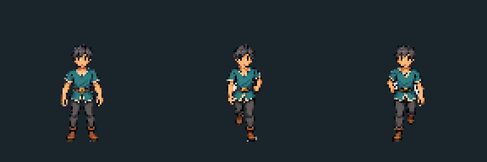

# Template, runtime and Windows delivery checkpoint

Status: local verified source, held art, blocked installer; 2026-09-09.
Historical checkpoint: [the cursor/cone/wireframe checkpoint](AIM-CONE-WIREFRAME-CHECKPOINT.md)
now contains the newest source playtest. Paths and counts here remain evidence for this older build.
Local, uncommitted, unpublished. Authoritative Godot source retained;
prior exports, user settings and real installation remain untouched.

## Run the latest verified game

Open [flux2.exe](../exports/windows-template-runtime-p47-20260909/windows/flux2.exe)
and keep `flux2.pck` beside it. This exact raw release booted independently of
the checkout with isolated settings,120Hz/protocol47 and no warnings/errors.
It is the current source checkpoint, including the reaction-batch optimization.
The [current portable ZIP](../exports/windows-template-runtime-p47-20260909/release/FLUX2-Windows-x86_64.zip)
contains the same verified EXE/PCK; extract the whole archive, not just the EXE.

Fresh profiles use **V Technique / Q Roll-Air Dodge**. Existing customized
bindings remain preserved by the previous exact-default-only migration.

| Delivery | Current result |
|---|---|
| Current raw EXE/PCK | Strict export, source/content identity, fresh defaults and isolated release boot passed |
| Current new FLUX.exe installer | Windows Application Control4551 blocked execution before stage00; zero install stages completed; no bypass/retry |
| Older QV installer |16-stage isolated install/update/repair/boot and20 native argument assertions passed; does not contain the newest runtime optimization |
| Distribution | Local artifacts only; no signing, public release, online updater or physical two-PC acceptance |

[Current delivery receipt and hashes](evidence/template-delivery-v1/final-delivery/README.md)
and [older verified installer](evidence/template-delivery-v1/delivery/README.md)
keep these states separate. Windows trust policy may differ on another machine;
never disable security or promise acceptance there. For a friend playtest both
players need the same complete build, using Host/Join Farflow as documented in
the README; internet access is not proven by local boot or snapshot tests.

## Implemented and verified

| Slice | Result | Boundary |
|---|---|---|
| Reaction batch | Build one ordered list of active, relevant reaction references per projectile batch; preserve inner live checks and original Heavy/blast lists | No persistent cache, recipe, cost, lifetime, cap, protocol or collision change |
| Regression protection |16 additional normal-suite assertions; all36-recipe edge fixtures plus mixed/Field every-tick old-loop oracles | Final state and ordered events match, not merely assertion counts |
| Full gate |91 suites,463,310 assertions, zero failures/stderr;85.390s | Automated source gate, not human fun/visual or remote acceptance |
| Small South art | One generated board plus targeted opposite-step correction; shared assembler creates three58px partial cells at pivot48/84 | HELD for enclosed checker islands; no live character promotion |
| Documentation | Corrected stale neutral-builder claims; current playtest, fallback installer, source proofs and next gates are explicit | Historical receipts retained as history, not competing plans |

## Measured runtime effect

| Fixed mixed-eight test | Before, repeats1/2 | After, repeats1/2 |
|---|---|---|
| Whole-step p95 |9.586 /9.595ms |8.093 /7.990ms |
| Projectile-stage p95 |6.883 /6.918ms |5.484 /5.423ms |
| Ticks above8.333ms |127 /124 |19 /6 |
| Maximum |12.166 /12.777ms |14.076 /11.665ms |

P95 improves15.57%/16.73%; the worse first-repeat maximum is explicitly retained.
This is a fixed eight-player, zero-obstacle CPU workload, not sustained120FPS,
live-map combat, rendering or physical networking certification. Independent
review found no blocking semantic change. [Scope and exact evidence](evidence/template-delivery-v1/runtime/BATCH-CANDIDATE.md).

## Small template status and next gate

Root and independent visual review agree that the leg and arm contacts now
alternate. The dark preview also exposes the blocking pale background islands
inside bent arms. Binary alpha and clean exterior gutters are not enough.
[Source, final prompt, exact mask and review](../art_batches/character_style_v1/template_small/south-pilot-v3/README.md).

Next smallest art slice: repair only verified enclosed background or obtain
genuine alpha; review light/dark at native size and distance-driven gait, then
Small rear-quarter anatomy. Complete all8 directions/action mappings before
Middle, Large and named characters. Keep current in-game art until accepted.

Other independent gates: live-map/rendered slow-tail measurement; trusted
Windows installer execution without policy bypass; physical same-build friend
playtest; human movement, sound and visual acceptance. No scope expansion is
needed to pursue these. Preserve all existing safe playable artifacts.
