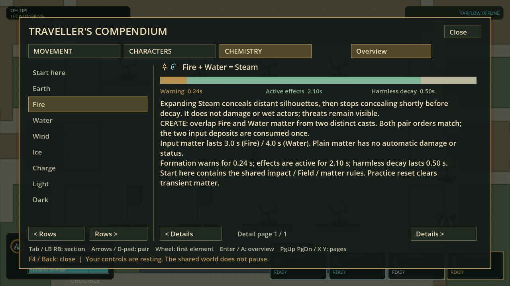
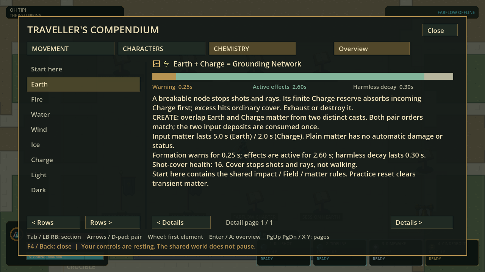

# Readable chemistry, device-aware guides and one visual contract

Status: verified source checkpoint, 2026-09-08; no new character or gameplay content.

The concept is clearer without increasing mechanics: observe -> act -> combine ->
counter -> reset. Teach one action and one pair before asking players to manage a
large loadout. README now gives a short practical learning sequence with Steam,
Fortify and Magma examples. Current guides distinguish spell impact, harmless
terminal matter, Field spells and active chemistry rather than implying that an
element name automatically grants burning, healing, freezing or another status.

## Implemented

| Area | Current behavior | Boundary |
|---|---|---|
| Chemistry selection | Details names and explains the exact selected matrix pair | No longer opens a whole eight-recipe row chapter |
| Phase clarity | Warning / active effects / harmless decay strip, proportional to actual recipe durations | Diagram is not a live-world timer or additional effect |
| Pair navigation | Arrows/D-pad select both elements in Details; returning to Overview preserves the selected cell | Mouse can select the pair in the matrix; full primer remains accessible |
| Specific rules | Live timing, matter lifetime, cadence, cover health and link limits; curated effect/counter text | Crystal Lens explicitly splits Light; it is not mislabeled as all-element blocking cover |
| Station usability | Movement guide follows the actual mapped Interact device, including rebindings | Unrelated keys/stick motion/releases do not overwrite the activation device |
| Recovery clarity | Character stats label base recovery and the source-derived idle ramp | Health does not receive the Flux/Stamina idle ramp; values unchanged |
| Size/style rules | Exact 58/68/76 heights, eight headings, ten rows, fixed body scale, sensible proportions and sprite-derived top-third portraits | Policy alignment, not a new raster template or art promotion |
| World/art scope | Opaque worldbone/no proximity fade; eight active elements and four reserved compatibility styles | Palette, pixel artwork, physics and current element scope unchanged |
| Documentation | Current contracts agree; old V0-V6 descriptions are labeled historical | Historical results cannot approve today's assets |

The character gate remains Small -> Middle -> Large -> user visual acceptance ->
named character repairs/additions. The Small raster proof is still 1/80 cells; no new
neutral atlas is complete, and all existing playable sprites remain unchanged.

## Verification

| Gate | Result |
|---|---|
| Full integration | 87 suites / 434,389 assertions, zero failures, empty stderr, strict import and 120 Hz boot; 81.785 s |
| Style/source policy focused | 44,049 assertions across visual language, glyphs, pixel library and raw export checks |
| Exact-pair focused | 5,060 assertions, zero failures; all 64 cells, source values, selection/cache and bounded lossless pagination |
| Device/recovery focused | 6,417 assertions, zero failures before final Lens wording; final Full includes that wording and its tests |
| Actual guide renders | Three isolated 1280x720 cases: Steam, Grounding Network and returned matrix; four frames each, empty stderr |
| Style token render | Actual 1280x720 diagnostic render with eight active element glyphs, not a claim of new material artwork |
| Windows payload | Strict export and actual adjacent release EXE/PCK boot from its isolated folder passed with empty stderr |

[Full receipt](evidence/usability-style-v1/full-receipt.json).
The guide capture harness bootstrapped the game and programmatically selected
pairs; this is not manual controller acceptance, a friend session or a 120 FPS
benchmark. No gameplay, balance, network protocol or roster counts changed.

## Audited source metadata

`visual_language_v1.json` formerly described a 44..76 height range, only six mixed
direction/action review states, mandatory foreground cutaway and a blanket ban on
realistic anatomy. These conflicted with the current three sizes/eight directions,
opaque-worldbone and sensible-proportion instructions. The shared validator now
enforces the current rules and tests against the presenter's actual 80-slot order.
Runtime consumers do not depend on the offline construction-guide folder.

Only this source-policy hash changed in the magic manifest and its authoring
snapshot: `dc43d67df59574375784c2742ba87c64e5dfa7021c643a2f0379550c4f638559`
to `cb6572d320bf03075eebd59864e3d265dcb24d49ff01eee7b527cab5e897dc6d`.
Element color ramps, material cadences, frame pixels, atlas allowlist hashes,
phase durations and chemistry kernel were not regenerated or altered. Source
snapshot checks still reject unexplained drift. The original pack's provenance
checkpoint remains historical, not a claim that this work occurred at that commit.

## Next bounded work

Continue the Small neutral/contact source on one calibrated board. Simplify the
native face/clothing clusters, prove genuine alternating support and readable
rear-quarter direction, then complete the Small grammar before Middle and Large.
Keep character additions paused. Delivery cache readiness, installer refresh,
physical friend playtest and performance acceptance remain separate open work.

No commit, push, publication or installer refresh is included in this checkpoint.
The user-authorized weekly allowance floor remains 50% remaining.

## Run the local checkpoint

Open `.godot/usability-style-export/flux2.exe` in this checkout and retain its
adjacent `flux2.pck`. This is a two-file developer playtest payload, not an updated
installer. Existing installs and earlier checkpoint folders were left untouched.
PCK size: 66,177,980 bytes; SHA-256:
`5d0d3e959db9ee6b1c100fe5b7e2bcab8c3b8db74b9463b754f82bb74b6e6d0a`.

Press F4 -> Chemistry, select Fire+Water or Earth+Charge, open Details, change the
second element with arrows/D-pad and return to Overview. At the movement-guide
station, use a controller Interact binding to verify controller instructions;
use the Characters reader to compare base recovery and idle-ramp labels.
