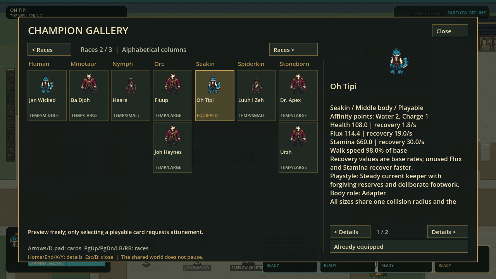
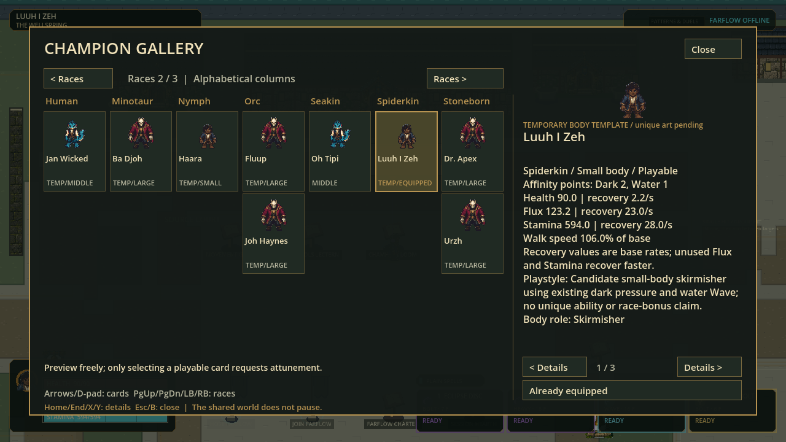

# Cast/Gallery checkpoint evidence

Status: verified local playable-baseline source,2026-09-08; unfinished unique character restyles.

| Evidence | Meaning |
|---|---|
| [Full receipt](full-receipt.json) / [suite log](full-suite.log) |90 suites,398091 assertions, zero failures/warnings/stderr; source on dirty main, no publish |
| [Source boot](boot-120.log) | Godot4.7.1,120Hz authoritative configuration, protocol47; not120FPS performance proof |
| [Exact selection probe](network-probe.log) |450 assertions,28 snapshots,24direction cases; real ENet and production handler for new Large/Small/Middle profiles |
| [Farflow host](farflow-host.log), [guest](farflow-guest.log), [late guest](farflow-late-guest.log) | Isolated local host/join/reconciliation/phase/reconnect/rematch/removal checks |
| [Strict art importer](art-import-tests.log) |785 assertions; rejected opaque/nonuniform mattes and malformed sources; no live draft promotion |

## Actual Windows Gallery

These are real1280×720 renderer captures from isolated source copies, not concept
mockups. Seven race columns are visible per page; all21 race columns and28 records
are source-derived.27 named entries are playable; Angel remains reserved.
Inputs were exercised through real production-handler fixtures and controller
events; no physical-controller usability claim is made.

## Draft artwork, deliberately not live

[Open the unchanged-matte Oh Tipi80-cell source review](oh-tipi-draft-proof.png).
This hidden Godot diagnostic arranges source regions without repairing the
background. It shows why actual alpha, opposite gait contacts, heading consistency
and cross-page anatomy still require review.785 importer tests do not certify
the pictured sprites as production-ready. No candidate runtime atlas exists.

Reproduce game validation with `scripts/test.ps1 -Tier Full`; reproduce the
standalone local selection probe with Godot headless and
`res://tests/scenarios/named_cast_network_probe.gd`. The art pack's own README
documents strict importer/test commands. No internet-match, installer publication,
individual race-art acceptance or heavy-load120FPS claim is included.
