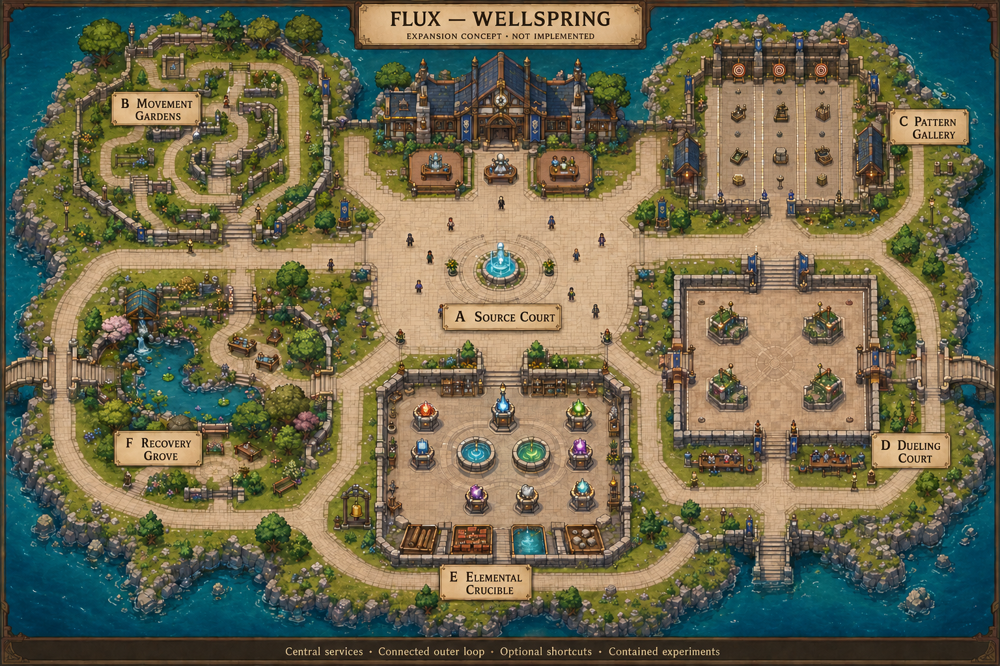

# Wellspring: connected-campus and animation proposal

Status: **reference art and further proposals; layout/M0-M2 foundation now
implemented as a source candidate**. See the
[current acceptance ledger](../../WELLSPRING-MOVEMENT-ACCEPTANCE.md).
The runtime has six connected areas, no-vault movement, explicit Evade, slide
protection/braking, contact wallrun and local trace/echo. Final art/feel acceptance,
independent activities and broader animation/cohesion work remain pending.

Reviewed 2026-09-04 against `main` at `430b5e6`. Requested by the user as a deeper
iteration of the current-game improvement review, with a visual reference for
later development. This folder itself contains references, not runtime assets.
The subsequent implementation is recorded separately in the acceptance ledger.
Its images are excluded from Godot import
and remain reference-only, never collision or runtime asset sources.

## 1. Recommendation

Build a compact, useful academy with a safe central court, five surrounding
activity pockets, direct ordinary routes and a connected outer loop. Expand
interactions before acreage. Prove one complete visual/animation specimen before
replicating it across the three current champions and the wider map.

The illustration establishes composition and atmosphere only. Exact lane widths,
doorways, element symbols, actors, collision and activity boundaries must come
from validated authored data, not pixel tracing. It is a whole-campus planning
view, not the intended player camera. Small figures do not specify the runtime
champion scale or authorize additional playable characters. Shoreline bridge
stubs suggest future connections; they are not required playable exits.

Image review limitation: the Crucible's northern entrance is clearly drawn,
but a second ordinary exit is not equally explicit. The graybox must add/prove
that escape route and every threshold clearance; the concept is not accepted
as a navigable collision plan. The eight plinths are counted, not certified as
eight correct elemental icons.

## 2. Findings that materially change the proposal

| Evidence in current source | Consequence for development |
|---|---|
| `sanctum_campus_g2_v1.json` is 2560 x 1440 with three combined regions; the broader hub document describes approximately 12800 x 7200 and three world layers. | Separate current footprint, next playable extension and long-term world ambition. Do not build the full large-world vision for the first acceptance. |
| `AuthoritativeSession.begin_round()` supplies all connected IDs; `_round_input_locked()` freezes nonparticipants outside Hearth; `SessionRound.begin()` clears world projectiles and fields. | Several concurrent independent activities are NOT already supported. Local participation, cleanup and lifecycle must be proven before claiming that dueling, gardening and training coexist. |
| Walk/sprint have two opposite contact poses in eight directions; other actions share semantic aliases. | Direction coverage is present, but complete gait/action cycles are a separate quality gate. Do not count aliases as unique finished animations. |
| The animation sampler accepts fractional time, but some bootstrap/presenter paths round the visual clock. | Remove unnecessary time quantization at the presentation seam; do not claim that all rendering is currently limited to 60 FPS. |
| Locomotion contact phase is time-based, with movement speed adjusting amplitude. | Test for foot sliding and cadence mismatch; use distance/speed-aware presentation phase if the recordings confirm the issue. |
| The Loom has 16 live spells, 12 positions and three visible library choices. | Improve browsing and comparison before adding more library entries. |
| Movement-guide strings hard-code keys; controller spell slots/layers have no default mappings. | Fix truthful prompts and complete controller defaults before calling configuration intuitive or controller-ready. |
| A historical visual rubric passed; recent captures still show large schematic roofs/floors and small actors/labels relative to the reference. | Preserve the earlier evidence as historical coverage. Require current gameplay-scale acceptance for charm, animation and usability rather than declaring the art final. |

Inspection sources: [map](../../../content/maps/sanctum_campus_g2_v1.json),
[session](../../../src/net/authoritative_session.gd),
[round lifecycle](../../../src/net/session_round.gd),
[champion presenter](../../../src/presentation/cartoon_champion_presenter.gd),
[motion](../../../src/presentation/minimal_champion_motion.gd),
[preferences](../../../src/app/player_preferences.gd),
[Loom](../../../src/app/spell_loom_editor.gd),
[hub contract](../../WELLSPRING-HUB.md).

## 3. Campus topology and scope

Suggested first blockout envelope: **3072 x 1728**, 20% wider/taller than the live
campus, approximately 44% more total area. This is a starting hypothesis, not a
committed runtime size or a promise of 44% more walkable floor. Keep the current
size if improved zoning already delivers the same experience.

| Map ID / place | Layout / purpose | First useful activity | Safety and dependency |
|---|---|---|---|
| A / Source Court | Central fountain landmark; character, spell, controls and party stations along the rim | Spawn, recognize friends, configure and choose a destination | Safe worldbone; no hostile damage, forced movement or lasting mutation; ordinary access always remains open |
| B / Movement Gardens | Northwest circuit; broad slalom, long runnable faces and open reversal/landing pockets | Repeat eight-direction routes and chain jump/slide/wall techniques; immediate local retry | No vault requirement or unimplemented jump-over-cover assumption; ordinary bypass; timer/ghost are later |
| C / Pattern Gallery | Northeast firing lanes face outward into backstops | Stationary/moving target drills; existing burst pattern and evasion practice | Authoritative projectile/field containment; selectable pattern intensity only after deterministic bounds |
| D / Dueling Court | Southeast square; balanced entrances, four small cover islands and outside spectator strip | Two opt-in players duel while others remain free elsewhere | Activity-local participant set, score, respawn, cleanup and late-join policy are prerequisites |
| E / Elemental Crucible | South yard; eight element plinths, paired-source basin, separate material plots and reset bell | Create, read, counter and reset each of 36 recipes through C6-C9 | Bounded material/exposure region; immutable perimeter and exits; no chain propagation into public routes |
| F / Recovery Grove | Southwest sheltered pond and benches, two ordinary exits | Talk/emote, regroup and explore a quiet shortcut | No mandatory crafting or progression; keep social props cosmetic until useful interactions are separately scoped |

The drawing shows two Crucible basins to reserve a future comparison station.
Implement one complete two-source experiment first; duplicate only after local
reset/ownership isolation passes. Plinth appearance does not define canonical
element identity; the live content catalog does.

| Route class | Required design |
|---|---|
| Central spokes | Broad ordinary connections from A to B/C/D/E/F; no precision movement required |
| Outer loop | B-C-D-E-F-B without crossing the fountain's busy center; the northern arcade may pass the academy frontage |
| Expressive shortcuts | Optional wall kicks/runs, slide-jump lines and aerial reversals through clear openings; never required to reach settings, friends or reset or to cross solid cover |
| Recovery | Failed jumps leave an ordinary escape or local recovery; no softlocks, forced lobby restart or mandatory resource expenditure |
| Future expansion | Reserve attachment edges without building new districts, vertical layers, world streaming or fast-travel systems yet |

Provisional graybox tests, not measured results: essential services within 2-5
seconds of ordinary walking after orientation; each activity within 10 seconds
from spawn; an outer lap around 30-45 seconds. Test with all three body roles,
actual collision, controller movement and the slowest intended ordinary route.
Prefer shorter paths over introducing teleportation to repair excessive size.

## Movement-led layout revision (2026-09-04)

**No vaulting.** The image remains an earlier atmosphere/topology sketch, not a
literal instruction to reproduce its narrow slalom or pass over its low walls.
The live game no longer activates vault or crest-superglide. Jump collision does
not automatically clear solid cover. Required crossings now use ordinary
openings, route around solid islands, and preserve explicit world collision.
Do not substitute a hidden auto-mantle for the removed action.

The [movement contract](../../PLAYER-CONTROLS-AND-POV.md#movement-revision-no-vaulting-2026-09-04)
owns implemented/planned status, i-frame timing, M0-M3 and optional techniques.
This section owns the corresponding level-design proposal.

### Dimension by movement envelopes, not visual decoration

All three body roles currently share an 18-world-unit collision radius; use
collision footprint width D = 36 for passage tests, not the 58/68/76px sprite heights.
Authored speed x duration gives rough unobstructed travel of jump 104, double
jump 140, slide 216, slide jump 182, roll 149, air dodge 155 and wall skim 218
world units. These are nominal planning estimates, not exact simulation reach:
120 Hz rounding, input release, steering, wall contact and cancellation change
the actual result. Capture production trajectories before locking dimensions.

| Feature | Starting graybox dimension | Design purpose / rejection test |
|---|---|---|
| Public path / bridge | 144-192 clear units (4-5.3 D) | Several players can pass; no tiny choke on the way to settings or experiments |
| Combat lane | 192-288 clear units | Room to bait, strafe, slide and retreat around projectiles; reject if automatic evasion is the only response |
| Aerial reversal pocket | 288-384 clear units across | Turn back, delay landing or convert into dodge without immediately striking an unrelated prop |
| Runnable wall face | 240-360 straight units; uncluttered approach | One useful short run plus readable entry/exit; art and collision endpoints must agree |
| Wall endpoint landing apron | 144-192 clear units | Wallrun detach/kick can lead to at least two choices rather than a mandatory collision |
| Movement chaining lane | Approximately 480-640 long with lateral exits | Demonstrate slide -> jump -> turn/dodge -> landing without requiring a specific combo to finish |
| Dueling test footprint | Start around 720 x 600, then measure | Larger than the current 660 x 480 arena without becoming long-distance empty travel |
| Practice-only constraint | Narrow challenges may exist off the ordinary route | Clearly opt-in, rapid recovery, no access gate and no body-size discrimination |

These are test ranges, not new constants or guaranteed final dimensions. Avoid
scaling every object with the overall map; grow useful decision space and keep
camera/actor scale independent.

### What changes in each area

| Area | Movement-led revision |
|---|---|
| A / Source Court | Keep the fountain small; add broad open lobes on every approach for all-eight-direction starts/reversals; put furniture outside movement axes; no public combat pressure |
| B / Movement Gardens | Replace the tight obstacle maze with an eight-way compass pad, a wide S-route, a pair of straight wall-run faces, staggered wall-jump exits and a broad aerial turnaround bay; all share an ordinary outside bypass |
| C / Pattern Gallery | Add side exits to each drill lane; vary pattern timing so walking, short slide protection, jumping and rolling each have a useful answer; keep backstops aimed away from public paths |
| D / Dueling Court | Use four small staggered cover islands with equal useful opportunities from both spawns, two crossing lanes, wall-run faces on separated sides and open central turning space; avoid a perfectly repeatable safe perimeter racing loop |
| E / Crucible | Put experiment basins off the main path; preserve an ordinary exit and a separate fallback; give players lateral space to evade a reaction and compare paths, not only reverse down the entry corridor |
| F / Recovery Grove | Preserve a quiet open social pocket and broad connections; vegetation frames routes rather than creating accidental catches; no forced movement puzzle |

Each movement encounter needs at least two useful responses. Examples:

| Situation | One response | Different response / opponent read |
|---|---|---|
| Burst fan approaching | Walk through a readable gap | Short protected slide across one lane; opponent can aim at the committed exit |
| Opponent leads a jump | Bend the arc back into the open pocket | Fast fall sooner; opponent can cover the landing instead of tracking the sprite |
| Wall-side pursuit | Brief run and outward kick | Detach/turn around earlier; pursuer chooses to follow or cover the exit |
| Low cover island | Break line around its left side | Brake, reverse and emerge right; no vault shortcut or wall-passing i-frame |
| Threatened landing | Paid angled air dodge into wavedash | Land and counter-strafe; each has a different timing/resource commitment |

The currently implemented wall kick, skim and early-release timing do not yet
prove all those combinations. M1-M3 need input/state/network tests and actual
play before any drill is labeled fully supported.

### Acceptance before art replication

1. Record start, stop, reversal and chained trajectories on a quiet floor for
   every body role and all eight keyboard directions, plus continuous analog aim.
2. Test open/corner/parallel-wall cases, air-contact kick versus double jump,
   wallrun endpoints and same-wall loops without vault or mantle fallback.
3. Run a threat through each lane and show two legible responses, including one
   positioning-based answer where feasible; i-frames must not be a universal tax.
4. Test slide -> jump and jump -> dodge chains with actual Stamina/cooldowns,
   vulnerable phases and Edgeweave rewards; retain counterplay without hidden
   global chain restrictions.
5. Check 2/4/8 people sharing the loop, simultaneous local activities, reset,
   disconnect and protected exits. No drill can reset/freeze unrelated players.
6. Review default 75% and 50/100% views before adding edge detail; no roof, tree,
   effect or label may conceal the actual run face or landing option.

## 4. Concurrent activity boundary -- before promising a shared campus

Reuse the existing session, round and material systems through a bounded local
activity seam; do not create a second simulation or rewrite networking wholesale.

| Contract | Required property |
|---|---|
| Activity identity | Stable zone/instance ID, bounded participant list, owner, ruleset, reset group, lifecycle and capacity |
| Admission | Explicit opt-in and host validation; being connected or walking nearby does not enroll a player |
| Containment | Projectile, beam, spray, field, splash, knockback, reaction propagation and residue respect zone policy at origin and boundary crossing |
| Safe preview | Harmless feedback must be visibly different from an active threat; normal attacks still obey Flux cost; any training override is local, explicit and labeled |
| Reset | Remove only the activity's effects/state, restore only its authored mutable surfaces, and never teleport/refill/freeze unrelated players |
| Overlapping work | Shared-lab reset requires ownership/participant-safe handling and visible feedback; an outsider cannot silently reset someone else's experiment |
| Departure | Disconnect, participant death, late join, cancellation and host shutdown each produce a defined outcome |
| Replication | Version relevant schemas, replay and compatibility together; fixed caps on events, state, propagation and per-tick work |

Key acceptance scenario: two players duel, two test spells, one resets a lab and
three move/configure/socialize; starting, finishing or resetting any one activity
does not clear or freeze the others. This is a future test, not existing proof.

## 5. Animation: useful cycles before more asset count

Maintain the existing `S/SE/E/NE/N/NW/W/SW` resolver. Travel and aim remain
continuous in simulation; only presentation selects eight pose sectors. Preserve
the shared feet pivot, body/clothing-only layers, hands-only casting, runtime
scale 1.0, body templates 58/68/76 px and existing collision/authority.

| Family | Proposed minimum improvement | Acceptance focus |
|---|---|---|
| Idle | Small breathing/posture cycle plus restrained secondary cloth/fin/cape motion | No body resizing, sliding feet or distracting constant motion |
| Walk | Four meaningful poses: left contact, pass, right contact, pass | Alternating limbs visible at gameplay zoom in all eight directions |
| Sprint | Distinct forward intent and quicker contact progression; reuse the same phase interface | Acceleration, braking and cadence agree; no speed change caused by animation |
| Turn / reverse / strafe | Preserve sensible phase; gait follows travel while independent aim changes upper-body intent | No leg reset every turn, sector flicker or forced delay before a legal input |
| Jump | Launch, rise/apex, descent and landing interpretation of actual state | Receiving-surface shadow and held-input air steering stay aligned; no extra animation lock |
| Slide | Entry, low travel and recovery | Fixed size, clear travel direction, honest end of action |
| Roll | Entry/tuck, progression through roll, recovery | Actual action progression instead of a static low pose; invulnerability timing remains simulation-owned |
| Cast while moving | Composed hand/upper-body action over locomotion | Legs do not freeze on every cast; no added charge or recovery frames that change gameplay |

Do not multiply all action variants by the whole planned roster. First prove
S. Wayne (`small`), then Oh Tipi (`middle`), then The Red Baron (`large`). Treat
four gait poses as the initial budget; add frames only when side-by-side runtime
review shows a benefit. Prefer discrete pixel poses over crossfading ghosted
sprites or interpolating body size.

Keep fractional presentation time through sampling; snap final spatial placement
according to the pixel/camera policy. Drive planted contact with distance/speed
where needed, but drive jump/cast/evasion phase from accepted authoritative
events/timers. Reconciliation/teleport/reset must clear or rebase motion history.

## 6. Spell and environment presentation

Extend the existing [delivery skeletons](../../../content/visual/spell_animation_skeletons_v1.json)
rather than replacing them. Geometry comes first, element dressing second.

| Delivery | Visual behavior | Never compromise |
|---|---|---|
| Projectile / burst | Brief hand gather, release snap, stable moving core, restrained trail and directional impact | Continuous collision/ownership read, spawn/bounce/impact continuity, visible safe lanes |
| Beam | Hand-to-endpoint opening, stable boundary and distinct contact end | Actual hit extent and wall stop; no decorative extension beyond authority |
| Spray | Short hand sweep, open fan with intentional negative space | Actual cone edges; no opaque cloud covering actors |
| Field / residue | Grounded boundary, clear formation/active/decay stages | Active hazard differs from harmless afterglow, without relying on color |

Use a small shared kit: floor variants, wall/corner/threshold, low cover, roof and
cutaway, stairs/ramps/bridge, water edge, foliage cluster, lamp/banner, station and
target. Author dimensions, pivot, collision/material reference, occlusion policy,
variation seed, provenance and render budget once per module. Visual material is
not proof of a supported chemistry response; classify surfaces as inert or live.

Build scenic richness with silhouette, shape grouping and material contrast, not
uniform noise. At 50% overview simplify decorative texture and distant labels;
at 75% default prioritize player/threat/route; at 100% show interaction detail.
Do not enlarge roofs to imitate concept scale. North is screen-up, gameplay
floors stay cardinal, and tall scenic silhouettes stay at non-occluding edges.

## 7. Configuration and learning

| Improvement | Scoped implementation principle |
|---|---|
| Actual controls everywhere | Format prompts from live bindings, including modifiers, wheel and controller glyphs; test remapped movement-guide text |
| Complete controller defaults | Design all four slots and three layers with conflict-free movement/aim access; verify held modifiers and simultaneous inputs on hardware |
| Spell browser | Show the current library as icons with element/delivery filters, selected-slot highlight, cost/cooldown/range and a safe practice action |
| Twelve positions | Retain Plain/Ctrl/Alt x 1-4; only four active cells in combat HUD; never restore a fifth button |
| Champion selection | Three clear selectable cards with size/strength/tradeoff; planned roster stays non-selectable; no empty race-column grid yet |
| Common settings | A fast overlay and physical station invoke the same commands; no separate start menu or walking requirement to escape/fix controls |
| Accessibility | Independent text/HUD scaling; contrast/reduced motion; configurable stick deadzone and aim response; hold/toggle choices only where input semantics are explicit |
| Learning | Teach one cause and correction at a time through short context cues; detailed mechanics remain in optional panels |

Audio sliders should be added alongside real audio buses, not as nonfunctional
settings. Save versioning, reset-to-default and safe recovery are part of every
new preference. Modifier ambiguity, wheel momentum and duplicate bindings need
tests; a configuration screen existing is not proof all input combinations work.

## 8. Proposed integration order and stopping rules

The user subsequently promoted map-first implementation and M0-M2 before C6.
That foundation is now in source; this image and the richer activity/animation
recommendations remain proposals. C6-C9 chemistry and its required playtest pause
remain next. Material-assisted movement is a neutral future seam; non-vault
landing burst is excluded. The rows below retain the original presentation
proposal, not authorization to advertise independent activities as implemented.

| Stage | Small playable outcome | Relationship to existing queue |
|---|---|---|
| P0 | Truthful binding prompts, usable defaults and separate coverage/quality statuses | Small usability corrections at the next safe seam |
| P1 | One Source Court art specimen and one small-character walk cycle | Targeted presentation validation, not wholesale asset replacement |
| P2 | Middle/large adaptation and coherent jump/slide/roll/cast transitions | Expand only the accepted motion contract; no balance retuning |
| P3 | Graybox connected campus and local activity admission/reset proof | Required before advertising concurrent independent training/duels; reuse C6-C8 ownership/reset work |
| P4 | First live Crucible exposure, shared effects and readable lifecycle | C6, then C7, then C8; keep current library and eight elements |
| P5 | Modular art extension, C9 all-pair journey and packaged friend test | Pause for user acceptance before bigger maps or roster expansion |
| Separate release work | Trusted signing, install/update/repair/quit and physical two-PC joining | Existing external blocker; never bypass Windows security or imply NAT traversal already exists |

No new races/champions, extra elements, vertical world layers, procedural map
generation, generalized plugin architecture, crafting progression or relay
service is required to prove this campus. Reserve extension points without
implementing speculative systems.

## 9. Evidence and acceptance

| Gate | Evidence required -- not yet run for this proposal |
|---|---|
| Orientation | A newcomer finds character, spells, controls and host/join without verbal coaching |
| Movement | Three champions x eight directions through start/stop/reverse/air/slide/roll, including opposite/side aiming and moving casts |
| Visual quality | Actual 720p/1080p gameplay at 50/75/100%, grayscale, high contrast and reduced effects; concept art does not count |
| Local activities | Mixed eight-player scenario above plus cancellation, late join, local reset and disconnect |
| Chemistry | All 28 different-element pairs and eight self-pairs create their authored bounded result, explain the counter and reset safely |
| Performance | Measure CPU/GPU frame-time percentiles, fixed-tick backlog, allocations, draw/effect counts, snapshot bytes and join/reset spikes on named hardware |
| Release | Same green commit installed, updated, launched, joined and safely closed on two physical Windows PCs |

120 Hz means an 8.33 ms frame interval, not a hardware-independent guarantee.
Budget static map rendering/culling separately from simulation. Do not add one
physics process or node-heavy effect graph per decorative tile. Prefer shared
atlases, pooled bounded effects and visible-region work, after profiling shows
the actual bottleneck. Report measured results, not assertion counts as FPS.

## 10. Artifact provenance and limitations

Created with the built-in image-generation tool. Full original and corrective
prompts are retained in [image-prompts.md](image-prompts.md); file checksum and
dimensions are recorded in [provenance.json](provenance.json). The revision fixes
the missing Source Court label and the extra plinth in the initial generation.
No external copyrighted game pixels were supplied to the generator.

This is an original design reference, not production art or a gameplay accuracy
guarantee. Label/count review is separate from route, collision, accessibility,
multiplayer, visual-motion and performance acceptance. No fresh game tests or
interactive playtest were performed for this design-only request.
