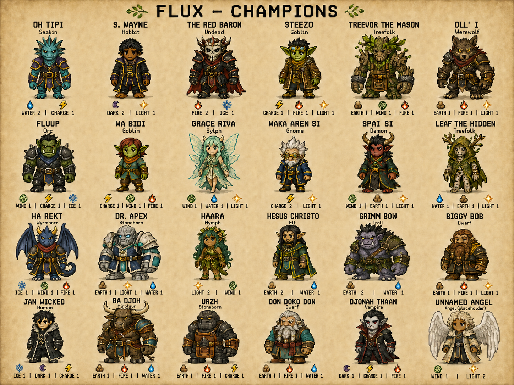

# FLUX full cast poster - style reference1

Status: preserved earlier24-character exact-front poster; superseded by [v4](../cast_sheet_v4/README.md) (2026-09-07).

Selected image: [flux-champions-current.png](flux-champions-current.png).

The poster contains24 current identities in a6-column/four-row grid, with names/races above and distinct element icons plus affinity levels beneath. One glyph denotes each affinity; its number denotes current strength. Oh Tipi and Ha Rekt received frontal-pose corrections; S. Wayne received a dark-brown-skin correction. Names/affinity allocations come from the live catalogs, not historical text on the supplied reference.

This is a labeled parchment review illustration, not a transparent sprite atlas. Generated cell scaling is illustrative; no claim is made that exact runtime stature ratios or animation landmarks have been measured or adopted. The latest compact cartoon-style request supersedes the prior long-anatomy individual-card direction.

Latest user direction supersedes the individual-card format: match Pictures/styleref1, all cast members in one image, elements beneath each.
The reference controls pixel-art charm and poster arrangement, not its historical roster labels or held weapons.
Current roster:24 identities including one explicitly unapproved Angel placeholder; names/races/three-point affinity profiles use live content/champions JSON catalogs.
Characters keep empty hands and separate elemental icons; no runtime art, mechanics, stats, files or atlases are replaced by this concept-review poster.
Cross-cast proportions target current58:68:76 size-role relationship, using compact coherent adult fantasy anatomy. Exact in-game atlas normalization remains a separate measured production task.

The individual v1 sequence stopped after16 cards; v2 stopped after12 when this latest one-image request arrived. Both drafts remain preserved.

Generated with the built-in image tool. PROMPT.md records initial art direction and current labels; CORRECTIONS.md records the two targeted polish passes. Earlier image variants are preserved beside the selected file for provenance, not separate approved designs.
