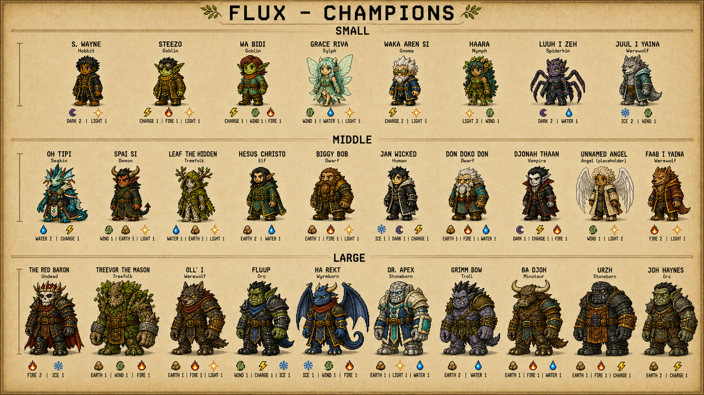

# FLUX character reference v4: slight-left cast

Status: complete generated reference candidate; user visual acceptance pending (2026-09-07).

Historical identity snapshot: the September 9 correction makes Faab I Yaina an
Angel and Juul I Yaina a Demon. The Werewolf assignments below and in this
folder's original images/JSON describe the earlier proposal, not current canon.
See [the corrected overview candidate](../cast_overview_angel_demon_v1/README.md)
and [the current cast contract](../../../docs/CURRENT-CAST.md).

## Selected references

| Asset | Use |
|---|---|
| [28-character three-size sheet](flux-cast-28-size-bands.png) | Current compact cast-style reference: 8 Small, 10 Middle, 10 Large; slight viewer-left poses; affinities below |
| [Matching Oh Tipi](oh-tipi-slight-left.png) | Standalone adaptation of the user's original into the group style; Seakin, Middle, Water2/Charge1 |

The first mixed-grid size edit did not establish consistent physical size differences.
The selected sheet replaces it with three visibly distinct bands, shared soles within
each band, and different body heights rather than labels alone. The illustrative
target was80:100:120; generated pixels are not certified exact measurements. Runtime
58/68/76 templates, stats, collision and all eight motion directions are unchanged.

Latest user direction: the complete group image becomes the character style reference; adapt the attached standalone Oh Tipi to its compact pixel style, angle every character slightly toward viewer-left, add explicit Small/Middle/Large labels, and add Luuh I Zeh (Spiderkin), Juul I Yaina and Faab I Yaina (Werewolves), and Joh Haynes (Orc) with unique affinities.

This supersedes v3's exact-front presentation. The cast keeps its existing identities and current affinity allocations; only the four newly requested identities receive new proposed profiles. Their body sizes, costume details and affinity allocations are review proposals, not claims of runtime implementation.

The group image is the current visual reference. The original Oh Tipi source is preserved and adapted, not overwritten. Empty hands, no staffs or wands, no spell effects merged with body art, coherent compact proportions, and practical nonsexualized clothing remain invariants.

This is reference artwork only: no runtime atlas, collision, abilities, roster JSON or game code is changed here. Production sprites still require isolated transparent art, measured size/anchor normalization, animation and gameplay acceptance.

## Four newly requested character proposals

| Character | Race | Size | Affinities |
|---|---|---|---|
| Luuh I Zeh | Spiderkin | Small | Dark2 / Water1 |
| Juul I Yaina | Werewolf | Small | Ice2 / Wind1 |
| Faab I Yaina | Werewolf | Middle | Fire2 / Light1 |
| Joh Haynes | Orc | Large | Earth2 / Charge1 |

All four profiles spend3points, are pairwise distinct and duplicate neither an
existing full allocation nor an existing two-element set. They cover the first
eight elements without repetition across the four newcomers. Spiderkin is the
user-requested visual race name; a runtime ancestry mapping remains undecided.

## Verification and provenance

Independent visual/data review found28 unique identities, correct8/10/10 size
membership,72 matching affinity values, one glyph per affinity and a clear
JuulSmall -> FaabMiddle -> Oll'ILarge progression. This is concept-level visual
review, not human approval or an in-game performance/animation test.

Generated with the built-in image tool. Prompts are preserved in
[Oh Tipi prompt](OH-TIPI-PROMPT.md), [initial group prompt](GROUP-PROMPT.md),
[rejected mixed-grid size correction](SIZE-CORRECTION-PROMPT.md), and
[selected size-band prompt](THREE-SIZE-BANDS-PROMPT.md).
Original inputs and intermediate poster variants remain untouched for provenance;
only the two files under Selected references are the latest candidate deliverables.
Image dimensions/hashes and generation-source paths are in manifest.json;
cast-reference.json records exact identities and proposed additions.
