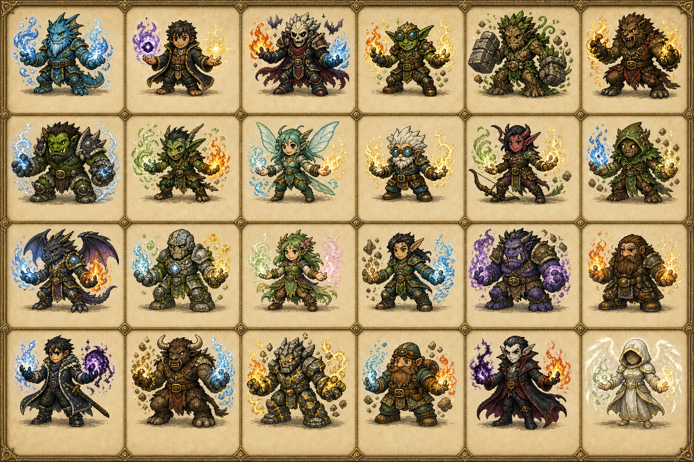

# Character style target after complete basic templates

Status: user-supplied style reference, 2026-09-08, activated for the shared visual
foundation by the September 9 request. The original image is not runtime art.

Current amendment: warm clothed shared bodies, basic elements and terrain now
translate this direction through their existing editable pixel sources. No
pixels were extracted from this sheet. Named-character skins still wait for
shared-template playback acceptance. The original staged request below remains
historical context, not a claim that all named cast artwork is implemented.

The user requests this look in game **after the general Small, Middle and Large
skeletons/templates are complete for all animations and directions**. Preserve
the original file; no extraction, background removal or sprite promotion has
occurred. SHA-256:
`4f24f503007ac34eb5e41411186ff3ac8880c58e9c438ef9b01c17ddcba68eba`.

## Reference priority and activation

| Phase | Authority |
|---|---|
| Current shared bodies | Existing three-size anatomy and eight-direction/action contracts; warm charcoal/leather/gold adventurer layer, no character-specific skins yet |
| Completion gate | Small, Middle and Large have complete directional/action coverage, stable anatomy/registration, reviewed animation playback and user acceptance |
| Character styling after that gate | This sheet is the newer primary cast-look target; original Oh Tipi remains a supporting detail reference |
| Identity and gameplay | CURRENT-CAST.md and validated content continue to own names, races, affinities, body allocation, skin/hair facts, stats and collision |

Filled80-slot sheets or construction diagrams alone do not complete the animation
gate. Review all live movement/action mappings in all eight directions, including
idle, walk/sprint, jump/Float, slide, roll/air dodge, wall movement, cast and hit.
Shared/derived poses must remain labeled and visually satisfactory in motion;
an unresolved skating gait or held still pose is not automatically an accepted
animation. This requirement does not silently introduce new gameplay actions.

## Translate into usable sprites

| Keep from the sheet | Adaptation at native game scale |
|---|---|
| Compact, recognizable silhouettes | Broad readable torso, grounded feet, separated limbs and limited strong ancestry features over the accepted size template |
| Expressive eyes, brows and mouths | Clear facial pixel clusters; maintain direction readability without exaggerating head size or changing accepted body proportions |
| Distinct skin, cloth and armor | Restrained ramps, dark colored outlines and deliberate highlights, not noisy texture or blurry downsampling |
| Layered practical clothes | Readable collars, cuffs, belts, boots and coat shapes that preserve volume and support-leg visibility throughout motion |
| Warm brass accents and strong local colors | Cohesive costume accents without turning clothing into permanent element-effect animation |
| Open-handed, charming poses | Personality through the shared animation system; magic is a separate independently reusable layer |

Do not bake parchment, card borders, floor shadows, spells, auras or loose props
into character cells. The sheet contains weapon-like details; the current
empty-hand/no-weapon body contract still wins. Preserve S. Wayne's dark skin and
Biggy Bob's brown hair. Do not assign identities or affinities to unlabeled figures,
reduce the roster to the sheet's panel count, or add a race from an illustration.

Most figures use a presentation quarter view; that does not replace symmetric
South, true side profiles, clear back views or distinct diagonals. Apply this
style across all eight headings and actual animation playback, one complete
character at a time, only after the basic-template gate. Keep current playable
sprites until their complete replacements pass review and integration tests.
