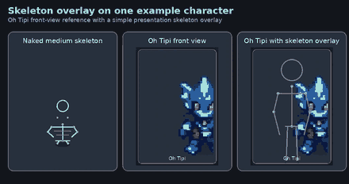

# Generated character sprite references

This directory contains generated visual reference material for FLUX character development. The artwork is **concept/reference only** and is not approved production art, runtime data, or an authoritative character specification.

The previews use PNG files because GitHub's rendered Markdown image proxy did not consistently display the previous WebP reference.

## Naked animation skeletons

Five presentation-only base skeletons cover the project size bands: Tiny, Small, Medium, Large, and Huge. They describe visual proportions and attachment placement only; they do not change collision, hitboxes, statistics, or gameplay rules.

## Skeleton on an example character

Oh Tipi is shown beside the Medium skeleton and with a simple overlay to demonstrate how a character-specific silhouette can be arranged over reusable presentation bones.

## Front view of each generated character

The front-facing reference is shown for Oh Tipi, S. Wayne, The Red Baron, Steezo, Spai Si, Hara, and Nico Lai.

## Intended use

Use these references to discuss compact pixel proportions, directional readability, silhouette separation, palette ideas, equipment cues, and possible ancestry details. Redraw and adapt all material to the final virtual-pixel grid, animation skeletons, camera projection, accessibility requirements, and original FLUX visual language.

Do not treat these images as authoritative for race assignments, kits, hitboxes, animation timing, final palettes, production scale, sprite-sheet layout, or gameplay state.
